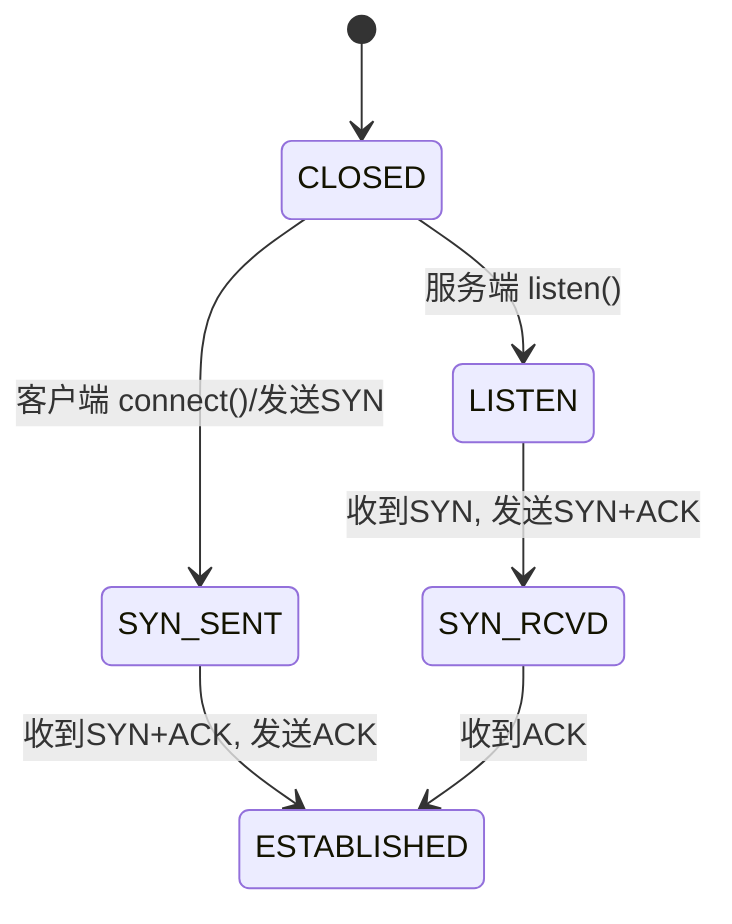
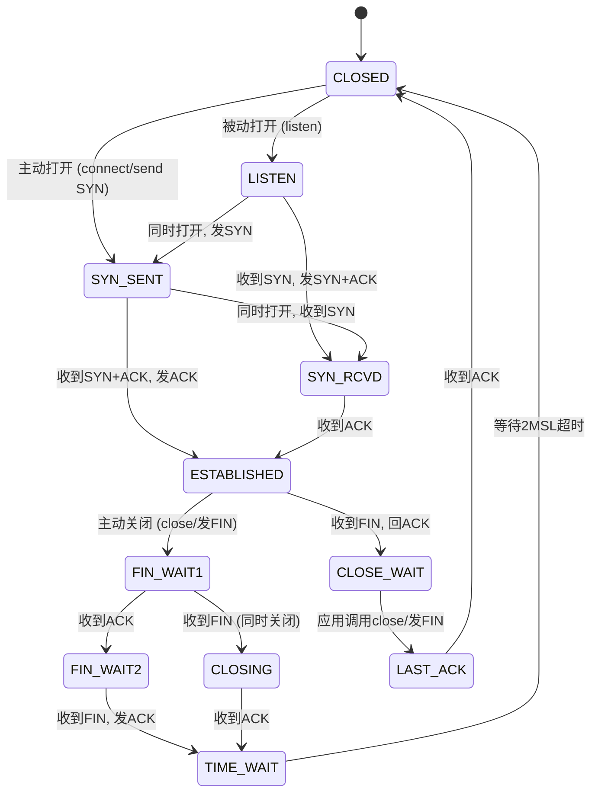
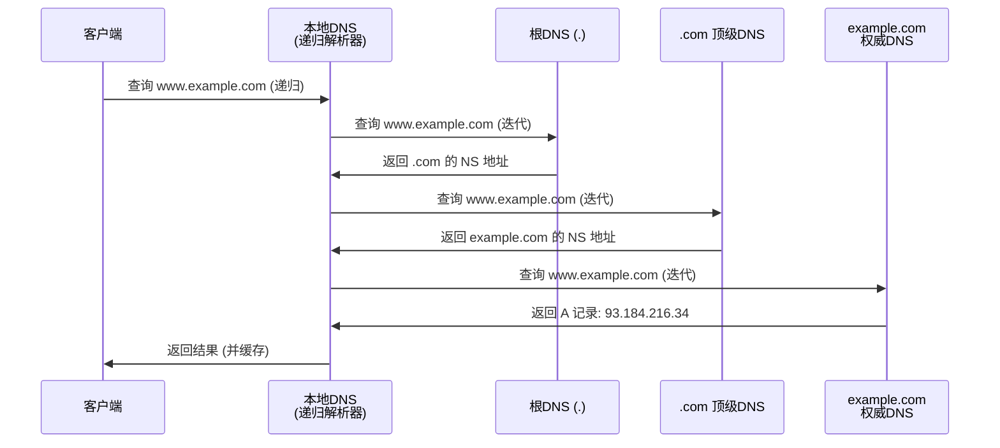

# 计算机网络面试碾压级讲义

> **定位**：覆盖 95%+ 中高级后端面试网络题，支持从「原理 + 内核 + 工程实践」三层回答
>
> **适用**：Golang 后端开发校招 / 社招，对标腾讯、阿里、字节、美团等大厂面试标准
>
> **学习路线**：
> - ★★★★★：必会，高频考点，要求能讲透原理
> - ★★★★：常考，要求理解机制 + 能回答追问
> - ★★★：了解即可，关键名词能解释
>
> **使用方式**：每个知识点按「一句话总结 → 标准回答模板 → 原理解释 → 面试追问」组织，可直接背诵回答
>
> 如果能够完整掌握本讲义内容，基本覆盖腾讯、阿里、字节、美团、京东、网易、携程、唯品会、百度等大厂后端网络相关面试题。

---

# 目录

1. [网络体系结构](#第一章-网络体系结构)
2. [TCP 深度解析](#第二章-tcp-深度解析)（重点章节，60%+ 面试问题来源）
3. [UDP 协议](#第三章-udp-协议)
4. [HTTP 协议](#第四章-http-协议)
5. [HTTPS 与 TLS](#第五章-https-与-tls)
6. [DNS 协议](#第六章-dns-协议)
7. [IP 协议](#第七章-ip-协议)
8. [ARP 协议](#第八章-arp-协议)
9. [会话与认证](#第九章-会话与认证)
10. [数据流全景分析](#第十章-数据流全景分析)
11. [网络安全](#第十一章-网络安全)
12. [CDN 与负载均衡](#第十二章-cdn-与负载均衡)
13. [Linux 网络编程与高并发网络模型](#第十三章-linux-网络编程与高并发网络模型)
14. [网络排查实战](#第十四章-网络排查实战)
15. [面试场景题](#第十五章-面试场景题)
16. [面试高频 35 题攻防](#第十六章-面试高频-35-题攻防)
17. [进阶深度专题](#第十七章-进阶深度专题)（容器网络、Anycast、延迟优化等 8 个专题）
18. [附录：内核参数速查表 & 面试速记卡](#附录)

---

# 第一章 网络体系结构

## 1.1 OSI 七层模型 ★★★

### 📌 核心结论
OSI 七层模型是 ISO 制定的理论参考模型，实际工业界使用 TCP/IP 四层模型。面试只需画出七层并说明各层职责，重点讲清楚「为什么分层」。

### 🎯 标准回答模板

**Q: OSI 七层模型是什么？**

> OSI（Open System Interconnection）七层模型是 ISO 制定的网络互连标准模型，从下到上依次为：物理层、数据链路层、网络层、传输层、会话层、表示层、应用层。
>
> **物理层**负责比特流传输和物理介质；**数据链路层**负责 MAC 寻址和帧封装；**网络层**负责 IP 寻址和路由选择；**传输层**负责端到端可靠传输（TCP/UDP）；**会话层**管理会话建立和终止；**表示层**处理数据格式转换和加密；**应用层**为应用程序提供网络服务接口。
>
> TCP 位于传输层（第4层），HTTP 位于应用层（第7层）。
>
> **为什么分层？** 四个原因：解耦（每层独立修改）、标准化（不同厂商互联）、简化问题（分而治之）、灵活性（某层协议可替换，如 IP 层之上可以跑 TCP 也可以跑 UDP）。

### 七层结构

从上到下依次为：

| 层级 | 名称 | 核心功能 | 典型协议/设备 |
|------|------|---------|-------------|
| 7 | 应用层（Application） | 为应用程序提供网络服务接口 | HTTP、HTTPS、FTP、SMTP、DNS、Telnet、SSH |
| 6 | 表示层（Presentation） | 数据格式转换、加密解密、压缩 | SSL/TLS、JPEG、ASCII、MPEG、gzip |
| 5 | 会话层（Session） | 建立、管理、终止会话 | RPC、SQL、NetBIOS |
| 4 | 传输层（Transport） | 端到端可靠传输、流量控制、差错控制 | TCP、UDP |
| 3 | 网络层（Network） | 路由选择、逻辑寻址（IP） | IP、ICMP、ARP、OSPF、BGP、路由器 |
| 2 | 数据链路层（Data Link） | 帧封装、MAC寻址、差错检测 | 以太网、Wi-Fi、PPP、交换机、网桥 |
| 1 | 物理层（Physical） | 比特流传输、物理介质、电气特性 | 光纤、双绞线、同轴电缆、集线器、中继器 |

### 各层职责详述

- **应用层**：直接面向用户，提供 HTTP、FTP、SMTP、DNS 等服务
- **表示层**：处理数据的表示形式，如编码转换（ASCII/Unicode）、加密（SSL/TLS）、压缩（gzip）
- **会话层**：负责建立、维护和终止会话，如 RPC、NetBIOS
- **传输层**：端到端的数据传输，TCP 提供可靠传输，UDP 提供不可靠传输
- **网络层**：IP 寻址和路由选择，将数据从源端发送到目的端
- **数据链路层**：将 IP 数据报封装成帧，通过 MAC 地址在相邻节点间传输
- **物理层**：将帧转换为比特流，通过物理介质（光纤、双绞线、无线）传输

### OSI 与 TCP/IP 模型对应关系

```
OSI 七层                    TCP/IP 四层         数据单元
┌──────────┐              ┌──────────────┐     ┌─────────┐
│  应用层   │              │              │     │  应用数据 │
├──────────┤              │   应用层      │     │  (Message)│
│  表示层   │              │              │     ├─────────┤
├──────────┤              │              │     │          │
│  会话层   │              │              │     │          │
├──────────┤              ├──────────────┤     ├─────────┤
│  传输层   │              │   传输层      │     │ TCP段    │
│          │              │              │     │ (Segment)│
├──────────┤              ├──────────────┤     ├─────────┤
│  网络层   │              │   网络层      │     │ IP数据报 │
│          │              │              │     │ (Packet) │
├──────────┤              ├──────────────┤     ├─────────┤
│ 数据链路层 │              │              │     │ 帧      │
├──────────┤              │  网络接口层    │     │ (Frame) │
│  物理层   │              │              │     │ 比特流   │
└──────────┘              └──────────────┘     └─────────┘
```

### 🔥 面试追问

**Q: OSI 为什么是七层而不是六层或八层？**

> 这体现了经典的「分治」思想。会话层和表示层在某些模型中会合并，但 OSI 将它们分开是因为：
> 1. 会话管理（连接维持、断点续传）和数据表示（编码转换、加密）是两个独立关注点
> 2. 实际协议中它们确实分开实现（如 TLS 工作在表示层，RPC 会话管理在会话层）
> 3. 但在 TCP/IP 模型中它们被合并到应用层，由应用程序自行处理

---

## 1.2 TCP/IP 四层模型 ★★★

### 📌 核心结论
TCP/IP 四层模型是事实上的工业标准，先有协议后有模型。和 OSI 最大的区别是它将应用层以下三层合并为两层（网络层 + 网络接口层），应用层以上三层合并为一层。

### 🎯 标准回答模板

**Q: TCP/IP 与 OSI 区别？**

> 1. **层数不同**：OSI 是七层，TCP/IP 是四层，TCP/IP 更简洁实用
> 2. **产生顺序不同**：OSI 是理论模型，先有模型后有协议；TCP/IP 是先有协议后有模型
> 3. **协议覆盖**：OSI 支持多种传输层协议，TCP/IP 以 TCP/IP 为核心
> 4. **工业事实**：OSI 模型更完整但复杂，TCP/IP 是事实上的工业标准

### 各层职责

**应用层**（对应 OSI 的应用层 + 表示层 + 会话层）：负责应用程序间的通信，协议包括 HTTP、HTTPS、FTP、DNS、SMTP 等。

**传输层**（对应 OSI 的传输层）：负责端到端的通信，提供进程间的数据传输服务：
- **TCP**：面向连接、可靠、字节流
- **UDP**：无连接、不可靠、数据报

**网络层**（对应 OSI 的网络层）：负责主机到主机的通信，处理数据包的路由和转发：
- **IP**：核心协议，负责寻址和路由
- **ICMP**：用于网络诊断和错误报告
- **ARP**：IP 地址到 MAC 地址的映射

**网络接口层**（对应 OSI 的数据链路层 + 物理层）：负责在物理介质上传输比特流，处理 MAC 寻址和帧的封装/解封装。

---

## 1.3 数据封装与解封装 ★★★

### 📌 核心结论
数据从应用层到物理层的过程中，每层加上自己的头部（封装）；接收方逐层去掉头部（解封装）。这是理解网络协议栈的最基本视角。

### 🎯 标准回答模板

**Q: 为什么需要网络分层？**

> 四大原因：
> 1. **解耦**：每层独立，各层之间的修改互不影响
> 2. **标准化**：便于不同厂商的设备互联互通
> 3. **简化问题**：将复杂的网络通信分解为若干小问题
> 4. **灵活性**：某一层协议可以替换而不影响其他层（如 IP 层之上可以跑 TCP 也可以跑 UDP），这就是「沙漏模型」——IP 是窄腰，上层和下层都可以各自演进

### 封装过程（发送方）

```
应用层：   HTTP数据（请求/响应报文）                  [应用数据]
              ↓  +TCP头部（源端口+目标端口+序列号+数据）
传输层：   TCP报文段（Segment）                      [TCP段]
              ↓  +IP头部（源IP+目标IP+TTL+协议号）
网络层：   IP数据报（Packet）                       [IP包]
              ↓  +MAC帧头（源MAC+目标MAC）+帧尾FCS
数据链路层：MAC帧（Frame）                          [帧]
              ↓
物理层：   比特流（01011010...）
```

### 解封装过程（接收方）

解封装是封装的逆过程：
1. **物理层**：接收比特流，同步时钟，转交数据链路层
2. **数据链路层**：去除帧头帧尾，验证 FCS 校验，根据 EtherType 字段（0x0800=IPv4, 0x86DD=IPv6）转交网络层
3. **网络层**：去除 IP 头部，根据协议字段（6=TCP, 17=UDP）转交传输层
4. **传输层**：去除 TCP/UDP 头部，根据端口号找到对应 socket，放入接收缓冲区
5. **应用层**：应用进程通过 read/recv 读取数据，解析应用数据

### 🔥 面试追问

**Q: IP 层的 protocol 字段和 TCP/UDP 的端口号有什么区别？**

> IP 层 protocol 字段决定数据交给哪个**传输层协议**（TCP=6, UDP=17, ICMP=1）。
> TCP/UDP 端口号决定数据交给哪个**应用进程**。
> 两者构成两级解复用：`IP.proto → 传输层协议 → .port → 应用进程`

---

# 第二章 TCP 深度解析

> ⚠️ 本章是整本讲义最核心的章节，面试 60%+ 的网络问题来自本章

## 2.1 TCP 与 UDP 本质区别 ★★★★★

### 📌 核心结论
TCP 是面向连接、可靠、有序、字节流的传输层协议，通过序列号+ACK+重传保证可靠性。UDP 是无连接、不可靠、保边界的数据报协议。选择 TCP 还是 UDP 本质是选择「可靠性」还是「实时性」。

### 🎯 标准回答模板

**Q: TCP 和 UDP 区别？**

> TCP 面向连接（三次握手建立连接），提供可靠传输（序列号+ACK+重传），保证数据有序到达，有流量控制和拥塞控制，头部开销 20-60 字节，基于字节流。
> UDP 无连接，不可靠传输，不保证顺序，无流控和拥塞控制，头部仅 8 字节，保留数据边界（数据报），支持广播和多播。
> 场景选择：文件传输/HTTP 用 TCP；视频直播/DNS/物联网用 UDP。

| 对比维度 | TCP | UDP |
|----------|-----|-----|
| 连接方式 | 面向连接（三次握手） | 无连接 |
| 可靠性 | 可靠（确认、重传、校验） | 不可靠（尽最大努力交付） |
| 有序性 | 有序（序列号保证顺序） | 无序 |
| 速度 | 慢（建立连接、确认机制） | 快 |
| 数据边界 | 字节流（无边界） | 数据报（有边界，每次 recv 一条完整消息） |
| 头部开销 | 20-60 字节 | 8 字节 |
| 适用场景 | 文件传输、HTTP、邮件、SSH | 视频直播、语音通话、DNS、游戏、IoT |
| 流量控制 | 有（滑动窗口） | 无 |
| 拥塞控制 | 有（慢启动、拥塞避免、快重传、快恢复） | 无（应用层自行实现） |
| 双工模式 | 全双工 | 全双工 |
| 广播/多播 | 不支持 | 支持 |
| 传输效率 | 较低（确认+重传开销） | 高（无额外开销） |

### 🔥 面试追问

**Q: 为什么游戏大多用 UDP？**

> 1. **实时性 > 可靠性**：游戏状态每秒更新数十次，丢失一帧影响远小于等待重传的延迟
> 2. **自定义可靠层**：游戏在 UDP 之上实现自己的可靠传输（只重传关键事件如射击命中，位置更新丢了就丢了）
> 3. **队头阻塞**：TCP 一个包丢失会阻塞后续所有数据到达应用层，游戏无法接受
> 4. **连接迁移**：UDP 无连接，Wi-Fi 切 4G 时不需要像 TCP 那样重建连接

---

## 2.2 TCP 报文结构 ★★★★

### 📌 核心结论
TCP 头部最小 20 字节，最大 60 字节。核心字段：端口号（定位进程）、序列号+确认号（可靠传输和有序性的基础）、标志位（控制连接状态）、窗口大小（流量控制）。

```
 0                   1                   2                   3
 0 1 2 3 4 5 6 7 8 9 0 1 2 3 4 5 6 7 8 9 0 1 2 3 4 5 6 7 8 9 0 1
+-+-+-+-+-+-+-+-+-+-+-+-+-+-+-+-+-+-+-+-+-+-+-+-+-+-+-+-+-+-+-+-+
|          源端口号 (16)         |           目标端口号 (16)      |
+-+-+-+-+-+-+-+-+-+-+-+-+-+-+-+-+-+-+-+-+-+-+-+-+-+-+-+-+-+-+-+-+
|                          序列号 Sequence Number (32)          |
+-+-+-+-+-+-+-+-+-+-+-+-+-+-+-+-+-+-+-+-+-+-+-+-+-+-+-+-+-+-+-+-+
|                       确认号 Acknowledgment Number (32)        |
+-+-+-+-+-+-+-+-+-+-+-+-+-+-+-+-+-+-+-+-+-+-+-+-+-+-+-+-+-+-+-+-+
| 数据偏移(4)| 保留(4)|C|E|U|A|P|R|S|F|    窗口大小 (16)        |
|            |       |W|C|R|C|S|S|Y|I|                          |
|            |       |R|E|G|K|H|T|N|                            |
+-+-+-+-+-+-+-+-+-+-+-+-+-+-+-+-+-+-+-+-+-+-+-+-+-+-+-+-+-+-+-+-+
|           校验和 (16)          |         紧急指针 (16)          |
+-+-+-+-+-+-+-+-+-+-+-+-+-+-+-+-+-+-+-+-+-+-+-+-+-+-+-+-+-+-+-+-+
|           选项 (可变，最多 40 字节)                              |
+-+-+-+-+-+-+-+-+-+-+-+-+-+-+-+-+-+-+-+-+-+-+-+-+-+-+-+-+-+-+-+-+
```

### 关键字段说明

- **源/目标端口**：各16位，标识发送和接收进程
- **序列号（Sequence Number）**：32位，标识本报文段数据的第一个字节的序号
- **确认号（ACK Number）**：32位，期望收到对方下一个报文段的第一个字节序号
- **数据偏移**：4位，TCP 头部长度，以 4 字节为单位
- **标志位**：
  - URG：紧急指针有效
  - ACK：确认号有效
  - PSH：接收方应尽快将数据交给应用层
  - RST：重置连接
  - SYN：同步序列号，用于建立连接
  - FIN：发送方完成数据发送，用于释放连接
- **窗口大小**：16位，接收方还能接收的数据量（流量控制）
- **校验和**：16位，校验整个报文段（头部+数据）
- **紧急指针**：16位，指向紧急数据的最后一个字节

### 标志位详解

| 标志 | 全称 | 作用 | 面试要点 |
|------|------|------|---------|
| SYN | Synchronize | 建立连接时同步序列号 | 三次握手的核心，SYN=1 时不能带数据（TFO 除外） |
| ACK | Acknowledgment | 确认号有效 | 连接建立后几乎所有报文都带 ACK=1 |
| FIN | Finish | 发送方数据发送完毕 | 四次挥手的发起标志 |
| RST | Reset | 异常重置连接 | 端口未监听、SO_LINGER=0、半开连接时触发 |
| PSH | Push | 催促接收方立即交付应用层 | 交互式应用（Telnet）使用，现代内核多忽略 |
| URG | Urgent | 紧急指针有效 | 几乎不使用 |

### 🔥 面试追问

**Q: 序列号为什么是随机初始化的（ISN）？**

> 1. **防止旧连接报文干扰**：如果 ISN 固定从 0 开始，上次连接在网络中滞留的报文段可能被新连接误收
> 2. **防止序列号预测攻击**：如果攻击者能预测 ISN，可以伪造 TCP 报文注入数据
> 3. Linux 使用基于时钟的 ISN 生成算法：`ISN = hash(srcIP, dstIP, srcPort, dstPort, random_secret)`，每 4 微秒加 1

---

## 2.3 UDP 报文结构 ★★★

```
 0      7 8     15 16    23 24    31
+-+-+-+-+-+-+-+-+-+-+-+-+-+-+-+-+-+-+-+-+-+-+-+-+
|     源端口号 (16)    |    目标端口号 (16)     |
+-+-+-+-+-+-+-+-+-+-+-+-+-+-+-+-+-+-+-+-+-+-+-+-+
|      长度 (16)      |      校验和 (16)       |
+-+-+-+-+-+-+-+-+-+-+-+-+-+-+-+-+-+-+-+-+-+-+-+-+
|                 数据（可变）                  |
+-+-+-+-+-+-+-+-+-+-+-+-+-+-+-+-+-+-+-+-+-+-+-+-+
```

UDP 头部仅 8 字节：
- **源端口号**：16位，可选，不要求回复时可设为 0
- **目标端口号**：16位
- **长度**：16位，UDP 头部 + 数据的字节数
- **校验和**：16位，可选（IPv4中可关闭，IPv6中必须计算）

**关键面试点**：UDP 校验和在 IPv4 中可选（设为 0 表示不校验），IPv6 中强制计算。

---

## 2.4 TCP 三次握手 ★★★★★

### 📌 核心结论
三次握手的核心目的是**同步双方的初始序列号（ISN）**和**验证双方的收发能力**。两次不够（服务端不知道客户端的收能力，也无法防止旧 SYN 到达），四次浪费（SYN 和 ACK 可以合并在一个报文中）。

### 🎯 标准回答模板（面试满分回答结构）

**Q: TCP 为什么三次握手？**

> 第一，**防止已失效的连接请求到达服务端**。如果只有两次握手，客户端第一次发出的 SYN 在网络中滞留后又到达服务端，服务端会直接进入 ESTABLISHED 分配资源，而客户端已关闭，这会造成资源浪费。
>
> 第二，**确保双方收发能力都正常**。第一次握手让服务端知道客户端发送能力正常；第二次握手让客户端知道服务端收发能力都正常；第三次握手让服务端知道客户端接收能力正常。两次握手无法验证客户端的接收能力。
>
> 第三，**同步初始序列号（ISN）**。TCP 的可靠传输依赖序列号，需要双方交换并确认各自的 ISN。这本质上是四次交互（A→B 发 ISN_A，B→A 确认 ISN_A，B→A 发 ISN_B，A→B 确认 ISN_B），但 SYN+ACK 可以把第二三步合并，所以是三次。

### 三次握手过程

```
    客户端                          服务端
       |                               |
  CLOSED                            LISTEN
       |                               |
       |-------SYN(seq=x)------------>|  （第一次：客户端→服务端，SYN=1, seq=x）
       |                               |
  SYN_SENT                         SYN_RCVD
       |                               |
       |<---SYN+ACK(seq=y,ack=x+1)----|  （第二次：服务端→客户端，SYN=1, ACK=1）
       |                               |
ESTABLISHED                            |
       |                               |
       |-------ACK(seq=x+1,ack=y+1)-->|  （第三次：客户端→服务端，ACK=1）
       |                               |
ESTABLISHED                      ESTABLISHED
```

**第一次握手**：客户端发送 SYN=1，seq=x（随机初始序列号）
**第二次握手**：服务端回复 SYN=1，ACK=1，seq=y，ack=x+1
**第三次握手**：客户端回复 ACK=1，seq=x+1，ack=y+1

### 为什么必须三次

1. **防止已失效的连接请求到达服务端**：如果只有两次握手，当客户端的第一个 SYN 在网络中滞留后重新到达，服务端会直接进入 ESTABLISHED 状态，而客户端已关闭，造成资源浪费。
2. **确保双方的收发能力**：
   - 第一次：服务端确认客户端的发送能力
   - 第二次：客户端确认服务端的接收和发送能力
   - 第三次：服务端确认客户端的接收能力

### 状态转换图解



### 🔥 深度追问：为什么不能两次/四次？

**Q: 为什么两次握手不够？**

> 经典反例：客户端发送第一个 SYN 因网络滞留未到达服务端，客户端超时重发第二个 SYN。服务端收到第二个 SYN 后回复 SYN+ACK，连接建立，通信完成后关闭。
> 此时，第一个滞留在网络中的 SYN 终于到达服务端。如果只有两次握手，服务端收到这个旧 SYN 后会直接进入 ESTABLISHED 状态分配资源，但客户端早已关闭连接。这样就白白浪费了服务端资源。三次握手让客户端有机会拒绝这个已失效的连接请求：客户端收到服务端的 SYN+ACK 后，发现这不是自己发起的连接（序列号不匹配），发 RST 拒绝。

**Q: 为什么不是四次？**

> 服务端的 SYN 和 ACK 可以合并在同一个报文中发送（SYN+ACK），因为服务端收到 SYN 后可以立即决定接受连接并同时发出自己的 SYN。拆成两次没必要，多浪费一个 RTT。

### 握手期间的数据携带问题 ★★★★★

**Q: 三次握手中哪些报文可以携带数据？**

> **只有第三次握手可以携带数据**。原因：
> - 第一次握手（SYN）：连接尚未建立，不能带数据
> - 第二次握手（SYN+ACK）：同理，连接尚未完全建立
> - 第三次握手（ACK）：此时客户端视角连接已建立（收到 SYN+ACK 后进入 ESTABLISHED），可以携带数据
>
> 这也是 **TCP Fast Open（TFO）** 的优化方向——TFO 允许在第二次握手时就携带数据。

### 握手过程中的定时器机制

**SYN 超时重传**：Linux 默认重传 5 次（`tcp_syn_retries = 5`），间隔指数退避：1s → 2s → 4s → 8s → 16s → 32s，总计约 63 秒后放弃，返回 ETIMEDOUT。

**SYN+ACK 超时重传**：Linux 默认重传 5 次（`tcp_synack_retries = 5`），同理指数退避。

### 三次握手深入追问 ★★★★★

**Q: 三次握手与 accept() 函数的关系？**

> 三次握手的完成与 accept() 调用是**异步**的：
> - 三次握手由内核的 TCP/IP 协议栈自动完成，不依赖应用层 accept() 是否被调用
> - 握手完成后，连接进入全连接队列（Accept Queue）
> - accept() 只是从全连接队列中取走一个已就绪的连接，返回对应的 fd
> - 如果应用层一直不调用 accept()，全连接队列会满，后续的新连接 ACK 被丢弃

**Q: 服务端收到 SYN 报文后的内部工作流程？**

> 1. 网卡收到 SYN 报文 → 触发硬中断 → CPU 处理
> 2. 内核校验 IP 头部、TCP 头部完整性
> 3. 查找 socket：根据四元组（源IP、源Port、目标IP、目标Port）匹配现有 socket
> 4. 若是新连接请求 → 检查半连接队列是否已满
> 5. 未满 → 创建 request_sock 结构，放入半连接队列
> 6. 构造 SYN+ACK 报文 → 发送
> 7. 启动 SYN+ACK 重传定时器
> 8. 收到 ACK → 从半连接队列移除 → 创建完整 socket → 放入全连接队列

**Q: 服务端收到重复 SYN 报文的处理逻辑？**

> 两种场景：
> 1. **已有半连接**（第一次 SYN 的 SYN+ACK 丢失，客户端重发 SYN）：服务端在半连接队列中找到对应项 → 直接重发 SYN+ACK（不重复分配资源）→ 这是一种正常现象
> 2. **SYN 序列号异常**（恶意攻击或网络错误）：回复 RST 报文重置连接

**Q: SYN 丢失怎么办？**

> 客户端会触发超时重传。Linux 中默认重传 5 次，每次间隔加倍（1s, 2s, 4s, 8s, 16s），共约 63 秒后放弃。

**Q: ACK 丢失怎么办？**

> - 第二次握手的 ACK 丢失：服务端触发 SYN+ACK 重传
> - 第三次握手的 ACK 丢失：服务端触发 SYN+ACK 重传，直到收到 ACK 或超时

---

### SYN Flood 攻击与防御 ★★★★★

#### 攻击原理

攻击者伪造大量不存在的 IP 地址，向服务端发送 SYN 请求。服务端回复 SYN+ACK 后等待 ACK 确认，但永远不会收到。这些半连接会占满服务器的半连接队列，导致正常请求无法处理。

#### 防御方案

| 层次 | 方案 | 实现 |
|------|------|------|
| 内核层 | **SYN Cookie** | 不立即分配资源，用算法将连接信息编码在 SYN+ACK 的序列号中 |
| 内核层 | 缩短 SYN Timeout 时间 | 减少半连接占用时间 |
| 配置层 | 增加半连接队列大小 | 调大 `tcp_max_syn_backlog` |
| 网络层 | 防火墙/负载均衡过滤 | iptables limit、SYN proxy、CDN/高防 IP |

### 半连接队列（SYN Queue）★★★★★

存放处于 SYN_RCVD 状态的连接。收到客户端的 SYN 后，连接信息放入此队列。队列满时，后续 SYN 将被丢弃（直接不回复，不发送 RST）。

**内核参数**：
```bash
net.ipv4.tcp_max_syn_backlog = 256      # 半连接队列最大长度
net.ipv4.tcp_syncookies = 1             # 开启 SYN Cookie
```

### 全连接队列（Accept Queue）★★★★★

存放已完成三次握手、处于 ESTABLISHED 状态的连接。服务端调用 accept() 时从此队列取出连接。队列满时，后续 ACK 可能被丢弃。

**内核参数**：
```bash
net.core.somaxconn = 128                 # accept 队列上限
```

实际全连接队列最大长度 = min(backlog, net.core.somaxconn)

### listen() 的 backlog 参数陷阱 ★★★★★

```c
int listen(int sockfd, int backlog);
```

**经典面试陷阱**："listen() 的 backlog 参数控制的是半连接队列还是全连接队列？"

**答案**：历史上不同内核版本行为不同，但 Linux 2.2+ 后，backlog 参数控制的是**全连接队列（Accept Queue）**的最大长度。半连接队列大小由内核参数 `tcp_max_syn_backlog` 独立控制。

**实际生效值**：全连接队列最大长度 = min(backlog, net.core.somaxconn)

**验证**：
```bash
# 查看全连接队列溢出（SYN丢包）
ss -lnt | grep <port>    # Send-Q=backlog设置值, Recv-Q=当前队列中连接数
# 查看溢出统计
netstat -s | grep overflowed
netstat -s | grep "LISTEN"
```

**队列溢出表现**：Recv-Q > Send-Q 且持续增长 → 全连接队列溢出 → 新连接 ACK 被丢 → 客户端表现为连接超时或失败。

---

### SYN Cookie 实现原理 ★★★★★

SYN Cookie 是 SYN Flood 攻击的关键防御手段。核心思路：**不立即为 SYN 请求分配资源**。

**普通流程**（无 SYN Cookie）：
```
收到SYN → 分配request_sock结构 → 放入半连接队列 → 发送SYN+ACK → 等待ACK
（如果ACK永远不来，已分配的资源被浪费）
```

**SYN Cookie 流程**：
```
收到SYN → 不分配任何资源 → 用算法生成特殊seq值 → 发送SYN+ACK(seq=cookie) → 直接丢弃
收到ACK → 验证ack号是否为合法cookie → 合法才创建socket → 放入全连接队列
```

**Cookie 生成算法**：
```
cookie = hash(sip, dip, sport, dport, timestamp, secret)
```
- 将源IP、目标IP、源端口、目标端口、时间戳与一个内核密钥（secret）做 hash
- cookie 写入 SYN+ACK 报文的 seq 字段
- 收到 ACK 后，ack = cookie+1，从中验证 cookie 合法性
- 验证通过 → 创建完整的 socket，连接建立

**关键点**：
- Cookie 依赖 `secret`，外界无法伪造
- 时间戳编码在 Cookie 中防止重放攻击
- 仅在**半连接队列满**时才自动启用（或通过 `tcp_syncookies=1` 始终启用）
- 使用 SYN Cookie 时**不支持 TCP 大窗口等高级选项**（序列号空间被 Cookie 占用）

---

### TCP Fast Open（TFO）★★★

传统三次握手：必须先完成握手才能传输数据 → 1-RTT 延迟

TFO 允许**在第二次握手时就开始传输数据**，将建立连接 + 数据发送缩减为 1-RTT。

**原理**：
1. 首次连接：正常三次握手，服务端返回 SYN+ACK 时携带一个**加密 Cookie**
2. 后续重连：客户端发送 SYN 时**携带此 Cookie + 应用数据**
3. 服务端验证 Cookie 合法 → 直接交付数据给应用层 → 省去一个 RTT

```
首次连接（获取Cookie）:
  客户端                   服务端
    |---SYN----------------->|
    |<--SYN+ACK+Cookie------|
    |---ACK----------------->|
    |---数据---------------->|  ← 此时才能发数据

后续连接（TFO）:
  客户端                   服务端
    |---SYN+Cookie+数据----->|  ← 握手的同时就发数据了！
    |<--SYN+ACK-------------|
    |---ACK+数据------------>|
```

**内核参数**：
```bash
net.ipv4.tcp_fastopen = 3   # 1=客户端开启, 2=服务端开启, 3=双方开启
```

**适用场景**：频繁建立短连接的场景（HTTP 请求、CDN），对长连接收益有限。

---

## 2.5 TCP 四次挥手 ★★★★★

### 📌 核心结论
TCP 是全双工通信，每个方向需要独立关闭，所以是四次挥手。主动关闭方经历 FIN_WAIT1 → FIN_WAIT2 → TIME_WAIT；被动关闭方经历 CLOSE_WAIT → LAST_ACK → CLOSED。**TIME_WAIT 是面试中出现频率最高的状态**。

### 🎯 标准回答模板

**Q: TCP 为什么四次挥手？**

> TCP 是全双工通信，两个方向的数据传输需要分别关闭。
> 主动方发 FIN、被动方回 ACK 关闭了主动方→被动方的方向。
> 但被动方可能还有数据要发，所以 ACK 和 FIN 分开发送——这就是第四次挥手是「被动方发 FIN + 主动方回 ACK」——实际上是四次。
> 如果被动方没有数据要发了，那它的 ACK 和 FIN 理论上可以合并（三次挥手），但大多数情况下服务端收到 FIN 后还有未发完的数据。

### 四次挥手过程

```
    客户端（主动关闭方）              服务端（被动关闭方）
       |                               |
ESTABLISHED                      ESTABLISHED
       |                               |
       |-------FIN(seq=u)------------>|  （第一次：客户端发 FIN）
       |                               |
  FIN_WAIT1                       CLOSE_WAIT
       |                               |
       |<------ACK(seq=v,ack=u+1)-----|  （第二次：服务端回 ACK）
       |                               |
  FIN_WAIT2                       CLOSE_WAIT
       |                               |  （服务端可能继续发送剩余数据）
       |<------FIN(seq=w,ack=u+1)-----|  （第三次：服务端发 FIN）
       |                               |
   TIME_WAIT                       LAST_ACK
       |                               |
       |-------ACK(seq=u+1,ack=w+1)-->|  （第四次：客户端回 ACK）
       |                               |
   TIME_WAIT                       CLOSED
  (等待2MSL, 约60秒)
       |
   CLOSED
```

**第一次挥手**：客户端发送 FIN=1，seq=u，进入 FIN_WAIT1
**第二次挥手**：服务端回复 ACK=1，seq=v，ack=u+1，进入 CLOSE_WAIT。客户端收到后进入 FIN_WAIT2
**第三次挥手**：服务端发送 FIN=1，seq=w，ack=u+1，进入 LAST_ACK
**第四次挥手**：客户端回复 ACK=1，seq=u+1，ack=w+1，进入 TIME_WAIT。服务端收到后关闭

### 为什么必须四次

TCP 是全双工通信，每个方向都需要独立关闭：
- 客户端 → 服务端：FIN + ACK（一次挥手 + 一次确认）
- 服务端 → 客户端：FIN + ACK（一次挥手 + 一次确认）

服务端的 ACK 和 FIN 通常分开发送，因为服务端收到 FIN 后可能还有数据要发送，不能立即发送 FIN。

### TCP 11 种状态完整图 ★★★★★



### 各状态含义速记

| 状态 | 谁在此状态 | 含义 | 面试重点 |
|------|-----------|------|---------|
| SYN_SENT | 客户端 | 已发 SYN，等待 SYN+ACK | connect() 调用后 |
| SYN_RCVD | 服务端 | 收到 SYN，已发 SYN+ACK，等待 ACK | 半连接队列 |
| ESTABLISHED | 双方 | 连接已建立，正常通信 | |
| FIN_WAIT1 | 主动关闭方 | 已发 FIN，等待 ACK | 等待对端确认 |
| FIN_WAIT2 | 主动关闭方 | 已收到 ACK，等待对方的 FIN | 对端还在发数据 |
| CLOSE_WAIT | 被动关闭方 | 收到对方 FIN 并已回 ACK，等待应用层 close() | **代码 bug 堆积处** |
| LAST_ACK | 被动关闭方 | 已发 FIN，等待最后一个 ACK | |
| TIME_WAIT | 主动关闭方 | 等待 2MSL 后关闭 | **面试最高频** |
| CLOSING | 双方 | 同时关闭时的短暂状态 | 少见 |

### 🔥 深度追问

**Q: 中间两次挥手为什么不能合并？二三次挥手能否合并？**

> 不能合并。服务端收到客户端的 FIN + 回复 ACK（第二次挥手），以及服务端发送自己的 FIN（第三次挥手），这两个操作之间有时间差：
> - 服务端回复 ACK 是内核 TCP 协议栈立即完成的
> - 服务端发送 FIN 需要等待应用层调用 close() 或 shutdown()
> - 如果应用层还有数据要发送，发送 FIN 的时机会更晚
> - 因此 ACK 和 FIN 必须分开发送
>
> 例外情况：如果服务端收到 FIN 时没有数据要发，close() 可以立即调用，ACK 和 FIN 可以在一个报文段中发送——变成三次挥手。

**Q: 第 3 次 FIN 报文一直未发送的后果？**

> 当服务端（被动关闭方）处于 CLOSE_WAIT 状态但迟迟不发送 FIN：
> - 客户端处于 FIN_WAIT2 状态，等待服务端的 FIN
> - 如果服务端应用层永远不调用 close()，连接会一直僵持
> - Linux 内核有 `tcp_fin_timeout` 参数（默认 60s），主动关闭方 FIN_WAIT2 超时后会强制关闭
> - 服务端 CLOSE_WAIT 不会自动超时关闭，会一直存在 → CLOSE_WAIT 堆积

**Q: 二、三次挥手间隔期间，主动断开端（客户端）的行为？**

> 客户端处于 **FIN_WAIT2** 状态：
> - 不再发送数据（己方已关闭发送通道）
> - 但**仍可接收数据**：如果服务端还有数据要发送，客户端的 TCP 层仍然可以接收
> - 如果服务端迟迟不发 FIN，客户端 FIN_WAIT2 会在 `tcp_fin_timeout` 秒后超时关闭
> - 应用层通常感知不到 FIN_WAIT2 状态（除非使用 shutdown(SHUT_WR) 而非 close）

**Q: 客户端 FIN 报文丢失后服务端连接状态？**

> - 客户端发送 FIN 后进入 FIN_WAIT1，启动重传定时器
> - 服务端未收到 FIN → 仍然处于 **ESTABLISHED** 状态
> - 客户端超时重传 FIN，重传次数耗尽后强制关闭
> - 服务端通过 KeepAlive 探测或应用层心跳检测发现连接异常

**Q: 为什么握手三次挥手四次？**

> 握手中，服务端的 SYN 和 ACK 可以合并一次发送（无中间数据需处理）；挥手中，服务端收到 FIN 后可能还有未发完的数据，因此先回 ACK，等数据处理完再发 FIN，无法合并。

---

## 2.6 TIME_WAIT 与 CLOSE_WAIT —— 面试最高频状态题 ★★★★★

### 📌 核心结论

| 状态 | 出现在哪 | 核心原因 | 过多怎么办 |
|------|---------|---------|-----------|
| TIME_WAIT | **主动关闭方** | 确保最后一个 ACK 被对方收到 + 让旧报文消失 | 调内核参数 / 长连接 / 让对端主动关闭 |
| CLOSE_WAIT | **被动关闭方** | 收到 FIN 后**应用层没调用 close()** | **修代码！** |

### TIME_WAIT 作用

1. **确保最后一个 ACK 能被对方收到**：如果 ACK 丢失，服务端会重传 FIN，客户端需要保持 TIME_WAIT 状态来重传 ACK
2. **让旧连接的所有报文在网络中消失**：防止旧连接的延迟报文被新连接接收。TIME_WAIT 持续 2MSL（Maximum Segment Lifetime），Linux 中 MSL 默认 30 秒，TIME_WAIT 约 60 秒

### TIME_WAIT 过多怎么办

TIME_WAIT 发生在**主动关闭方**。高并发场景下客户端可能是主动关闭方，导致大量 TIME_WAIT。

**解决方案**：
1. **调整内核参数**：
   ```bash
   # 开启 TIME_WAIT 重用（仅客户端角色可用）
   net.ipv4.tcp_tw_reuse = 1
   # ⚠️ tcp_tw_recycle 在 Linux 4.12+ 已移除（严重 NAT 兼容问题）
   ```
2. **使用长连接**：避免频繁创建/销毁连接
3. **减小 MSL 时间**（不推荐，可能引发其他问题）
4. **设置 SO_LINGER**：强制发送 RST 而非正常关闭，跳过 TIME_WAIT（不推荐，可能丢数据）

### CLOSE_WAIT 过多原因（100% 是代码 bug）

CLOSE_WAIT 发生在**被动关闭方**。堆积说明服务端没有正确调用 close() 关闭连接。

**常见原因**：
1. 应用层代码忘记调用 close()
2. 线程/协程阻塞，无法执行 close()
3. 业务逻辑异常，跳过了关闭逻辑

**排查方法**：
```bash
# 查看 CLOSE_WAIT 数量
netstat -an | grep CLOSE_WAIT | wc -l
# 查看具体连接
ss -tan | grep CLOSE_WAIT
# 找到持有连接的进程
lsof -i -n | grep CLOSE_WAIT
```

---

## 2.7 close() vs shutdown()：TCP 半关闭 ★★★★

网络编程中关闭连接有两个系统调用，行为完全不同：

```c
close(fd)：          // 关闭 socket，引用计数 -1
                     // 仅当引用计数 = 0 才真正发送 FIN
                     // 同时关闭读写两端

shutdown(fd, how)：  // 直接操作连接，不关心引用计数
  SHUT_RD            // 关闭读端（不能再 recv）
  SHUT_WR            // 关闭写端 → 立即发送 FIN（半关闭，仍可 recv）
  SHUT_RDWR          // 关闭读写两端
```

**为什么需要 shutdown？**

1. **fork 后子进程共享 fd**：父进程 close() 后引用计数未到 0 → FIN 不会发出 → 对端以为连接还在。shutdown() 不管引用计数直接发 FIN。

2. **半关闭场景**：服务端 `shutdown(SHUT_WR)` → 发 FIN 告知"我发完了"，但仍可 recv 客户端最后的请求 → 优雅关闭，避免 RST 丢数据。

3. **close() 的隐患**：如果接收缓冲区还有未读数据就 close() → 内核发 RST 而非正常 FIN → 对端数据丢失。

**面试要点**：网络编程中推荐用 `shutdown(SHUT_WR)` 发 FIN，等对端也关闭后再 close()。这是优雅关闭的标准做法。

---

## 2.8 TCP 可靠传输机制 ★★★★★

### 📌 核心结论
TCP 通过七大机制保证可靠传输：**序列号+ACK（有序+确认）、校验和（差错检测）、超时重传（丢包恢复）、快速重传（加速恢复）、SACK（精确重传）、流量控制（防止接收方溢出）、拥塞控制（防止网络过载）**。

### 序列号与确认号

- 每个 TCP 报文段都有一个序列号，序列号是该报文段第一个数据字节的编号
- 初始序列号（ISN）随机生成，防止旧连接报文干扰
- 接收方通过序列号对数据包进行排序和去重
- ACK 号 = 已连续收到的最后一个字节序号 + 1（即期望收到的下一个字节序号）
- TCP 使用**累积确认**：ACK 号之前的所有数据都已收到

### 校验和

- 覆盖 TCP 头部 + 数据 + 伪头部（源IP、目标IP、协议号、TCP长度）
- 发送方计算校验和并写入头部
- 接收方重新计算并比较，不一致则丢弃

### 超时重传（RTO）

- 发送方设置重传计时器（RTO，Retransmission Timeout）
- RTO 根据 RTT（Round Trip Time）动态计算
- 若计时器超时未收到 ACK，重传未确认的数据
- 每次重传后 RTO 加倍（指数退避）

RTO 计算公式：
```
RTO = SRTT + 4 × RTTVAR

SRTT（平滑往返时间）：
  SRTT_new = (1 - α) × SRTT_old + α × RTT_sample
  α = 1/8（新样本权重小，保证平滑）

RTTVAR（RTT 波动）：
  RTTVAR_new = (1 - β) × RTTVAR_old + β × |SRTT - RTT_sample|
  β = 1/4
```

### 快速重传（Fast Retransmit）

- 发送方连续收到**3个重复ACK**（3 Dup ACK）时，立即重传缺失的报文段
- 不必等待超时计时器到期——大幅缩短丢包恢复时间
- 原理：第 1 个 Dup ACK 可能是乱序；第 2 个概率变小；第 3 个大概率是丢包

### SACK（Selective ACK）★★★★★

**核心问题**：TCP 默认只有累积 ACK。如果窗口中有多个包丢失，发送方不知道具体哪些包丢了——只能一次重传一个包，等 ACK 更新。

**SACK 的解决方案**：接收方在 TCP option 中告知发送方"我收到了哪些不连续的数据段"。

```
无 SACK：
发送: 1 2 3 4 5
丢失:   2   4
收到 ACK: ack=2 (只确认了 1)
发送方: 重传 2,3,4,5 (不知道 3 其实已经收到了！)

有 SACK：
发送: 1 2 3 4 5
丢失:   2   4
收到 ACK: ack=2 + SACK=3-4,5-6 (告知收到了 3 和 5)
发送方: 只重传 2 和 4 (精准重传！)
```

**面试关键点**：SACK 解决了「一个 RTT 只能恢复一个丢包」的问题，在高丢包场景下显著提升性能。

**DSACK（Duplicate SACK）**：接收方收到重复数据时，通过 DSACK 告知"这段数据我已经有了"。帮助发送方区分「真的丢包」还是「ACK 丢失导致的不必要重传」。

---

## 2.9 TCP 流量控制 ★★★★★

### 📌 核心结论
流量控制是**接收方驱动**的机制：接收方通过 ACK 报文中的窗口大小字段（Window Size）告诉发送方自己缓冲区还剩多少空间，防止发送方发送太快导致接收方缓冲区溢出。

### rwnd（接收窗口 - Receiver Window）

- 接收方在 ACK 报文的"窗口大小"字段中告知自己能接收的缓冲区大小
- 发送方根据 rwnd 调整发送速率
- 实际发送窗口 = min(cwnd（拥塞窗口）, rwnd（接收窗口）)

### 滑动窗口机制

```
发送方维护：
├── 已发送已确认 (窗口左侧已滑过)
├── 已发送未确认 | 可发送 | 不可发送 (窗口右侧)
└── 由 rwnd 和 cwnd 决定窗口大小
```

### 零窗口与持续计时器

- 当接收方缓冲区满时，rwnd=0
- 发送方停止发送，启动**持续计时器**（Persist Timer），定期发送窗口探测报文（Zero Window Probe）
- 当发送方收到零窗口通告后启动，定时发送窗口探测报文询问接收方窗口是否恢复
- 防止零窗口通告死锁（接收方窗口恢复的 ACK 丢失导致双方永远等待）

### TCP Window Scaling（窗口扩大因子）★★★★

TCP 头部窗口大小字段只有 16 位 → 最大 65535 字节。在高带宽高延迟（LFN，Long Fat Network）网络中，这远远不够。

**解决方案**：三次握手时在 SYN 报文中通过选项协商 Window Scale（0-14），最终窗口 = `win × 2^scale`。最大窗口可达 `65535 × 2^14 ≈ 1GB`。

---

## 2.10 TCP 拥塞控制 ★★★★★

### 📌 核心结论
拥塞控制是**发送方驱动**的机制，防止网络过载。核心变量：cwnd（拥塞窗口）、ssthresh（慢启动阈值）。实际发送窗口 = min(cwnd, rwnd)。

### 四大算法

#### 1. 慢启动（Slow Start）

- cwnd 初始为 1 个 MSS（Linux 3.0+ 中 init_cwnd = 10）
- 每收到一个 ACK，cwnd += 1 MSS（即每过一个 RTT，cwnd 翻倍）
- 指数增长：1 → 2 → 4 → 8 → 16...
- 当 cwnd >= ssthresh 时，进入拥塞避免阶段

#### 2. 拥塞避免（Congestion Avoidance）

- 每过一个 RTT，cwnd += 1 MSS
- 线性增长，而不是指数增长
- 直到出现丢包

#### 3. 快重传（Fast Retransmit）

- 收到 3 个重复 ACK 时，立即重传（不等超时）
- ssthresh = max(cwnd / 2, 2 MSS)
- cwnd = ssthresh + 3 MSS（这 3 个 ACK 说明有 3 个包离开了网络）

#### 4. 快恢复（Fast Recovery）

- 快重传后，进入快恢复而非慢启动
- 每收到一个重复 ACK，cwnd += 1 MSS
- 收到新数据的 ACK 后，cwnd = ssthresh，进入拥塞避免
- 避免网络恢复后的慢启动阶段

### 拥塞控制完整流程

```
cwnd ↑
     │   慢启动(指数增长)
     │     │
     │     RTO超时 → ssthresh = cwnd/2, cwnd = 1, 回到慢启动
     │     ↓
     │   ssthresh ←──────────────┐
     │     │                      │ RTO超时
     │  拥塞避免(线性增长)         │
     │     │                      │
     │    3 Dup ACK               │
     │     ↓                      │
     │   ssthresh = cwnd/2       │
     │   cwnd = ssthresh + 3     │
     │   快恢复                    │
     │     │                      │
     │  收到新ACK                  │
     │   cwnd = ssthresh         │
     │  回到拥塞避免 ──────────────┘
     └──────────────────→ 时间
```

### CUBIC 算法详解 ★★★★

Linux 默认拥塞控制算法（2.6.19+ 默认）。

**核心创新**：CUBIC 用**三次函数**（而不是线性函数）来探测可用带宽。窗口大小取决于距离上次丢包的时间：

```
W(t) = C × (t - K)^3 + W_max

其中 K = ³√(W_max × β / C)
```

- `W_max`：上次丢包时的窗口大小
- `β`：乘法减少因子（~0.7，即丢包后窗口降为 70%）
- `C`：缩放常数
- 凹函数特性：在 W_max 附近缓慢增长（稳定），远离 W_max 时快速增长（探测）

**为什么 CUBIC 比 Reno 好**：窗口增长不依赖 RTT（Reno 每个 RTT +1，RTT 小的流增长更快——不公平）；快速收敛到 W_max 附近；在 W_max 附近缓慢探测并迅速探出新的可用带宽。

### BBR（Bottleneck Bandwidth and RTT）★★★★

Google 提出（2016），Linux 4.9+ 支持。

**核心思想**：传统算法（CUBIC/Reno）依赖**丢包**作为拥塞信号 → "等到丢包才降速" → 延迟已经很高了（Bufferbloat 问题）。

BBR **不依赖丢包**，而是**主动测量**链路的瓶颈带宽和最小 RTT，通过 pacing（发送速率平滑控制）来控制发送速率。目标：**用最小延迟达到最大吞吐**。

| | CUBIC | BBR |
|--|-------|-----|
| 拥塞信号 | 丢包 | 带宽 + RTT 测量 |
| 延迟 | 高（填满缓冲区才丢包） | 低（不故意填满缓冲区） |
| 高丢包网络 | 性能急剧下降 | 抗丢包能力更强（丢包≠拥塞） |
| 公平性 | 较好 | v2 改善了与其他流竞争时的公平性 |
| 适用场景 | 通用 | 跨境链路、视频传输、CDN |

> 面试答法："传统拥塞控制看丢包，BBR 看带宽和延迟。BBR 适合高延迟、有丢包的网络（如跨国链路），YouTube、Google 内部大量使用。"

---

## 2.11 TCP 粘包与拆包 ★★★★

### 📌 核心结论
TCP 是**字节流**协议，没有消息边界。粘包和拆包是应用层的问题，需要应用层协议来定义消息边界。解决方案：**固定长度、分隔符、Length-Field**（最常用）。

### 产生原因

1. **发送方**：Nagle 算法可能导致小数据包被合并
2. **接收方**：应用层读取不及时，缓冲区累积多个数据包
3. **TCP 层**：MSS（最大报文段长度）限制，大包必须拆分

### 三大解决方案

| 方案 | 原理 | 优点 | 缺点 | 典型案例 |
|------|------|------|------|---------|
| **固定长度** | 每个消息固定 N 字节，不足补齐 | 实现最简单 | 浪费带宽 | 简单私有协议 |
| **分隔符** | 每条消息末尾加上特殊分隔符（如 `\r\n`） | 可读性好 | 需转义处理，扫描开销 | HTTP/1.x、Redis |
| **Length-Field** | 消息头部固定字段包含消息体长度 | 解析最快，最灵活 | 需定长头 | 大多数自定义协议 |

```
Length-Field 格式（推荐方案）：
+--------+----------+
| Length |  Payload |
| 4字节  |  N字节   |
+--------+----------+

解码逻辑：
1. 先读取 4 字节 → 得到消息长度 len
2. 再读取 len 字节 → 得到完整消息
3. 重复步骤 1
```

---

## 2.12 Nagle 算法与 Delayed ACK ★★★★★

### 📌 核心结论
Nagle 算法和 Delayed ACK 都是为了减少小包数量而设计的优化，但两者同时启用会产生 40-200ms 的延迟（双方互相等待）。解决方案：**关闭 Nagle（TCP_NODELAY）**。

### Nagle 算法

Nagle 算法旨在减少网络中小包的数量，提高带宽利用率。

**算法规则**：任一时刻最多只能有一个未被 ACK 确认的「小包」（< MSS）。
1. 如果发送窗口 >= MSS（最大报文段长度），立即发送
2. 如果之前发送的数据已被 ACK 确认，可以立即发送新的小包
3. **否则**：累积数据，等待收到前一个分组的 ACK 后再发送，或等待超时（200ms）后发送

**简单理解**：任一时刻最多只能有一个未被 ACK 确认的小包。

**问题**：Nagle 算法会导致小包延迟，适合 telnet 等交互式场景，但在需要低延迟的场景（游戏、实时通信）中应关闭。

**关闭 Nagle**：设置 `TCP_NODELAY` 选项。
```c
int flag = 1;
setsockopt(sockfd, IPPROTO_TCP, TCP_NODELAY, (char *)&flag, sizeof(int));
```

### Delayed ACK（延迟确认）

接收方收到数据后不立即发送 ACK，而是等待一段时间（通常 40-200ms）：
- 如果在此时间内有数据要发回 → ACK 和数据合并为一个包（捎带确认）
- 如果超时 → 单独发送 ACK
- Linux 默认延迟 40ms

**目的**：减少 ACK 报文数量，将 ACK 与响应数据合并。

### Nagle + Delayed ACK 的致命组合 ★★★★★

**经典面试题**：Nagle 算法 + Delayed ACK 同时启用会导致什么问题？

```
发送方（Nagle）: "我要等前一个包的 ACK 才能发下一个包"
接收方（Delayed）: "我要等 40ms 或有数据要回才能发 ACK"

→ 双方互相等待 → 产生 40-200ms 延迟！
```

**场景**：
1. 发送方发送一个小包
2. 接收方收到后延迟发送 ACK（等 40ms）
3. 发送方有后续小包，但 Nagle 阻止发送（等待 ACK）
4. 死锁 40ms，直到延迟 ACK 超时发送

**解决方案**：
1. **关闭 Nagle**（`TCP_NODELAY`）：适用于需要低延迟的场景
2. **关闭 Delayed ACK**（`TCP_QUICKACK`）：适用于服务端需要快速确认的场景
3. **避免逐个发送小包**：应用层合并写入（writev）

**实际案例**：
- Redis、Nginx 默认关闭 Nagle
- HTTP/2 一个连接多路复用，关闭 Nagle 避免延迟叠加
- 游戏服务器必须关闭 Nagle

```bash
# 关闭 Delayed ACK（Linux）
echo 1 > /proc/sys/net/ipv4/tcp_no_delay_ack
```

### TCP_CORK vs TCP_NODELAY ★★★

- `TCP_NODELAY`：禁用 Nagle，立即发送，适合低延迟场景
- `TCP_CORK`：强制累积数据，直到取消 cork 或达到一定大小，适合批量发送（如 HTTP 响应头+体一起发出）

---

## 2.13 长连接与短连接 ★★★★

### 短连接

- 每次请求-响应完成后关闭连接
- HTTP/1.0 默认短连接
- 适合低频请求场景

### 长连接

- 连接建立后，可复用该连接发送多个请求
- HTTP/1.1 默认长连接（Connection: keep-alive）
- 减少 TCP 三次握手和四次挥手的开销

### KeepAlive（TCP Keep-Alive）

- TCP 层面的保活机制，默认关闭
- 当连接空闲一段时间后，发送探测报文确认对方是否存活
- Linux 参数：
  ```bash
  net.ipv4.tcp_keepalive_time   = 7200  # 空闲 2 小时后开始探测
  net.ipv4.tcp_keepalive_intvl  = 75    # 探测间隔 75 秒
  net.ipv4.tcp_keepalive_probes = 9     # 最多探测 9 次
  ```

### 心跳机制

- 应用层的心跳保活，优于 TCP KeepAlive
- 更灵活，可以携带业务信息
- 常见实现：定时发送 PING 帧，超时未收到 PONG 则断开重连

---

## 2.14 TCP 连接异常处理 ★★★

### RST（Reset）

RST 报文用于异常关闭连接，常见场景：
1. 请求不存在的端口
2. 异常终止连接（SO_LINGER 设为 0）
3. 半开连接：一端已关闭，另一端仍发送数据
4. 防火墙/负载均衡主动中断

### 半开连接（Half-Open）

一端已经关闭或崩溃，另一端仍处于 ESTABLISHED 状态。发送数据时会收到 RST。

### 半关闭连接（Half-Close）

一端发送 FIN 后不再发送数据，但还能接收数据。TCP 支持半关闭（shutdown(socket, SHUT_WR)）。参见 2.7 节。

---

## 2.15 TCP 内核参数调优速查 ★★★★★

```bash
# === 三次握手相关 ===
net.ipv4.tcp_syn_retries = 5           # SYN 重传次数
net.ipv4.tcp_synack_retries = 5        # SYN+ACK 重传次数
net.ipv4.tcp_max_syn_backlog = 256     # 半连接队列大小
net.core.somaxconn = 128               # 全连接队列上限
net.ipv4.tcp_syncookies = 1            # SYN Cookie（1=队列满时自动启用）

# === TIME_WAIT 相关 ===
net.ipv4.tcp_tw_reuse = 1              # TIME_WAIT 复用（仅客户端角色可用）
net.ipv4.tcp_fin_timeout = 60          # FIN_WAIT2 超时时间（秒）

# === Keep-Alive 相关 ===
net.ipv4.tcp_keepalive_time = 7200     # 空闲后首次探测（秒）
net.ipv4.tcp_keepalive_intvl = 75      # 探测间隔（秒）
net.ipv4.tcp_keepalive_probes = 9      # 最多探测次数

# === 缓冲区相关 ===
net.core.rmem_max = 16777216           # 接收缓冲区最大值
net.core.wmem_max = 16777216           # 发送缓冲区最大值
net.ipv4.tcp_rmem = "4096 87380 16777216"   # 接收(最小, 默认, 最大)
net.ipv4.tcp_wmem = "4096 65536 16777216"   # 发送(最小, 默认, 最大)

# === 端口范围 ===
net.ipv4.ip_local_port_range = "32768 60999"  # 本地可用端口范围

# === TCP Fast Open ===
net.ipv4.tcp_fastopen = 3              # 1=客户端, 2=服务端, 3=双方

# === 拥塞控制 ===
net.ipv4.tcp_congestion_control = cubic # 拥塞控制算法
net.core.default_qdisc = fq            # 配合 BBR 时使用 fq 排队规则
```

---

# 第三章 UDP 协议

## 3.1 UDP 核心特性 ★★★★

### 📌 核心结论
UDP 是最简单的传输层协议，几乎就是 IP 层加了端口号。无连接、不可靠、不保证顺序、保留边界。适用场景：实时通信（游戏、VoIP）、DNS、广播/多播、QUIC（HTTP/3 的底层）。

### 🎯 标准回答模板

**Q: UDP 为什么快？什么场景用 UDP？**

> UDP 快在三方面：
> 1. **无连接建立开销**：不需要三次握手，直接发包
> 2. **无确认/重传机制**：发包后不需要等待 ACK，不需要维护 RTO 定时器
> 3. **无流控/拥塞控制**：不会因为网络拥塞主动降速
>
> 适用场景：DNS（查询小且快，丢包重试即可）、视频直播（丢掉一帧比卡顿好）、游戏（实时性 > 可靠性）、IoT（设备资源受限）、QUIC（在 UDP 上实现可靠传输，取二者之长）。

详见 2.1 TCP vs UDP 对比表，以及 2.3 UDP 报文结构。

---
# 第四章 HTTP 协议

## 4.1 HTTP 基础 ★★★★★

### 📌 核心结论
HTTP（HyperText Transfer Protocol）是无状态的应用层协议，基于 TCP，使用请求-响应模型。核心特点：无状态（每个请求独立）、灵活（可传输任意类型数据通过 Content-Type 标识）、简单（方法语义清晰）。

默认端口：HTTP=80, HTTPS=443。

---

## 4.2 HTTP 报文结构 ★★★★★

### 请求报文

```
POST /api/user HTTP/1.1            ← 请求行（方法 + URI + 版本）
Host: www.example.com              ← 请求头
Content-Type: application/json
Content-Length: 28
Connection: keep-alive
Authorization: Bearer xxx
                                   ← 空行 CRLF 分隔
{"name":"zhangsan","age":20}       ← 请求体
```

### 常用请求头

| 字段 | 说明 |
|------|------|
| Host | 目标主机和端口（HTTP/1.1 必带） |
| Content-Type | 请求体的 MIME 类型 |
| Content-Length | 请求体字节数 |
| Connection | 连接管理（keep-alive / close） |
| User-Agent | 客户端信息 |
| Cookie | 携带 Cookie |
| Accept | 可接受的响应类型 |
| Authorization | 认证凭据 |

### 响应报文

```
HTTP/1.1 200 OK                     ← 状态行（版本 + 状态码 + 原因短语）
Content-Type: application/json      ← 响应头
Content-Length: 42
Set-Cookie: session=abc123
Cache-Control: max-age=3600
                                    ← 空行 CRLF 分隔
{"code":0,"msg":"ok"}               ← 响应体
```

---

## 4.3 HTTP 方法 ★★★★★

| 方法 | 语义 | 幂等 | 请求体 | 缓存 |
|------|------|------|--------|------|
| GET | 获取资源 | ✅ | 无（通常） | 可缓存 |
| POST | 创建资源 | ❌ | 有 | 通常不缓存 |
| PUT | 全量替换 | ✅ | 有 | 不可缓存 |
| PATCH | 部分修改 | ❌ | 有 | 不可缓存 |
| DELETE | 删除资源 | ✅ | 无（通常） | 不可缓存 |
| HEAD | 获取头部 | ✅ | 无 | 可缓存 |
| OPTIONS | 查询支持方法 | ✅ | 无 | 不可缓存 |

> RESTful API 中的 CRUD：POST（创建）、GET（读取）、PUT（全量更新）、PATCH（部分更新）、DELETE（删除）

### 🔥 GET vs POST 最全对比

| 对比维度 | GET | POST |
|---------|-----|------|
| 语义 | 获取资源 | 创建/提交资源 |
| 参数位置 | URL 查询字符串 | 请求体 |
| 缓存 | 可缓存 | 不缓存（除非显式设置） |
| 浏览器历史 | 参数保留在历史记录 | 参数不会保留 |
| 书签 | 可收藏 | 不可收藏 |
| 幂等性 | 幂等 | 非幂等 |
| 安全性（URL可见） | 参数暴露在 URL | 参数在请求体（相对安全） |
| 长度限制 | URL 长度有限制（浏览器约 2KB，HTTP 协议无限制） | 请求体无限制 |

**注意**：从 HTTP 协议层面，GET 也可以带 body（但不推荐，语义被忽略），POST 也可以带 URL 参数。

---

## 4.4 HTTP 状态码 ★★★★★

### 1xx 信息性

| 状态码 | 含义 | 说明 |
|--------|------|------|
| 100 | Continue | 客户端继续发送请求体 |
| 101 | Switching Protocols | 协议切换（如 WebSocket 升级） |

### 2xx 成功

| 状态码 | 含义 | 说明 |
|--------|------|------|
| 200 | OK | 请求成功 |
| 201 | Created | 资源创建成功 |
| 204 | No Content | 请求成功但无返回内容 |
| 206 | Partial Content | 范围请求（断点续传、视频拖拽） |

### 3xx 重定向

| 状态码 | 含义 | 说明 |
|--------|------|------|
| 301 | Moved Permanently | 永久重定向（**浏览器会缓存新 URL**） |
| 302 | Found | 临时重定向（每次仍访问原 URL） |
| 304 | Not Modified | 资源未修改，使用缓存 |
| 307 | Temporary Redirect | 临时重定向（保持请求方法不变） |
| 308 | Permanent Redirect | 永久重定向（保持请求方法不变） |

**301 vs 302**：301 浏览器会记住新的 URL，下次直接访问新地址；302 每次都会先访问原地址。

### 4xx 客户端错误

| 状态码 | 含义 | 说明 |
|--------|------|------|
| 400 | Bad Request | 请求参数有误 |
| 401 | Unauthorized | 未认证（需要登录） |
| 403 | Forbidden | 已认证但无权限 |
| 404 | Not Found | 资源不存在 |
| 405 | Method Not Allowed | 请求方法不允许 |
| 429 | Too Many Requests | 请求频率超限（限流） |

**401 vs 403**：401 需要登录认证；403 已认证但无权限访问。

### 5xx 服务端错误

| 状态码 | 含义 | 说明 |
|--------|------|------|
| 500 | Internal Server Error | 服务端异常 |
| 502 | Bad Gateway | 网关/代理从上游收到无效响应 |
| 503 | Service Unavailable | 服务暂时不可用（过载/维护） |
| 504 | Gateway Timeout | 网关/代理等待上游超时 |

---

## 4.5 HTTP 缓存机制 ★★★★★

### 📌 核心结论
浏览器缓存分两级：**强缓存**（不发请求直接用本地缓存）和**协商缓存**（发请求验证，304 则用本地缓存）。Cache-Control 优先级 > Expires，ETag 优先级 > Last-Modified。

### 强缓存

**Expires**（HTTP/1.0）：
```
Expires: Thu, 01 Dec 2025 16:00:00 GMT
```
绝对时间，受客户端时钟影响，已较少使用。

**Cache-Control**（HTTP/1.1，优先使用）：
```
Cache-Control: max-age=3600        # 缓存 3600 秒
Cache-Control: no-cache            # 不跳过缓存，但必须先验证（走协商）
Cache-Control: no-store            # 完全不缓存
Cache-Control: public              # 可被任何缓存存储（CDN 也可以）
Cache-Control: private             # 仅浏览器缓存
Cache-Control: must-revalidate     # 过期后必须重新验证
Cache-Control: immutable           # 资源永不变化（指纹化静态资源）
```

### 协商缓存

强缓存过期后，浏览器携带缓存标识向服务端验证，服务端判断是否可用。

**ETag / If-None-Match**（优先级更高，HTTP/1.1）：
```http
# 第一次请求
HTTP/1.1 200 OK
ETag: "abc123"

# 后续请求
GET /file HTTP/1.1
If-None-Match: "abc123"

# 未修改
HTTP/1.1 304 Not Modified
```

**Last-Modified / If-Modified-Since**（HTTP/1.0）：
```http
# 第一次请求
HTTP/1.1 200 OK
Last-Modified: Wed, 21 Oct 2025 07:28:00 GMT

# 后续请求
GET /file HTTP/1.1
If-Modified-Since: Wed, 21 Oct 2025 07:28:00 GMT

# 未修改
HTTP/1.1 304 Not Modified
```

**ETag 优于 Last-Modified 的原因**：
1. Last-Modified 精度只能到秒，1 秒内的修改无法感知
2. 文件内容可能未变但修改时间变了（如 `touch` 命令）
3. ETag 是内容的 hash，更精确地反映内容变化

### 浏览器缓存完整决策流程 ★★★★★

```
                    浏览器请求资源
                          │
                          ▼
                   是否有本地缓存？
                    │        │
                   否       是
                    │        │
                    ▼        ▼
               直接请求   强缓存是否有效？
               服务端     (Cache-Control/Expires)
                              │
                         是      否（过期）
                          │        │
                          ▼        ▼
                     直接使用   发起协商缓存验证
                     本地缓存   (携带ETag/Last-Modified)
                         发送条件请求到服务端
                              │
                              ▼
                     服务端判断资源是否变化？
                          │
                    未变(304)      已变(200)
                      │              │
                      ▼              ▼
                 使用本地缓存    返回新资源+新缓存头
                 并更新缓存头    更新本地缓存
```

**面试关键点**：先走强缓存（不发请求），强缓存失效后才走协商缓存（发请求但可能 304）。Cache-Control 优先级高于 Expires，ETag 优先级高于 Last-Modified。

---

## 4.6 HTTP 版本演进 ★★★★★

### HTTP/1.0

**特点**：
- 默认**短连接**（每次请求需要新建 TCP 连接）
- 不支持 Host 头（一个 IP 只能对应一个域名）
- 缓存机制仅 Expires

**问题**：每次请求都要三次握手 + TCP 慢启动 → 性能极差

### HTTP/1.1 ★★★★★

**重大改进**：
1. **默认长连接**（Connection: keep-alive），减少 TCP 握手开销
2. **Host 头**：支持虚拟主机，一个 IP 托管多个域名
3. **请求管道化（Pipelining）**：允许在收到上一个响应前发送下一个请求。**但由于队头阻塞问题，浏览器默认关闭**
4. **Cache-Control** 缓存机制
5. **Chunked 编码**（Transfer-Encoding: chunked）：分块传输，服务端可以边生产边发送
6. **Range 范围请求**：断点续传

**Chunked Transfer Encoding（HTTP/1.1 拆包原理）**：
当响应内容长度未知（动态生成）时，无法提前设置 Content-Length。使用 `Transfer-Encoding: chunked` 替代：
```
HTTP/1.1 200 OK
Transfer-Encoding: chunked

5\r\n                ← 第一个 chunk 长度=5字节
Hello\r\n            ← 数据
A\r\n                ← 第二个 chunk 长度=10字节
World!!!!\r\n        ← 数据
0\r\n                ← 结束标记（长度为0）
\r\n
```

**HTTP 断点续传原理（Range Request）**：
```http
# 请求（下载前1024字节）
GET /file.zip HTTP/1.1
Range: bytes=0-1023

# 响应
HTTP/1.1 206 Partial Content
Content-Range: bytes 0-1023/4096
Content-Length: 1024
```

**HTTP/1.1 的致命问题**：**队头阻塞（HOL Blocking，Head-of-Line Blocking）**——同一连接上请求必须按顺序返回响应。TCP 连接数限制（浏览器一般限制同一域名 6-8 个并发连接）。

### HTTP/2 ★★★★★

**五大改进**：

#### 1. 二进制分帧（Binary Framing）

HTTP/2 通信的最小单位是**帧（Frame）**，所有通信都在一个 TCP 连接上完成。

```
帧结构：
+-----------------------------------------------+
|          Length (24 bits)                      |  帧负载长度
+-----------------------------------------------+
|          Type (8 bits)                         |  帧类型
+-----------------------------------------------+
|          Flags (8 bits)                        |  标志位
+-----------------------------------------------+
|    R    |        Stream ID (31 bits)           |  保留位+流标识符
+-----------------------------------------------+
|          Frame Payload (可变长度)               |
+-----------------------------------------------+
```

**9 种帧类型**：
| 帧类型 | 说明 |
|---------|------|
| DATA | 传输请求/响应体数据 |
| HEADERS | 传输压缩后的 HTTP Header |
| PRIORITY | 指定 Stream 优先级 |
| RST_STREAM | 终止某个 Stream |
| SETTINGS | 连接级别的配置参数 |
| PUSH_PROMISE | 服务端推送前通知客户端 |
| PING | 心跳检测 + 测量 RTT |
| GOAWAY | 通知对端优雅关闭连接 |
| WINDOW_UPDATE | 流量控制窗口更新 |

#### 2. 多路复用（Multiplexing）★★★★★

- 一个 TCP 连接上通过不同的 Stream ID 区分不同请求/响应
- Stream 间互相独立，不会互相阻塞
- 解决了 HTTP/1.1 的应用层队头阻塞问题

#### 3. HTTP/2 流控制（Stream Flow Control）★★★★

与 TCP 流量控制的区别：
- TCP 流控：控制的是整个连接层面的数据传输速率（传输层）
- HTTP/2 流控：控制的是**单个 Stream 级别**的数据传输速率（应用层）

**关键设计**：
1. **双向独立**：发送方和接收方的窗口互相独立，各自维护
2. **两级流控**：连接级别窗口 + Stream 级别窗口，取 min()
3. **WINDOW_UPDATE 帧**：接收方处理完数据后，发送 WINDOW_UPDATE 通知发送方增加窗口
4. **初始窗口**：通过 SETTINGS 帧协商初始窗口大小（默认 65535 字节）

#### 4. Header 压缩（HPACK）★★★★

- HTTP/1.1 中 Header 是纯文本、重复、冗长
- HTTP/2 使用 HPACK 算法压缩 Header
- **静态表**（61 个预定义常用 Header，如 `:method: GET` → 索引 2）
- **动态表**（运行时动态添加，FIFO 淘汰）
- 首次发送完整 Header → 后续用索引引用 → 大幅压缩
- 使用 Huffman 编码进一步压缩

**面试要点**：如果第 N 次请求和第 1 次请求的 Header 完全一样，第 N 次可能只需要几字节（一个索引号）。

#### 5. Server Push

- 服务端可以主动向客户端推送资源
- 例如：客户端请求 HTML，服务端顺便推送 CSS 和 JS
- 减少客户端请求数，加快页面加载

**HTTP/2 的致命问题**：多路复用导致丢包影响放大——一个 TCP 丢包会导致**所有 Stream** 阻塞（TCP 层面的队头阻塞）。

### HTTP/3 ★★★★★

#### QUIC 协议：基于 UDP 的下一代传输协议

```
HTTP/3（应用层）
    ↓
QUIC（传输层，基于 UDP）
    ↓
UDP
    ↓
IP
```

#### QUIC 七大特性：

| 特性 | TCP | QUIC |
|------|-----|------|
| 握手延迟 | 1-RTT（TCP握手）+ 1-RTT（TLS）= 2-RTT | 0-RTT（重连）或 1-RTT（首次） |
| 队头阻塞 | TCP 丢包阻塞所有 Stream | 每个 Stream 独立，一个丢包不影响其他 |
| 连接迁移 | 四元组标识，IP 变则断 | Connection ID 标识，IP 变不影响 |
| 加密 | TLS 在 TCP 之上 | TLS 1.3 内置，所有数据都加密 |
| 重传歧义 | 序列号相同（无法区分原包和重传包） | 每次发新包 Packet Number 递增，无歧义 |
| 前向纠错 | 无 | 可选 FEC |
| 实现位置 | 内核态（升级困难） | 用户态（协议升级灵活） |

**QUIC 如何在 UDP 上实现可靠传输**：
1. **数据确认与重传**：每个 QUIC 包有独立的 Packet Number
2. **拥塞控制**：类似 TCP NewReno/CUBIC，但在用户态实现
3. **多路复用**：Stream 完全独立，无队头阻塞
4. **连接迁移**：使用 Connection ID 代替四元组

**QUIC 的 0-RTT 安全风险**：0-RTT 数据可以被重放攻击。缓解：服务端记录 ClientHello 随机数拒绝重复的；只允许幂等操作用 0-RTT。

---

## 4.7 WebSocket ★★★★★

### 📌 核心结论
WebSocket 通过 HTTP Upgrade 握手后切换为 ws/wss 协议，实现全双工通信。与 HTTP 长连接的本质区别：WebSocket 双方都可以主动发消息，HTTP 长连接依然遵循请求-响应模型。

### HTTP 长连接与 WebSocket 区别

| 对比 | HTTP 长连接 | WebSocket |
|------|-----------|-----------|
| 通信方式 | 请求-响应（客户端主动） | 全双工（双方都可主动发消息） |
| 协议标识 | HTTP/1.1 (keep-alive) | ws:// / wss:// |
| 服务端推送 | 不支持（需轮询/SSE） | 原生支持 |
| 数据帧 | HTTP 报文格式 | WebSocket 二进制帧 |
| 握手 | TCP 三次握手 | HTTP 升级握手 → WS 协议 |
| 适用场景 | REST API、Web 页面 | 即时通讯、游戏、实时数据推送 |

### WebSocket 握手过程

```
客户端 HTTP 请求（升级）：
GET /chat HTTP/1.1
Host: server.com
Upgrade: websocket
Connection: Upgrade
Sec-WebSocket-Key: dGhlIHNhbXBsZSBub25jZQ==
Sec-WebSocket-Version: 13

服务端 HTTP 响应（切换协议）：
HTTP/1.1 101 Switching Protocols
Upgrade: websocket
Connection: Upgrade
Sec-WebSocket-Accept: s3pPLMBiTxaQ9kYGzzhZRbK+xOo=

之后使用 WebSocket 协议帧进行双向通信
```

### WebSocket vs SSE vs 轮询（即时通讯方案对比）★★★★

| 方案 | 方向 | 协议 | 原理 | 延迟 | 适用场景 |
|------|------|------|------|------|---------|
| **短轮询** | 客户端→服务端 | HTTP | 定时发请求查询 | 高（取决于间隔） | 简单通知，已淘汰 |
| **长轮询** | 客户端→服务端 | HTTP | 服务端 hold 住请求直到有数据 | 较低 | 即时通讯（兼容老环境） |
| **SSE** | 服务端→客户端（单向） | HTTP | 服务端持续推送事件流 | 低 | 消息推送、日志流、通知 |
| **WebSocket** | 双向 | ws/wss | TCP 长连接，帧协议双向通信 | 最低 | IM 聊天、游戏、实时数据 |

**SSE vs WebSocket**：
- SSE 只用 HTTP，无需额外协议，浏览器原生支持 `EventSource`，自动重连，但单向
- WebSocket 全双工但需要 upgrade 握手，实现更复杂
- 只需服务端推送 → 优先 SSE（更简单）；需要双向通信 → WebSocket

---

## 4.8 HTTP 不安全的原因 ★★★★★

HTTP 明文传输导致三大安全风险：

1. **窃听（Eavesdropping）**：攻击者通过中间人/抓包工具直接读取通信内容（账号密码、信用卡号），HTTP 无任何加密
2. **篡改（Tampering）**：攻击者拦截并修改请求/响应内容（插入广告、替换下载链接），接收方无法验证数据完整性
3. **冒充（Impersonation）**：攻击者伪装成目标网站，用户无法验证访问的是真正的服务器，HTTP 无身份认证机制

**HTTPS 如何解决**：
- 加密（防窃听）：TLS 对称加密通信内容
- 完整性校验（防篡改）：MAC（Message Authentication Code）验证数据未被修改
- 身份认证（防冒充）：数字证书 + CA 体系验证服务器身份

---

## 4.9 HTTP、Socket、TCP 三者区别 ★★★★

- **TCP**：传输层协议，面向连接、可靠传输，负责端到端的数据传输
- **Socket**：编程接口，封装了 TCP/UDP 协议，是应用层连接传输层的桥梁（本质是 API）
- **HTTP**：应用层协议，基于 TCP，定义通信的语义和格式（请求/响应）

**关系**：HTTP 基于 TCP，TCP 通过 Socket 编程接口暴露给应用层。

```
应用层    HTTP（浏览器/服务器）
           ↓
传输层    TCP（socket编程接口）
           ↓
网络层    IP
```

**Q: HTTP、Socket、TCP 三者区别？**

> TCP 是传输层协议负责可靠传输；Socket 是对 TCP/UDP 的编程抽象，提供 send/recv 等接口；HTTP 是应用层协议定义通信格式，基于 TCP 通过 Socket 编程实现。

---

## 4.10 TCP 建立后 HTTP 连接中断场景 ★★★

常见场景：

1. **TCP KeepAlive 超时**：TCP 层探测到对端不可达，自动断开连接，HTTP 请求失败
2. **中间设备断开**：NAT 路由器/Firewall 超时断开空闲连接，客户端再次请求时发现连接已失效，收到 RST→ 重新 TCP 握手
3. **服务端主动关闭**：HTTP keep-alive 超时（如 Nginx `keepalive_timeout 65s`），服务端发送 FIN 关闭连接
4. **网络闪断**：链路层故障导致 TCP 重传次数耗尽，连接中断

**影响**：HTTP 请求可能返回 `Connection: close` 或直接失败（RST），客户端需重新建立 TCP 连接重试。

**HTTP 的 keep-alive 与 TCP 的 keep-alive 区别**：
- **HTTP keep-alive**：应用层概念，复用连接发送多个请求
- **TCP keep-alive**：传输层概念，长时间空闲后发探测包确认对端存活

---

## 4.11 gRPC 协议 ★★★★

### 📌 核心结论
gRPC 是基于 HTTP/2 + Protobuf 的高性能 RPC 框架。与 REST 相比：二进制编码体积更小、HTTP/2 多路复用连接利用更高效、强类型 IDL 编译期安全、原生支持四种流式调用。

### gRPC vs REST

| 对比 | HTTP (REST) | RPC (gRPC/Thrift) |
|------|------------|-------------------|
| 协议 | 文本协议（HTTP/1.1） | 二进制协议（HTTP/2 + Protobuf） |
| 序列化 | JSON（文本可读但体积大） | Protobuf（二进制，体积小 3-10x） |
| 速度 | 较慢（JSON 序列化+文本传输） | 快（二进制编码+HTTP/2 多路复用） |
| 接口定义 | 无强约束（Swagger/OpenAPI 可选） | .proto 文件强类型 IDL |
| 代码生成 | 手动或工具辅助 | 自动生成客户端/服务端代码 |
| 类型安全 | 弱（运行时校验） | 强（编译期校验） |
| 流式传输 | 不支持（需 WebSocket） | 原生支持 4 种模式 |
| 适用场景 | 对外 API、浏览器-服务端 | 微服务间高性能通信 |

### gRPC 四种调用模式

1. **Unary**（一元 RPC）：一问一答
2. **Server Streaming**：客户端发一个请求，服务端持续推送响应流
3. **Client Streaming**：客户端持续推送请求流，服务端合并后返回一个响应
4. **Bidirectional Streaming**：双方独立、有序地发送消息流

**面试回答重点**：RPC 更关注**性能**和**强类型契约**。HTTP/REST 更适合对外提供 API（浏览器兼容、可读性好），RPC 更适合微服务内部高性能通信。

---

## 4.12 HTTP 安全头 ★★★★

```http
# HSTS：强制 HTTPS，防止 301 劫持降级到 HTTP
Strict-Transport-Security: max-age=31536000; includeSubDomains; preload

# CSP：防 XSS
Content-Security-Policy: default-src 'self'; script-src 'self' 'nonce-xxx'

# 防点击劫持
X-Frame-Options: DENY / SAMEORIGIN

# 防 MIME 类型嗅探
X-Content-Type-Options: nosniff

# Referrer 信息控制
Referrer-Policy: strict-origin-when-cross-origin
```

---

# 第五章 HTTPS 与 TLS

## 5.1 HTTP 与 HTTPS 区别 ★★★★★

| 对比 | HTTP | HTTPS |
|------|------|-------|
| 协议 | HTTP | HTTP over TLS |
| 加密 | 明文 | TLS 加密 |
| 端口 | 80 | 443 |
| CA 证书 | 不需要 | 需要 |
| 速度 | 快（无加密开销） | 较慢（加密+握手） |
| SEO | 浏览器标记"不安全" | 更受搜索引擎青睐 |

## 5.2 核心加密概念 ★★★★★

### 📌 核心结论
HTTPS = HTTP over TLS。TLS 握手使用非对称加密交换密钥，通信阶段使用对称加密。非对称加密解决密钥分发问题（慢），对称加密解决传输效率问题（快）。

### 对称加密

加密和解密使用**同一个密钥**。
- **AES**（Advanced Encryption Standard）：最常用的对称加密算法，128/192/256 位密钥
- **DES**（Data Encryption Standard）：旧标准，56 位密钥，已不安全

**优点**：加解密速度快，适合大量数据加密
**缺点**：密钥分发困难，双方需要安全地共享密钥

### 非对称加密

使用**公钥和私钥**，公钥加密的数据只能用私钥解密（反之亦然）。
- **RSA**：基于大整数因数分解，2048 位以上安全
- **ECC**（Elliptic Curve Cryptography）：基于椭圆曲线，256 位 ECC ≈ 3072 位 RSA，更高效

**优点**：密钥分发安全（公钥可公开）
**缺点**：加解密速度慢（慢 100-1000 倍），不适合大量数据

### 数字签名

**作用**：验证数据的完整性和发送方身份（防篡改、防否认）

**流程**：
1. 发送方对数据计算 hash（如 SHA-256）
2. 发送方用**自己的私钥**对 hash 加密，得到数字签名
3. 接收方用发送方的**公钥**解密签名，得到 hash1
4. 接收方对数据计算 hash2
5. 比较 hash1 == hash2，一致则数据未被篡改

### 数字证书与 CA

数字证书用于解决**公钥真实性问题**（防止中间人替换公钥）。

**内容**：域名、证书持有者、公钥、颁发机构、有效期、CA 的数字签名

**CA（Certificate Authority）认证机构**：
1. 服务端将**公钥 + 域名**发给 CA
2. CA 验证域名所有权
3. CA 用自己的私钥对证书签名
4. 浏览器内置了可信 CA 的根证书（CA 的公钥）
5. 浏览器用 CA 的公钥验证证书签名，确认公钥可信

**证书链**：Root CA → Intermediate CA → Server Certificate（逐级签名，逐级验证）

---

## 5.3 TLS 握手过程 ★★★★★

### TLS 1.2 握手（完整版，2-RTT）

```
  客户端                                        服务端
    |                                             |
    |---ClientHello----------------------------->|
    |   (支持的加密套件、TLS版本、随机数random_C)  |
    |                                             |
    |<--ServerHello------------------------------|
    |   (选择的加密套件、TLS版本、随机数random_S)  |
    |<--Certificate------------------------------|
    |   (服务端证书，包含公钥)                     |
    |<--ServerKeyExchange (如需)-----------------|
    |<--ServerHelloDone--------------------------|
    |                                             |
    |---ClientKeyExchange----------------------->|
    |   (用服务端公钥加密的Pre-Master Secret)      |
    |---ChangeCipherSpec------------------------>|
    |   (通知服务端后续使用加密通信)               |
    |---Finished (加密)------------------------->|
    |                                             |
    |<--ChangeCipherSpec-------------------------|
    |<--Finished (加密)--------------------------|
    |                                             |
    |========= 安全通信开始 ======================|
```

**密钥生成**：
- 双方根据 random_C + random_S + Pre-Master Secret 生成相同的 Master Secret
- 由 Master Secret 派生出对称加密密钥和 MAC 密钥

### TLS 1.3 改进

| | TLS 1.2 | TLS 1.3 |
|--|---------|---------|
| 握手 RTT | 2-RTT | 1-RTT（0-RTT 重连） |
| 密钥交换 | RSA, DHE, ECDHE | 仅 ECDHE（前向安全） |
| 加密套件 | 160+ 种组合 | 仅 5 种（精简，默认安全） |
| 加密时机 | ClientHello 明文 | ServerHello 之后即加密 |
| 不安全算法 | 支持 RSA 密钥交换、CBC 模式、RC4 | 全部移除 |

**TLS 1.3 1-RTT 握手**：
```
客户端                                    服务端
  |                                         |
  |---ClientHello + 密钥交换参数----------->|  (共享 ECDHE 公钥)
  |                                         |
  |<--ServerHello + 密钥交换参数------------|  (选定加密套件 + ECDHE 公钥)
  |   + {EncryptedExtensions}               |  (加密的扩展信息)
  |   + {Certificate}                       |  (加密的证书)
  |   + {CertificateVerify}                 |  (加密的签名验证)
  |   + {Finished}                          |  (加密的 Finished)
  |                                         |
  |---{Finished}-------------------------->|  (加密的 Finished)
  |                                         |
  |====== 安全通信 =========================|
```

### 🔥 面试追问

**Q: 为什么 TLS 1.3 废弃 RSA 密钥交换？**

> RSA 密钥交换没有**前向安全（Forward Secrecy）**——如果服务端私钥被破解，所有历史会话都可以被解密。ECDHE 每次会话生成临时密钥对，即使私钥泄露也无法解密历史会话。

---

## 5.4 HTTPS 如何防止中间人攻击

1. **证书验证**：中间人无法伪造 CA 签名的证书（无 CA 私钥）
2. **公钥加密**：即使中间人拦截通信，也无法解密 Pre-Master Secret
3. **数字签名**：ServerHello 中的 key exchange 参数被服务端私钥签名，客户端用证书公钥验证
4. **完整性验证**：Finished 消息包含之前所有握手消息的 MAC，防止篡改

**中间人攻击的唯一可能**：用户手动信任了攻击者的证书，或者 CA 被攻破。

---

# 第六章 DNS 协议

## 6.1 DNS 基础 ★★★★★

DNS（Domain Name System）将域名解析为 IP 地址。

**DNS 默认端口**：53（UDP 和 TCP 都使用此端口）

**DNS 服务器 IP**：常见公共 DNS
- 114.114.114.114（国内）
- 8.8.8.8（Google）
- 223.5.5.5（阿里）

**hosts 文件**：
- 操作系统本地的域名-IP 映射文件，优先级**高于** DNS 服务器
- Linux：`/etc/hosts`
- Windows：`C:\Windows\System32\drivers\etc\hosts`
- 作用：在 DNS 查询之前先查 hosts 文件，可用于本地开发、屏蔽网站、加速解析
- 缺点：需手动维护，不适用于大规模场景

**域名层级结构**：
```
www.example.com.
│   │       │   │
│   │       │   └── 根域（.）—— 全球 13 组根服务器
│   │       └────── 顶级域（com）
│   └────────────── 二级域（example）—— 权威 DNS
└────────────────── 主机名（www）
```

**DNS 记录类型**：
| 类型 | 名称 | 说明 |
|------|------|------|
| A | 地址记录 | 域名 → IPv4 |
| AAAA | IPv6地址记录 | 域名 → IPv6 |
| CNAME | 别名记录 | 域名 → 域名 |
| MX | 邮件交换 | 域名 → 邮件服务器 |
| NS | 域名服务器 | 域名的 DNS 服务器 |
| TXT | 文本记录 | 任意文本（常用于验证域名所有权） |
| PTR | 反向记录 | IP → 域名 |
| SRV | 服务记录 | 服务地址+端口 |

## 6.2 DNS 查询过程 ★★★★★

### 递归查询

客户端向本地 DNS 服务器请求，本地 DNS 服务器负责完成整个查询过程并返回结果。

### 迭代查询

DNS 服务器之间使用迭代查询，每级 DNS 返回下一级的地址，由请求方继续查询。

**完整查询流程**：

```
客户端 → 本地DNS → 根DNS → .com顶级DNS → example.com权威DNS
        结果 ←     ←      ←              ←
```

1. 客户端向**本地 DNS 服务器**发起递归查询
2. 本地 DNS 向**根 DNS** 服务器（.）发起迭代查询
3. 根 DNS 返回 .com 的**顶级 DNS** 地址
4. 本地 DNS 向 .com 的顶级 DNS 查询
5. 顶级 DNS 返回 example.com 的**权威 DNS** 地址
6. 本地 DNS 向权威 DNS 查询 www.example.com
7. 权威 DNS 返回 IP 地址
8. 本地 DNS 缓存结果并返回给客户端



## 6.3 DNS 缓存

- **浏览器缓存**：浏览器会缓存 DNS 结果，Chrome 默认约 60 秒
- **操作系统缓存**：操作系统的 DNS 缓存（可通过 `ipconfig /flushdns` 清除）
- **本地 DNS 服务器缓存**：运营商的 DNS 缓存
- **各级 DNS 服务器缓存**：递归/迭代路径上的各级服务器

**TTL（Time To Live）**：DNS 记录的缓存有效期，由权威 DNS 设定。

## 6.4 DNS 为什么使用 UDP

1. DNS 查询数据量小（通常 < 512 字节，UDP 最大载荷满足）
2. UDP 无连接，一次往返即可完成查询，速度快
3. DNS 查询量大，UDP 无需维护连接状态，节省服务器资源
4. 可靠性由上层保障：UDP 丢包时客户端重试即可

## 6.5 DNS 为什么也会使用 TCP

1. **数据量超过 512 字节**：DNS 响应超过 UDP 限制时，服务端返回 TC（Truncated）标志，客户端改用 TCP
2. **区域传输（Zone Transfer）**：主从 DNS 服务器同步大量记录时使用 TCP
3. **DNSSEC**：签名的 DNS 响应可能较大，使用 TCP
4. **DNS over TLS/HTTPS（DoT/DoH）**：加密 DNS 传输

---

## 6.6 DNS 安全：劫持与防御 ★★★★

### 常见劫持方式

| 方式 | 原理 |
|------|------|
| 本地 hosts 文件篡改 | 恶意软件修改用户 hosts 文件，将银行域名指向钓鱼 IP |
| DNS 缓存投毒 | 向 DNS 服务器注入伪造的 DNS 响应，污染缓存 |
| 路由器 DNS 劫持 | 攻击路由器，修改 DNS 服务器地址 |
| 运营商 DNS 劫持 | 运营商在 DNS 层面插入广告或劫持 404 页面 |
| 中间人伪造 DNS 响应 | 伪造 DNS 应答包，比真实的 DNS 服务器更快到达 |

### 防御方案

| 方案 | 原理 |
|------|------|
| **DoT**（DNS over TLS） | DNS 查询通过 TLS 加密，端口 853 |
| **DoH**（DNS over HTTPS） | DNS 查询通过 HTTPS 传输，端口 443（混入普通流量更难被阻断） |
| **DNSSEC** | 对 DNS 响应进行数字签名，防伪造 |
| **使用可信 DNS 服务器** | 如 8.8.8.8 (Google)、114.114.114.114 |
| **定期检查 hosts 文件** | 防本地篡改 |
| **HTTPS + 证书验证** | 即使 IP 被劫持，没有正确证书也无法建立 TLS → 浏览器警告 |

---

## 6.7 DNS 优化技巧 ★★★★

```html
<!-- 1. DNS 预解析（HTML <head> 中） -->
<link rel="dns-prefetch" href="//api.example.com">

<!-- 2. DNS 预连接 -->
<link rel="preconnect" href="https://api.example.com">
```

3. **减少域名数量**：资源尽量集中在少数域名下
4. **使用 CDN**：让用户就近解析
5. **增加 DNS 缓存 TTL**

---

# 第七章 IP 协议

## 7.1 IPv4 头部 ★★★★

| 字段 | 位数 | 说明 |
|------|------|------|
| 版本 | 4 | IPv4 = 4 |
| 头部长度 | 4 | 以 4 字节为单位，最小 5（20 字节） |
| 区分服务 | 8 | QoS |
| 总长度 | 16 | 头部+数据，最大 65535 字节 |
| 标识 | 16 | 分片重组标识 |
| 标志 | 3 | DF（不分片）、MF（更多分片） |
| 片偏移 | 13 | 分片在原数据报中的位置 |
| TTL | 8 | 经过路由器的最大跳数，每跳减 1，为 0 时丢弃 |
| 协议 | 8 | TCP=6, UDP=17, ICMP=1 |
| 头部校验和 | 16 | 仅校验 IP 头部 |
| 源 IP | 32 | |
| 目标 IP | 32 | |

## 7.2 IPv4 与 IPv6

| 对比 | IPv4 | IPv6 |
|------|------|------|
| 地址长度 | 32位 | 128位 |
| 地址数量 | ~43 亿 | 3.4×10^38（几乎无限） |
| 格式 | 192.168.1.1 | 2001:db8::1 |
| NAT | 广泛使用 | 不需要（地址够用） |
| 安全性 | IPsec 可选 | IPsec 内置支持 |
| 广播 | 支持 | 不支持（用多播替代） |
| 头部 | 20-60 字节，有校验和 | 固定 40 字节，无校验和 |
| 分片 | 中间路由器可分片 | 仅源端可以分片 |
| 自动配置 | DHCP | SLAAC + DHCPv6 |

## 7.3 子网掩码与 CIDR

### 子网掩码

将 IP 地址分为**网络号**和**主机号**两部分。

```
IP:    192.168. 1.100
掩码:  255.255.255.0
网络号: 前 24 位 = 192.168.1.0
主机号: 最后 8 位 = 100
```

/24 表示前 24 位是网络号。

### CIDR（无类别域间路由）

CIDR 消除了传统的 A/B/C 类地址划分，使用前缀长度灵活划分子网。

`192.168.1.0/24` 表示第 1~24 位为网络号，可容纳 2^8 - 2 = 254 个主机。

## 7.4 MTU 与路径 MTU 发现（PMTUD）★★★★

### 📌 核心结论
MTU（Maximum Transmission Unit）是链路层单帧能承载的最大数据量（以太网 1500 字节）。当 IP 数据报 > MTU 时需要分片。IPv4 允许中间路由分片，IPv6 禁止中间分片。

### Path MTU Discovery（PMTUD）

**问题**：路径上某段链路 MTU 较小（如 VPN 隧道 MTU=1400），但源端不知道，导致数据包被丢弃。

**PMTUD 流程**：
1. 源端发送 DF（Don't Fragment）= 1 的包
2. 中间路由器发现包 > 出接口 MTU → 丢弃 → 回复 ICMP Fragmentation Needed（Type 3, Code 4），告知可支持的 MTU
3. 源端降低发送包大小，重试
4. 最终找到路径上最小的 MTU

**面试场景题**：「为什么有些 HTTPS 网站部分用户打不开？」→ 可能是 PMTUD 失败：中间防火墙屏蔽了 ICMP → PMTUD 无法工作 → 大数据包被静默丢弃。

## 7.5 NAT（网络地址转换）★★★★

### 私有 IP 地址范围（不路由到公网，局域网内部使用）

| 范围 | CIDR | 可用 IP 数 | 典型场景 |
|------|------|-----------|---------|
| 10.0.0.0 ~ 10.255.255.255 | 10.0.0.0/8 | ~1677 万 | 大型企业内网 |
| 172.16.0.0 ~ 172.31.255.255 | 172.16.0.0/12 | ~104 万 | 中型网络 |
| 192.168.0.0 ~ 192.168.255.255 | 192.168.0.0/16 | ~6.5 万 | 家庭/小型网络 |

### NAT 类型

- **SNAT**（源地址转换）：内网访问外网，替换源 IP。NAT 网关维护映射表 `(内网IP:端口) → (公网IP:新端口)`
- **DNAT**（目标地址转换）：外网访问内网服务，替换目标 IP。需要端口映射

### NAT 的局限
1. 内网服务器无法被外网直接访问（需要端口映射/UPnP/NAT-PMP）
2. NAT 网关是单点瓶颈
3. 破坏了端到端原则（P2P 连接困难）

## 7.6 ICMP 协议 ★★★

ICMP（Internet Control Message Protocol）用于网络诊断和错误报告。

| 类型 | 代码 | 含义 | 触发场景 |
|------|------|------|---------|
| 0 | 0 | Echo Reply | ping 响应 |
| 3 | 0 | Net Unreachable | 路由表无匹配 |
| 3 | 3 | Port Unreachable | 端口未监听（UDP） |
| 3 | 4 | Fragmentation Needed | PMTUD |
| 8 | 0 | Echo Request | ping 请求 |
| 11 | 0 | TTL Exceeded | traceroute |

### ping 原理

```
A 发送 ICMP Echo Request → B 接收后回复 ICMP Echo Reply → A 收到并计算 RTT
```

ping 基于 ICMP 协议，是网络层的功能，不涉及传输层。

### traceroute 原理

1. 依次发送 TTL=1, 2, 3... 的 UDP 包
2. 每跳路由器发现 TTL=0 时，回复 ICMP Time Exceeded
3. 到达目标主机时，回复 ICMP Port Unreachable
4. 根据每跳的 IP 和 RTT，绘制路由路径

---

# 第八章 ARP 协议

## 8.1 ARP 原理 ★★★★

ARP（Address Resolution Protocol）将 IP 地址解析为 MAC 地址，工作在网络层和数据链路层之间。

### ARP 查询过程

1. 主机 A 要发送数据给 IP_B，先查本地 ARP 缓存
2. 缓存未命中，A 广播 ARP Request："谁是 IP_B？告诉我你的 MAC"
3. 所有主机收到广播，只有 IP_B 回复 ARP Reply：单播自己的 MAC 地址
4. A 将 IP_B-MAC_B 的映射存入 ARP 缓存

```
A 广播: ARP Request (who is 192.168.1.2 ?)
B 单播: ARP Reply   (192.168.1.2 is aa:bb:cc:dd:ee:ff)
```

## 8.2 免费 ARP（Gratuitous ARP）★★★

主机主动广播自己的 IP-MAC 映射，用于：
1. **IP 冲突检测**：如果收到回复，说明有 IP 冲突
2. **更新其他主机 ARP 缓存**：IP 没变但 MAC 变了（如更换网卡）
3. **VRRP 主备切换**：虚拟 IP 地址漂移到新的 Master 时通知交换机

## 8.3 ARP 欺骗与防御 ★★★

攻击者伪造 ARP 响应，将网关 IP 映射到攻击者的 MAC 地址，从而实现中间人攻击。

**防御**：
- **静态 ARP 绑定**：在关键设备上手动绑定 IP-MAC
- **DAI（Dynamic ARP Inspection）**：交换机层面检测 ARP 包
- **ARP 防火墙/arpwatch**：监控 ARP 表变化

---

# 第九章 会话与认证

## 9.1 Cookie ★★★★★

- 存储在**浏览器**端的小型数据（通常 < 4KB）
- 每次同域请求自动携带
- 可设置过期时间、HttpOnly、Secure、SameSite 等属性

**常用属性**：
| 属性 | 说明 |
|------|------|
| Expires/Max-Age | 过期时间 |
| HttpOnly | 禁止 JavaScript 访问（防 XSS 窃取 Cookie） |
| Secure | 仅 HTTPS 传输 |
| SameSite | 跨站请求控制（Strict/Lax/None），防 CSRF |
| Domain | 生效域名范围 |

## 9.2 Session ★★★★★

- 存储在**服务端**的用户会话数据
- 客户端只持有 Session ID（通常放在 Cookie 中）
- 服务端根据 Session ID 查找对应的会话数据

**缺点**：
- 服务端存储压力大
- 分布式系统中需要 session 共享（Redis/DB）

## 9.3 JWT（JSON Web Token）★★★★★

JWT 是自包含的 Token，由三部分组成：

```
Header.Payload.Signature
```

- **Header**：`{"alg":"HS256","typ":"JWT"}` → Base64 编码
- **Payload**：`{"sub":"123","name":"zhangsan","exp":1700000000}` → Base64 编码
- **Signature**：`HMAC-SHA256(base64(Header) + "." + base64(Payload), secret)`

**优点**：
1. **无状态**：服务端无需存储，适合分布式系统
2. **跨域**：不受同源策略限制，可用于 SSO
3. **防篡改**：签名保证数据完整性

**缺点**：
1. 无法主动失效（签发后不能撤回，只能等过期）
2. Payload 是 Base64（非加密），敏感信息应加密或不放
3. Token 体积较大，每次请求都携带

**安全问题**：
- **不要把密码等敏感信息放在 Payload**
- **设置合理的过期时间**
- **使用 HTTPS 传输**
- **密钥要足够复杂**

## 9.4 OAuth2 ★★★

OAuth2 是授权框架，允许第三方应用获取用户在服务提供商上的资源。

**四种授权模式**：
1. **授权码模式**（最安全，使用最多）：
```
用户 → 第三方App → 授权服务器 → 用户登录授权 → 重定向到第三方App（带code）
→ 第三方App用code换token → 使用token访问资源
```
2. **隐式模式**：直接返回 token（已不推荐）
3. **密码模式**：用户把用户名密码给第三方（仅信任应用使用）
4. **客户端凭证模式**：服务端对服务端的授权

## 9.5 LocalStorage 与 Cookie 对比 ★★★★★

| 对比维度 | Cookie | LocalStorage | SessionStorage |
|---------|--------|-------------|----------------|
| 容量 | ~4KB | ~5MB | ~5MB |
| 生命周期 | 可设过期时间 | 永久（手动删除） | 标签页关闭即删除 |
| 与请求关系 | 每次请求自动携带 | 不自动发送 | 不自动发送 |
| 跨域 | 可设 Domain | 同源 | 同源 |
| API | document.cookie | localStorage API | sessionStorage API |
| 安全性 | HttpOnly 防 XSS | JS 可直接读取 | JS 可直接读取 |
| 作用域 | 同源+Path | 同源 | 同标签页+同源 |

## 9.6 前端数据存储选型规范 ★★★★

| 数据类型 | 存储位置 | 原因 |
|---------|---------|------|
| 用户身份凭证（Session ID / Token） | **Cookie** | HttpOnly + Secure + SameSite 防 XSS |
| 用户偏好（主题/语言） | **LocalStorage** | 不敏感，需持久化 |
| 临时表单数据 | **SessionStorage** | 关闭页面自动清除 |
| 敏感数据（密码/支付信息） | **内存** | 不要持久化到本地 |
| 大体积缓存数据 | **IndexedDB** | 支持大容量和索引查询 |

## 9.7 Cookie、Session、Token 三者区别 ★★★★★

| 对比 | Cookie | Session | Token (JWT) |
|------|--------|---------|-------------|
| 存储位置 | 客户端 | 服务端 | 客户端 |
| 认证方式 | 携带 Session ID | 服务端查数据 | 服务端验签名 |
| 扩展性 | 依赖 Session | 差（需共享存储） | 好（无状态） |
| 安全性 | 可被窃取篡改 | 较高（数据在服务端） | 防篡改（签名保护） |
| 资源消耗 | 几乎无 | 服务端内存/Redis | 几乎无 |
| 主动失效 | 删除即可 | 删除 Session | 无法主动失效 |
| 移动端支持 | 依赖 Cookie 机制 | 依赖 Cookie | 原生支持 |

## 9.8 Session 与 Token 专题密集追问 ★★★★★

**Q1: HTTP 是否无状态？带 Cookie 后仍为无状态吗？**

A: HTTP 协议本身是**无状态**的——每个请求独立，服务端不会记住之前的请求。即使带了 Cookie，**HTTP 协议层面仍然是无状态的**。Cookie 是在应用层面实现了状态管理（由浏览器和服务端应用处理 Cookie 的读写），HTTP 协议本身不维护任何会话状态。

**Q2: 客户端禁用 Cookie 后 Session 还能用吗？**

A: Cookie 被禁用后，传统的 Session ID（存于 Cookie）无法传递，Session 无法使用。但可以通过以下方式补救：
1. **URL Rewriting**：将 Session ID 拼接在 URL 中（`/path;jsessionid=xxx`）
2. **隐藏表单域**：将 Session ID 放在 `<input type="hidden">`
3. **改用 Token 方案**：Token 可放在请求头 `Authorization: Bearer xxx` 中，不依赖 Cookie

实际项目中，移动端 App 不用 Cookie，直接使用 Token 从 Header 传递。

**Q3: JWT 解决集群部署的原理？**

A: 集群部署指同一服务部署在多个节点上，通过负载均衡分发请求。Session 方案下，用户登录状态存储在节点 A 的内存中，下次请求可能被分发到节点 B，节点 B 没有该 Session → 用户被踢下线。解决方案是 Redis 共享存储 Session。

JWT 天然解决此问题：任何节点收到 Token 后只需验证签名即可获取用户信息，无需查询共享存储。这就是 JWT 的**无状态**优势。

**Q4: JWT 泄露后的解决方案？**

A:
1. **短期 Token + Refresh Token**：Access Token 有效期 15-30 分钟，泄露后影响窗口短。Refresh Token 存于服务端（Redis），可随时撤销
2. **Token 黑名单**：维护已泄露 Token 的黑名单（存 Redis），每次请求验证时检查
3. **设备指纹+IP 绑定**：JWT 中包含设备信息或 IP，服务端校验是否一致
4. **设置合理的过期时间**：不宜过长（<=24h）
5. **HTTPS 传输**：防止中间人窃取

**Q5: 前端 JWT 存储方案？**

A:
- **推荐方案**：Access Token 存内存（Vuex/Redux）+ Refresh Token 存 Cookie（HttpOnly+Secure+SameSite）
- **不推荐**：localStorage 存 Token。localStorage 可被 JS 读取，XSS 攻击下 Token 泄露
- **纯 Cookie 方案**：设置 HttpOnly + Secure + SameSite=Strict，JS 无法读取，但需注意 CSRF
- **Service Worker 方案**：Token 存在 Service Worker 内存中，页面通过 postMessage 获取，最安全但实现复杂

## 9.9 已有 HTTP 为何还要 RPC ★★★★★

即使已有 HTTP 协议，RPC 在后端服务间通信中仍有不可替代的优势：

| 对比 | HTTP (REST) | RPC (gRPC/Thrift) |
|------|------------|-------------------|
| 协议 | 文本协议（HTTP/1.1） | 二进制协议（HTTP/2 + Protobuf） |
| 序列化 | JSON（文本可读但体积大） | Protobuf（二进制，体积小 3-10x） |
| 速度 | 较慢（JSON 序列化+文本传输） | 快（二进制编码+HTTP/2 多路复用） |
| 接口定义 | 无强约束（Swagger/OpenAPI 可选） | .proto 文件强类型 IDL |
| 代码生成 | 手动或工具辅助 | 自动生成客户端/服务端代码 |
| 类型安全 | 弱（运行时校验） | 强（编译期校验） |
| 流式传输 | 不支持（需 WebSocket） | 原生支持（Client/Server/Bidirectional Streaming） |
| 适用场景 | 对外 API、浏览器-服务端 | 微服务间高性能通信 |

**面试回答重点**：RPC 更关注**性能**和**强类型契约**。HTTP/REST 更适合对外提供 API（浏览器兼容、可读性好），RPC 更适合微服务内部高性能通信。

## 9.10 Nginx 深入补充 ★★★★

**Nginx 所在 OSI 层级**：
- Nginx 主要工作在**第 7 层（应用层）**，做 HTTP 反向代理和负载均衡
- 也可工作在**第 4 层（传输层）**，通过 stream 模块做 TCP/UDP 代理

**Nginx 常用负载均衡算法**：
1. **轮询（Round Robin）**：默认，依次分配
2. **加权轮询（Weighted）**：根据 `weight` 分配
3. **IP Hash**：同一客户端 IP 固定到同一后端
4. **最少连接（Least Connections）**：优先分给连接数少的服务器
5. **一致性哈希（Consistent Hash）**：适合缓存场景，节点增减影响最小
6. **随机（Random）**：随机选择

**四层 vs 七层负载均衡**：

| | 四层 LB | 七层 LB |
|--|---------|---------|
| 工作层 | 传输层 (TCP/UDP) | 应用层 (HTTP/HTTPS) |
| 代表 | LVS、F5、HAProxy(TCP模式) | Nginx、HAProxy(HTTP模式) |
| 路由依据 | IP:Port | URL、Header、Cookie |
| 性能 | 高（内核态转发） | 略低（解析HTTP协议） |
| 灵活性 | 低 | 高（可按URL/Cookie路由） |
| SSL终结 | 不支持 | 支持 |

**Q: Nginx 高性能原因？**
A:
1. **Master-Worker 多进程模型**：Worker 数量 = CPU 核心数，减少上下文切换
2. **epoll IO 多路复用**：单 Worker 可处理数万并发连接
3. **异步非阻塞**：Worker 不会阻塞在单个连接上
4. **零拷贝**：静态文件使用 sendfile 发送

---

# 第十章 数据流全景分析

> ⭐ 本章是面试加分关键章节，展示你对全链路的理解

## 10.1 浏览器输入 URL 到页面返回 ★★★★★

### 📌 核心结论
从输入 URL 到页面渲染，经历 11 步：URL 解析 → DNS 解析 → TCP 三次握手 → TLS 握手（HTTPS）→ HTTP 请求 → CDN/负载均衡 → 服务端处理 → HTTP 响应 → 浏览器解析渲染 → TCP 四次挥手。

### 逐步拆解

```
https://www.example.com:443/path?key=value#hash
│      │             │    │      │          │
协议   域名          端口  路径   查询参数   锚点
```

**第 1 步：URL 解析** —— 判断是搜索还是 URL；HSTS 检查（若在 HSTS Preload 列表则强制 HTTPS）；对非 ASCII 字符进行 Punycode 编码。

**第 2 步：DNS 解析** —— 浏览器缓存 → OS 缓存（hosts 文件）→ 路由器缓存 → ISP DNS → 递归/迭代查询 → 返回 IP。优化点：DNS 预解析（dns-prefetch）、DNS 预连接（preconnect）。

**第 3 步：TCP 三次握手** —— 客户端 → SYN → 服务端 → SYN+ACK → 客户端 → ACK。1-RTT。

**第 4 步：TLS 握手（HTTPS）** —— TLS 1.2: 额外 2-RTT；TLS 1.3: 额外 1-RTT。含证书验证、密钥交换（ECDHE）。优化：TLS False Start、Session Resumption、0-RTT。

**第 5 步：HTTP 请求** —— 浏览器构造请求报文（方法 + URI + Header + Cookie + Body），发送。

**第 6 步：CDN / 负载均衡** —— CDN 边缘节点有缓存则直接返回；否则回源。负载均衡（四层/七层）分发请求到后端。

**第 7 步：服务端处理** —— Nginx → 应用服务器 → 查缓存（本地/Redis）→ 查数据库 → RPC 调用下游 → 组装响应。

**第 8 步：HTTP 响应** —— 返回状态行 + 响应头（Content-Type, Cache-Control, Set-Cookie 等）+ 响应体（HTML/CSS/JS/JSON）。

**第 9 步：浏览器渲染** —— 解析 HTML → DOM 树 → 解析 CSS → CSSOM 树 → 合并 → Render 树 → 布局（Layout）→ 绘制（Paint）→ 合成（Composite/GPU）。`<script>` 阻塞 DOM 解析（除非 async/defer）。`` 异步加载。

**第 10 步：TCP 四次挥手** —— 连接可能保持（HTTP keep-alive 复用），空闲超时后再关闭。

### 🎯 面试加分表述

> "从输入 URL 到页面呈现，数据包经历了：浏览器构造 HTTP 请求 → DNS over UDP 解析域名 → TCP 三次握手建立连接（TFO 可缩减为 0-RTT）→ TLS 1.3 握手交换密钥（ECDHE 前向安全）→ HTTP/2 多路复用传输请求 → CDN 边缘节点命中或回源 → 四层 LB → 七层 Nginx 反向代理 → 应用服务器处理（缓存→DB→RPC）→ 响应原路返回 → 浏览器解析渲染。全链路优化的关键在于减少 RTT 次数和减少数据拷贝。"

---

## 10.2 一个数据包的内核之旅 ★★★★★

### 📌 核心结论
用户态 `send()` → 系统调用 → 内核 socket 缓冲区 → TCP 协议栈（分段、封装）→ IP 层（路由、封装）→ 邻居子系统（ARP 解析 MAC）→ 网络设备子系统（Qdisc）→ NAPI 软中断 → 驱动 → 网卡 TX Ring Buffer → DMA → 物理发送。

### 发送路径（用户态→内核态→网卡）

```
应用层：     write(fd, buf, len)
                ↓ 系统调用 (sys_write → sys_sendto)
Socket层：   内核根据 fd 找到 struct socket → struct sock
                ↓ tcp_sendmsg()
TCP层：      数据写入 sk_buff → 加入发送队列 (sk_write_queue)
             TCP 分段（根据 MSS）、添加 TCP 头部
             拥塞控制检查 → 决定是否可以发送
                ↓ tcp_transmit_skb()
IP层：       路由查找（确定出口网卡和下一跳）
             添加 IP 头部、计算校验和
             Netfilter (iptables) POST_ROUTING 钩子
                ↓ ip_local_out() → dst_output()
邻居子系统： ARP 解析下一跳 MAC 地址
             添加以太网帧头
                ↓ dev_queue_xmit()
网络设备：   入队到 Qdisc（排队规则，如 fq, fq_codel）
             __netif_schedule() 触发软中断
                ↓ NAPI poll
驱动层：     写入网卡 TX Ring Buffer (DMA)
网卡：       将数据通过物理介质发送
```

### 接收路径（网卡→内核态→用户态）

```
网卡：       收到数据包 → DMA 写入 RX Ring Buffer
             触发硬中断
                ↓
内核：       硬中断 → 触发 NAPI 软中断 (NET_RX_SOFTIRQ)
             NAPI poll：从 RX Ring Buffer 读取
                ↓ netif_receive_skb()
网络设备层： 剥离以太网头部
             根据 EtherType 分发给 IP 层
                ↓ ip_rcv()
IP层：       Netfilter PRE_ROUTING 钩子
             路由查找：是本机还是转发？
             如果是本机 → ip_local_deliver()
             IP 分片重组（如果需要）
             根据协议号分发给 TCP 层
                ↓ tcp_v4_rcv()
TCP层：      查找 socket（四元组匹配）
             验证序列号、校验和
             状态机处理（tcp_rcv_state_process）
             数据放入接收缓冲区 (sk_receive_queue)
             更新 rwnd，发送 ACK
                ↓ sk->sk_data_ready() 唤醒等待的进程
Socket层：   epoll 通知用户态 fd 可读
                ↓
应用层：     read(fd, buf, len) 系统调用
             内核从接收缓冲区拷贝数据到用户空间
```

### 🔥 面试加分追问

**Q: sk_buff 是什么？**

> `sk_buff`（socket buffer）是 Linux 内核网络栈中描述网络数据包的核心数据结构。一个数据包在内核中从协议栈一层层传递时，就是以 `sk_buff` 的形式存在。它包含：数据指针（data/head/tail/end）、协议头指针（transport_header/network_header/mac_header）、时间戳、所属 socket、网络设备信息等。各层协议通过移动数据指针来添加/剥离自己的头部，而不是真的拷贝数据——这是零拷贝思想在内核协议栈中的体现。

**Q: 网卡收到数据后如何通知内核？**

> 传统方式（中断模式）：每来一个包触发一次**硬中断** → CPU 被打断去处理 → 高吞吐下 CPU 被中断淹没（中断活锁，receive livelock）。
>
> NAPI（New API，Linux 2.5+）：第一个包触发硬中断 → CPU 关闭中断 → 用**软中断（NET_RX_SOFTIRQ）轮询**批量处理多个包（poll 函数）→ 处理完再开中断。高吞吐下显著减少中断开销，是 Linux 高性能网络的基础。

---

## 10.3 数据包穿越 Netfilter（iptables）★★★★★

```
入站流量：
                    ┌──────────┐
                    │ 网卡     │
                    └────┬─────┘
                         ↓
                ┌─── PREROUTING ───┐ (DNAT, raw)
                └──────┬──────────┘
                         ↓
                  ┌─ 路由判断 ─┐
                  │  是本机？   │
                  └──┬────┬───┘
              是 ↓       ↓ 否 → FORWARD 链 → POST_ROUTING → 发出
          ┌─ INPUT ─┐
          └──┬──────┘
             ↓
       ┌── 应用层 ──┐
       └──┬────────┘
         ↓ (本地发出的包)
    ┌─ OUTPUT ─┐
    └──┬──────┘
       ↓
  ┌─ POST_ROUTING ─┐ (SNAT, MASQUERADE)
  └──────┬─────────┘
         ↓
    ┌── 网卡 ──┐
    └─────────┘
```

**面试高频**：「PREROUTING 和 INPUT 的区别？」

> PREROUTING 是所有入站包（包括本机和其他主机的转发包）经过的第一个钩子，通常做 DNAT。
> INPUT 是确定包是发往本机后（路由判断后），进入本机应用层前经过的钩子，做本机防火墙过滤。
> 收到一个发给本机的包 → PREROUTING 先触发 → 路由判断确定是本机 → INPUT 再触发。

---

# 第十一章 网络安全

## 11.1 SYN Flood ★★★★★

攻击者伪造大量不存在的 IP 地址，向服务端发送 SYN 请求。服务端回复 SYN+ACK 后等待 ACK，但永远不会收到。这些半连接占满半连接队列（SYN Queue），导致正常用户无法建立连接。

**防御方案**：
- **SYN Cookie**：不立即分配资源，用算法将连接信息编码在 SYN+ACK 的序列号中（详见 2.4 节）
- **缩短 SYN Timeout 时间**
- **增加半连接队列大小**
- **防火墙/负载均衡过滤**

## 11.2 DDoS ★★★★

DDoS（Distributed Denial of Service）分布式拒绝服务攻击：

| 类型 | 原理 | 防御 |
|------|------|------|
| 流量型（UDP/ICMP Flood） | 大流量占满带宽 | 黑洞路由、高防 IP |
| 连接型（SYN Flood） | 占满半连接队列 | SYN Cookie、SYN Proxy |
| 应用型（CC/HTTP Flood） | 耗尽 CPU/数据库连接 | 限流、WAF、验证码 |
| 反射放大（DNS/NTP Amplification） | 伪造源 IP 请求放大包 | 源 IP 验证 |

## 11.3 XSS（跨站脚本攻击）★★★★★

### 反射型

恶意脚本通过 URL 参数传入，服务端直接反射回页面。用户点击恶意链接后触发。

```
http://site.com/search?q=<script>alert(1)</script>
```

### 存储型

恶意脚本存储在服务端（如评论、用户资料），所有访问页面的用户都受影响。

### DOM 型

通过 JavaScript 操作 DOM 触发，不经过服务端。

**防御**：
1. **输出编码**：HTML 实体编码（`<` → `&lt;`）
2. **输入校验**：严格过滤用户输入
3. **CSP**（Content Security Policy）：限制脚本来源
4. **HttpOnly Cookie**：防止 JS 读取 Cookie

## 11.4 CSRF（跨站请求伪造）★★★★★

**攻击原理**：
1. 用户登录了 bank.com
2. 用户访问了恶意网站 evil.com
3. evil.com 的页面中包含 ``
4. 浏览器自动携带 bank.com 的 Cookie 发送请求，转账成功

**防御四件套**：
1. **CSRF Token**：服务端生成随机 Token，前端请求时携带，服务端验证
2. **SameSite Cookie**：设置 SameSite=Strict/Lax
3. **Referer/Origin 验证**：校验请求来源
4. **验证码/二次确认**：敏感操作需用户确认

## 11.5 SQL 注入 ★★★

攻击者通过输入拼接恶意 SQL 语句，操作数据库。

```sql
-- 输入: ' OR '1'='1' --
SELECT * FROM users WHERE name = '' OR '1'='1' --' AND password = ''
```

**防御**：
1. **参数化查询**（预编译语句）
2. **ORM 框架**（GORM 等）
3. **输入校验和过滤**
4. **最小权限原则**（数据库账号只给必要权限）

## 11.6 CORS 跨域 ★★★★★

### 什么是跨域

浏览器的**同源策略（Same-Origin Policy）**：协议 + 域名 + 端口三者全同才算同源。不同源的 JS 脚本不能发送 AJAX 请求。

```
http://a.com:80  访问  http://a.com:80   ✅ 同源
http://a.com:80  访问  https://a.com:80  ❌ 跨域（协议不同）
http://a.com:80  访问  http://b.com:80   ❌ 跨域（域名不同）
http://a.com:80  访问  http://a.com:8080 ❌ 跨域（端口不同）
```

**关键理解**：跨域限制是**浏览器的安全机制**，不是服务端的限制。请求实际能到达服务端并返回响应，但浏览器检查响应头中没有正确的 CORS 头 → 拦截返回结果。

### 简单请求 vs 预检请求

**简单请求**（直接发送，无预检）：方法为 GET/POST/HEAD，Content-Type 为 form/text/json 之一。

**预检请求（Preflight）**：不满足简单请求时，浏览器先发 `OPTIONS` 请求询问服务端：

```
浏览器:
  OPTIONS /api/user HTTP/1.1
  Origin: http://frontend.com
  Access-Control-Request-Method: DELETE
  Access-Control-Request-Headers: Authorization

服务端响应（允许跨域）:
  HTTP/1.1 204 No Content
  Access-Control-Allow-Origin: http://frontend.com
  Access-Control-Allow-Methods: GET, POST, DELETE
  Access-Control-Allow-Headers: Authorization
  Access-Control-Max-Age: 86400    ← 预检结果缓存 1 天

之后浏览器才发真正的 DELETE 请求
```

### 关键响应头

| 响应头 | 作用 |
|--------|------|
| `Access-Control-Allow-Origin` | 允许的源（`*` 或具体域名） |
| `Access-Control-Allow-Methods` | 允许的方法 |
| `Access-Control-Allow-Headers` | 允许的自定义 Header |
| `Access-Control-Allow-Credentials` | 是否允许带 Cookie（此时 Origin 不能为 `*`） |
| `Access-Control-Max-Age` | 预检结果缓存时间（秒） |

### 服务端如何配置

**Nginx**：
```nginx
add_header Access-Control-Allow-Origin *;
add_header Access-Control-Allow-Methods "GET,POST,PUT,DELETE,OPTIONS";
add_header Access-Control-Allow-Headers "Content-Type,Authorization";
if ($request_method = OPTIONS) { return 204; }
```

**Go Gin**：
```go
func CORSMiddleware() gin.HandlerFunc {
    return func(c *gin.Context) {
        c.Header("Access-Control-Allow-Origin", "*")
        c.Header("Access-Control-Allow-Methods", "GET,POST,PUT,DELETE,OPTIONS")
        c.Header("Access-Control-Allow-Headers", "Content-Type,Authorization")
        if c.Request.Method == "OPTIONS" {
            c.AbortWithStatus(204)
            return
        }
        c.Next()
    }
}
```

### 面试题

**Q: CORS 是什么？为什么需要预检请求？**
A: CORS 是浏览器的跨域安全机制。预检请求（OPTIONS）先询问服务端是否允许该跨域请求，通过后才发真正请求，防止恶意网站直接发 DELETE/PUT 等危险操作。

**Q: 跨域请求带 Cookie 需要什么配置？**
A: 前端设置 `withCredentials: true`，服务端必须返回 `Access-Control-Allow-Credentials: true`，且 `Access-Control-Allow-Origin` 不能是 `*`（必须指定具体域名）。

**Q: 服务端怎么没有收到请求？**
A: 跨域限制是浏览器行为，服务端实际**收到并处理**了请求。排查：先看浏览器 Network 面板是否有 OPTIONS 预检、服务端是否返回了正确的 CORS 头。

---

## 11.7 DNS 劫持 ★★★★

**原理**：攻击者篡改 DNS 解析过程，将用户引导至伪造服务器。

**常见方式**：
1. **本地 hosts 文件篡改**：恶意软件修改用户 hosts 文件，将银行域名指向钓鱼 IP
2. **DNS 缓存投毒**：向 DNS 服务器注入伪造的 DNS 响应，污染缓存
3. **路由器 DNS 劫持**：攻击路由器，修改 DNS 服务器地址
4. **运营商 DNS 劫持**：运营商在 DNS 层面插入广告或劫持 404 页面
5. **中间人伪造 DNS 响应**：伪造 DNS 应答包，比真实的 DNS 服务器更快到达

**防御**：
1. **DNS over HTTPS (DoH)** / **DNS over TLS (DoT)**：加密 DNS 请求，防止中间人篡改
2. **DNSSEC**：对 DNS 响应做数字签名，防止伪造
3. **使用可信 DNS 服务器**：如 8.8.8.8 (Google)、114.114.114.114（国内）
4. **定期检查 hosts 文件**：防篡改
5. **HTTPS + 证书验证**：即使 IP 被劫持，没有正确证书也无法建立 TLS 连接

---

## 11.8 Go 网络编程核心要点 ★★★★

### TCP Server/Client 基础

```go
// 服务端
listener, _ := net.Listen("tcp", ":8080")
for {
    conn, _ := listener.Accept()     // 阻塞等待新连接
    go handleConn(conn)              // 每个连接一个 goroutine
}

func handleConn(conn net.Conn) {
    defer conn.Close()
    buf := make([]byte, 4096)
    for {
        n, err := conn.Read(buf)     // 阻塞读取
        if err != nil { return }
        conn.Write(buf[:n])          // 回写
    }
}

// 客户端
conn, _ := net.Dial("tcp", "localhost:8080")
defer conn.Close()
conn.Write([]byte("Hello"))
```

### 连接超时设置（面试重点）

```go
// 连接超时
conn, err := net.DialTimeout("tcp", "host:port", 5*time.Second)

// 读写超时（每次读写前设置，防止连接僵死）
conn.SetReadDeadline(time.Now().Add(10 * time.Second))
conn.SetWriteDeadline(time.Now().Add(10 * time.Second))
conn.SetDeadline(time.Now().Add(10 * time.Second))  // 同时设读写
```

**不设超时的后果**：客户端/服务端 hang 住 → goroutine 泄漏 → 内存耗尽。

### HTTP 客户端最佳实践（连接池）

```go
// ❌ 错误：每次请求创建新 Client → TCP 连接不复用
// ❌ 不关闭 resp.Body → 连接泄漏，fd 耗尽

// ✅ 正确：共享 Client + 复用连接池
var httpClient = &http.Client{
    Timeout: 10 * time.Second,
    Transport: &http.Transport{
        MaxIdleConns:        100,   // 最大空闲连接数
        MaxIdleConnsPerHost: 10,    // 每个 Host 最大空闲连接
        IdleConnTimeout:     90 * time.Second,  // 空闲连接超时
    },
}

resp, err := httpClient.Get(url)
if err != nil { return }
defer resp.Body.Close()  // 必须关闭！否则连接不能复用
```

### Go net.Dial 默认已启用 TCP Keep-Alive

```go
// net.Dial 默认已开启 Keep-Alive（探活间隔 15s）
conn, _ := net.Dial("tcp", "host:port")

// 手动控制 Keep-Alive
tcpConn := conn.(*net.TCPConn)
tcpConn.SetKeepAlive(true)
tcpConn.SetKeepAlivePeriod(30 * time.Second)

// 关闭 Nagle 算法（低延迟场景）
tcpConn.SetNoDelay(true)  // TCP_NODELAY
```

---

# 第十二章 CDN 与负载均衡

## 12.1 正向代理与反向代理 ★★★★★

```
正向代理（Forward Proxy）：代理客户端
  客户端 → [正向代理] → 服务端
  服务端不知道真实客户端是谁
  场景：VPN、企业上网代理、访问受限网站

反向代理（Reverse Proxy）：代理服务端
  客户端 → [反向代理] → 多个后端服务
  客户端不知道真实后端是谁
  场景：Nginx、API 网关、负载均衡、CDN
```

| 对比 | 正向代理 | 反向代理 |
|------|---------|---------|
| 代理对象 | 客户端 | 服务端 |
| 谁配置 | 客户端（设置代理地址） | 服务端（配置转发规则） |
| 隐藏谁 | 客户端（保护用户隐私） | 服务端（保护后端架构） |
| 典型用途 | 翻墙、企业上网控制 | 负载均衡、SSL 终结、安全防护 |
| 是否透明 | 客户端知道代理存在 | 客户端不知道后端存在 |

**面试要点**：Nginx 是最常见的反向代理，同时具备负载均衡功能。一句话记住：正向代理帮客户端找服务端，反向代理帮服务端承接客户端。

## 12.2 CDN（内容分发网络）★★★★

### 回源机制

- 用户访问 CDN 节点 → 未命中缓存 → 向上一级节点查询 → 回源站获取
- 回源率越低，CDN 效果越好

### 缓存机制

- CDN 节点缓存静态资源（图片、CSS、JS）
- 根据 Cache-Control 和 Expires 决定缓存策略
- 支持缓存预热和缓存刷新

### 调度策略

- **DNS 调度**：根据用户 DNS 解析的出口 IP，返回最近的 CDN IP
- **AnyCast**：多个节点使用同一 IP，路由协议自动选最近节点
- **HTTP 重定向**：302 重定向到最近的 CDN 节点

## 12.3 负载均衡 ★★★★★

### Nginx

- 七层负载均衡（应用层，HTTP）
- 支持反向代理、静态文件、SSL 终结
- 配置灵活，可基于 URL/Header 做路由

### LVS（Linux Virtual Server）

- 四层负载均衡（传输层，TCP/UDP）
- 工作在内核态，性能极高
- DR（直接路由）模式：请求经过 LVS，响应直接回客户端

### HAProxy

- 四层和七层负载均衡
- 高可用、性能好
- 常用于 TCP 代理

**分层对比**：

| 层级 | 代表 | 优势 | 劣势 |
|------|------|------|------|
| 四层 | LVS、F5、HAProxy(TCP模式) | 性能高，通用性强 | 无法按 URL/Cookie 路由 |
| 七层 | Nginx、HAProxy(HTTP模式) | 灵活，可按内容路由 | 性能略低（需解析 HTTP） |

## 12.4 负载均衡算法

### 轮询（Round Robin）

依次分配请求到每台服务器，简单公平。

### 加权轮询（Weighted Round Robin）

根据服务器权重分配，权重高的分配更多请求。

### 最少连接（Least Connections）

优先将请求分配给当前连接数最少的服务器。

### IP Hash

对客户端 IP 做 hash，同一 IP 的请求始终分配到同一台服务器。适合需要 session 粘滞的场景。

### 一致性哈希

- 将服务器节点和请求都映射到一个 hash 环上
- 节点增减时，只影响相邻节点的数据迁移
- 解决了普通 hash 的扩容问题

---

# 第十三章 Linux 网络编程与高并发网络模型

> ⭐ 大厂后端面试最容易深入追问的章节

## 13.1 用户态与内核态 ★★★★

### 什么是用户态

CPU 运行用户程序时的状态，权限受限，只能访问用户空间的虚拟内存，不能直接操作硬件和内核数据结构。

### 什么是内核态

CPU 运行操作系统内核代码时的状态，拥有完全权限，可以访问所有内存、执行特权指令。

### 系统调用

用户态程序通过系统调用（System Call）请求内核提供服务，如读写文件、创建进程、网络 I/O 等。

### 上下文切换

从用户态切换到内核态（或反过来）的过程：
1. 保存当前上下文（寄存器、PC 等）
2. 恢复目标上下文

上下文切换开销较大，尽量在用户态完成工作是提高性能的关键。

### 面试题

**Q: 什么是系统调用？**
A: 用户态程序向内核请求服务的接口，如 `read()`、`write()`、`socket()`，涉及用户态到内核态的切换。

**Q: 用户态和内核态区别？**
A: 用户态权限受限、不能直接访问硬件；内核态拥有完全特权。网络数据从网卡到用户进程需要经过内核态。

---

## 13.2 Socket 编程基础 ★★★★★

### Socket 是什么

Socket 是应用层与传输层之间的编程接口，封装了 TCP/UDP 协议，提供统一的 API。

### 服务端流程

```
socket()  创建 socket
  ↓
bind()    绑定地址和端口
  ↓
listen()  监听，设置 backlog（全连接队列大小）
  ↓
accept()  阻塞等待客户端连接，返回新的 socket fd
  ↓
recv()/read()   接收数据
  ↓
send()/write()  发送数据
  ↓
close()   关闭连接
```

### 客户端流程

```
socket()  创建 socket
  ↓
connect() 发起连接（三次握手）
  ↓
send()/write()  发送数据
  ↓
recv()/read()   接收数据
  ↓
close()   关闭连接
```

### 面试题

**Q: listen 的 backlog 参数含义？**
A: 设置全连接队列（Accept Queue）的最大长度。当队列满时，新的连接请求可能被丢弃。

---

## 13.3 阻塞 I/O（Blocking IO）★★★★★

### 工作流程

```
应用进程调用 recv()
  ↓
内核数据未就绪 → 进程阻塞，等待数据
  ↓
内核数据就绪 → 内核拷贝数据到用户空间
  ↓
进程解除阻塞，返回数据
```

### 缺点

- 一个线程只能处理一个连接
- 线程切换开销大，不适合高并发
- 大量时间浪费在等待上

---

## 13.4 非阻塞 I/O（Non-Blocking IO）★★★

### 工作流程

```
应用进程调用 recv()
  ↓
内核数据未就绪 → 立即返回 EWOULDBLOCK 错误
  ↓
应用进程不断轮询 recv() 直到数据就绪（Busy Poll）
  ↓
内核拷贝数据到用户空间，返回成功
```

### Busy Poll 问题

- 需要不断轮询，消耗大量 CPU
- 数据就绪前都是在做无用功
- 一般不单独使用，需配合 IO 多路复用

---

## 13.5 IO 多路复用 ★★★★★

### 为什么需要 IO 多路复用

一个线程同时监控多个 socket 的 I/O 事件，实现一个线程处理多个连接。解决了阻塞 I/O 和纯非阻塞 I/O 的问题。

### select ★★★

```c
int select(int nfds, fd_set *readfds, fd_set *writefds,
           fd_set *exceptfds, struct timeval *timeout);
```

#### 工作原理

1. 将需要监听的 fd 加入到 fd_set 中
2. 调用 select，内核遍历所有 fd，检查是否有事件就绪
3. 有事件时返回，用户态遍历所有 fd 找到就绪的
4. fd_set 被修改，每次调用前需要重新设置

#### 优缺点

**优点**：跨平台（POSIX 标准）
**缺点**：
1. fd 数量限制：默认 1024（FD_SETSIZE），虽然可修改但性能会更差
2. 每次调用都要将 fd_set 从用户态拷贝到内核态
3. 内核需要遍历所有 fd（O(n)）
4. 返回后用户态还需要遍历找到就绪的 fd（O(n)）

### poll ★★★

```c
int poll(struct pollfd *fds, nfds_t nfds, int timeout);
```

#### 工作原理

与 select 类似，但用 pollfd 数组代替 fd_set，没有最大 fd 数量限制。

#### 与 select 区别

1. poll **没有最大 fd 数量限制**（基于链表）
2. poll 使用独立的 events/revents 字段，不需要每次重建
3. 但依然需要**遍历所有 fd**（O(n)），高并发时性能差

### epoll ★★★★★

```c
int epoll_create(int size);        // 创建 epoll 实例
int epoll_ctl(int epfd, int op, int fd, struct epoll_event *event);  // 添加/修改/删除 fd
int epoll_wait(int epfd, struct epoll_event *events, int maxevents, int timeout);  // 等待事件
```

### epoll 工作原理

#### 红黑树

- epoll 使用红黑树存储所有注册的 fd
- 增删改时间复杂度 O(log n)
- 不需要每次调用都传入所有 fd

#### 就绪链表（rdlist）

- 当 fd 就绪时，通过回调函数将其加入就绪链表
- epoll_wait 直接从就绪链表获取就绪的 fd
- 不需要遍历所有 fd，时间复杂度 O(1)

### epoll 为什么快

1. **事件驱动**：fd 就绪时通过回调加入就绪链表，不需要轮询
2. **只返回就绪的 fd**：epoll_wait 返回的都是就绪的 fd，用户层不需要遍历
3. **内核与用户空间共享内存**（mmap）：减少数据拷贝
4. **没有 fd 数量限制**：理论上可以监听数十万个 fd

### LT 模式（Level Trigger - 水平触发）

- **默认模式**
- 只要 fd 就绪（缓冲区有数据），每次 epoll_wait 都会通知
- 如果没有一次性读完数据，下次 epoll_wait 还会通知
- 编程更简单，不要求一次性处理完

### ET 模式（Edge Trigger - 边缘触发）

- fd 从"未就绪"变为"就绪"时，epoll 只通知一次
- 必须一次性读完所有数据（循环 read 直到返回 EAGAIN）
- 必须配合非阻塞 I/O
- 减少重复通知，性能更高
- Nginx 使用 ET 模式

### LT vs ET

| 对比 | LT（水平触发） | ET（边缘触发） |
|------|---------------|---------------|
| 通知方式 | 只要就绪就通知 | 仅状态变化时通知一次 |
| 数据读取 | 可多次读取 | 必须一次性读完 |
| I/O 模式 | 阻塞/非阻塞均可 | 必须非阻塞 |
| 编程难度 | 简单 | 较复杂 |
| 性能 | 略低 | 更高 |

### 🔥 ET 为什么必须使用非阻塞 IO？（高频追问）

```
ET 模式 + 非阻塞IO（正确做法）:
  epoll_wait 返回可读
    → read(fd, buf, 4096) 读 4096 字节
    → read(fd, buf, 4096) 读 4096 字节
    → read(fd, buf, 4096) → 返回 EAGAIN（无数据）
    → 停止读 → 返回 epoll_wait 继续等待

ET 模式 + 阻塞IO（错误做法）:
  epoll_wait 返回可读
    → read(fd, buf, 4096) 读 4096 字节
    → read(fd, buf, 4096) → buffer 读空了
    → read() **永久阻塞**！因为不会再收到数据，也没有新的通知
    → 整个线程卡死在这里
```

**致命后果**：如果使用阻塞 IO + ET 模式，最后一个 read 会因为等不到新数据而**永久阻塞**，整个线程/进程卡死，无法再处理其他连接的 I/O 事件。

**LT 模式不需要循环读**：因为只要缓冲区有数据，每次 epoll_wait 都会通知，可以分多次读。

**一句话总结**：ET 模式"只通知一次"的特性要求一次性把数据读完（读到 EAGAIN），而只有非阻塞 IO 能在数据读完时返回 EAGAIN 而不是阻塞。

### select、poll、epoll 三者对比（面试必考表）

| | select | poll | epoll |
|--|--------|------|-------|
| 数据结构 | fd_set（位图） | pollfd 数组 | 红黑树 + 就绪链表 |
| fd 限制 | 默认 1024 | 无限制 | 无限制 |
| 内核实现 | 遍历 O(n) | 遍历 O(n) | 回调 O(1) |
| 用户态遍历 | 需遍历所有 O(n) | 需遍历所有 O(n) | 只返回就绪的 |
| fd 拷贝 | 每次传入全部 | 每次传入全部 | fd 只注册一次 |
| 适用场景 | 少量连接 | 少量连接 | 大量连接（十万级） |

---

## 13.6 五种 IO 模型 ★★★★★

### 1. Blocking I/O（阻塞 I/O）

进程调用 recv，直到数据到达并拷贝到用户空间后才返回。全程阻塞。

### 2. Non-Blocking I/O（非阻塞 I/O）

进程反复调用 recv，没有数据时立即返回错误（EWOULDBLOCK），有数据时拷贝返回。轮询期间不阻塞但不释放 CPU。

### 3. I/O Multiplexing（I/O 多路复用）

使用 select/poll/epoll 同时监控多个 fd，阻塞在多路复用系统调用上，有 fd 就绪时返回，再调用 recv 读取。**epoll 属于此模型**。

### 4. Signal Driven I/O（信号驱动 I/O）

先注册 SIGIO 信号处理函数，进程不被阻塞。当数据就绪时内核发送 SIGIO 信号，进程在信号处理函数中读取数据。

### 5. Asynchronous I/O（异步 I/O）

进程发起 aio_read 后立即返回，内核完成数据读取并拷贝到用户空间后，通知进程。**真正的异步 I/O**，全程不阻塞。

```
对比总结：
                   发起    等待数据   拷贝数据   通知
阻塞IO:            阻塞     阻塞       阻塞      返回
非阻塞IO:          不阻塞   轮询       阻塞      返回
IO多路复用:        阻塞     阻塞       阻塞      返回(select/epoll)
信号驱动IO:        不阻塞   不阻塞     阻塞      信号通知
异步IO:            不阻塞   不阻塞     不阻塞    回调/信号通知
```

**Q: Linux 五种 I/O 模型是什么？epoll 属于哪一种？**
A: 阻塞 I/O、非阻塞 I/O、I/O 多路复用、信号驱动 I/O、异步 I/O。epoll 属于 I/O 多路复用。

---

## 13.7 Reactor 模型 ★★★★★

Reactor 是基于事件驱动的高并发网络编程模型，核心是 I/O 多路复用 + 事件分发。

### Single Reactor Single Thread（单 Reactor 单线程）

```
┌────────────────────────────┐
│         Reactor            │
│  (select/epoll + 事件分发)  │
│            │               │
│     ┌──────┼──────┐        │
│     ↓      ↓      ↓        │
│   Accept  Read  Write      │
│     ↓      ↓      ↓        │
│   Handler Handler Handler  │
└────────────────────────────┘
    一个线程处理所有事务
```

- 所有 I/O 和业务逻辑都在一个线程中处理
- 适合业务简单的场景
- **Redis** 单线程模型（但 6.0+ 引入多线程 I/O）

### Single Reactor Multi Thread（单 Reactor 多线程）

```
┌──────────────────────────┐
│         Reactor          │
│  (select/epoll + 事件分发)│
│            │             │
│     ┌──────┼──────┐      │
│     ↓      ↓      ↓      │
│   Accept  Read  Write    │
│            ↓             │
│       ┌────┴────┐        │
│       │线程池   │        │
│       │业务处理  │        │
│       └─────────┘        │
└──────────────────────────┘
```

- Reactor 线程只负责 I/O 事件监听和分发
- Worker 线程池处理业务逻辑
- Reactor 线程依然是性能瓶颈

### Master Reactor Multi Reactor（主从 Reactor 多线程）

```
┌──────────────────────────────────────────┐
│              MainReactor                 │
│            (只处理 Accept)                │
│                  ↓                       │
│  ┌───────────────┼───────────────┐       │
│  ↓               ↓               ↓       │
│ SubReactor1  SubReactor2  SubReactor3    │
│ (epoll + I/O处理)                         │
│  ↓               ↓               ↓       │
│  └───────────────┼───────────────┘       │
│                  ↓                       │
│            Worker 线程池                  │
│           (业务逻辑处理)                   │
└──────────────────────────────────────────┘
```

- **MainReactor**：只处理 Accept 事件，将新连接分配给 SubReactor
- **SubReactor**：负责已建立连接的 I/O 事件处理
- **Worker 线程池**：处理业务逻辑

**Nginx 和 Netty 均使用此模型**，这也是服务端的主流架构。

---

## 13.8 Proactor 模型 ★★★★

### 工作流程

1. 处理器发起异步 I/O 操作，立即返回
2. 内核完成 I/O 操作（读取+拷贝）后，通知 Proactor
3. Proactor 调用完成处理回调

### 与 Reactor 区别

| | Reactor | Proactor |
|----|---------|----------|
| I/O 操作 | 应用层自己读写（同步） | 内核完成读写（异步） |
| 通知时机 | I/O 就绪（可读/可写）时通知 | I/O 完成时通知 |
| I/O 模型 | I/O 多路复用 | 异步 I/O |
| 实现 | select/epoll | IOCP（Windows）、aio（Linux） |
| 平台 | 跨平台 | Linux 异步 I/O 支持不完善 |

**Linux 的高性能网络编程主要基于 Reactor 模型，因为 Linux 的异步 I/O（AIO）支持不完善。Windows 的 IOCP 是典型的 Proactor 实现。**

---

## 13.9 高并发服务器设计 ★★★★★

### One Thread Per Connection

每连接一个线程，线程阻塞在 recv/send。大量连接时线程数爆炸，上下文切换开销巨大。**已被淘汰**。

### Thread Pool

固定大小的线程池处理连接，减少线程创建/销毁开销。但单个线程仍阻塞在一个连接上，无法充分利用 CPU。

### Event Loop

一个线程运行 Event Loop（epoll + 事件分发），处理大量连接。**主流方案**。

### Netty 架构（Java）

主从 Reactor + Pipeline 模式。

### Goroutine 架构（Go）

Goroutine 非常轻量（几 KB 栈空间），可以每连接一个 Goroutine。Go runtime 的 Netpoll 将网络 I/O 多路复用。

### 面试题

**Q: C10K 问题是什么？**
A: 单机同时处理 10000 个并发连接时，传统的每连接一个线程/进程模型无法满足。解决方案是 I/O 多路复用（select/poll/epoll）+ Event Loop。

**Q: 如何设计百万连接服务器？**
A:
1. 使用 epoll（Linux）或 kqueue（FreeBSD）的 I/O 多路复用
2. 主从 Reactor 多线程架构
3. 每个连接对象尽量小（几 KB 以内）
4. 内核参数调优（`fs.file-max`, `net.ipv4.ip_local_port_range`, `net.ipv4.tcp_mem` 等）
5. 减少内存拷贝（零拷贝 sendfile/splice）

---

## 13.10 Netty 网络模型 ★★★★★

### EventLoop

Netty 的核心，负责监听事件、读写数据、执行 ChannelHandler 中的逻辑。每个 EventLoop 绑定一个线程。

### Channel

对 Socket 的抽象，封装了网络 I/O 操作。

### ChannelPipeline

事件处理链（责任链模式），包含多个 ChannelHandler，数据在 Pipeline 中流转处理。

### ChannelHandler

处理入站/出站数据的具体实现（编码、解码、业务处理等）。

### ByteBuf

Netty 的字节容器，比 Java NIO 的 ByteBuffer 更易用，支持池化（减少 GC 压力）。

**Q: Netty 为什么高性能？**
A:
1. 基于 NIO + epoll，I/O 多路复用
2. 主从 Reactor 模型，充分利用多核 CPU
3. 零拷贝（DirectBuffer、CompositeByteBuf、FileRegion）
4. 对象池化（ByteBuf 池化减少 GC）
5. 无锁化设计（每个 Channel 绑定一个 EventLoop 线程）

---

## 13.11 Go 网络模型 ★★★★★

### GMP 调度模型

- **G（Goroutine）**：用户态轻量级协程
- **M（Machine）**：操作系统线程
- **P（Processor）**：逻辑处理器，管理 G 的本地队列

G-M-P 多对多调度，Goroutine 阻塞时 M 可以执行其他 G。

### Netpoll

Go 1.9+ 对 epoll 的封装，是 Go runtime 的网络轮询器：
- 将 socket fd 注册到 epoll
- 当 Goroutine 执行网络 I/O 阻塞时，runtime 将其挂起，M 执行其他 G
- epoll 通知 fd 就绪后，runtime 唤醒对应 Goroutine

### Goroutine 阻塞原理

1. Goroutine 调用 `conn.Read()`
2. runtime 通过 Netpoll 检测 fd 是否就绪
3. 未就绪：Goroutine 被挂起（Gopark），放入 Netpoll 等待队列
4. M 从 P 的队列取其他 G 执行
5. Netpoll 检测到 fd 就绪，唤醒对应 G，将其放回 P 的队列

**Q: Go 网络库底层如何实现？**
A: Go 的 net 包在 Linux 下使用 epoll，通过 runtime 的 Netpoll 实现。Goroutine 进行网络 I/O 时，runtime 将其挂起，当 epoll 通知数据就绪后唤醒对应 Goroutine，实现看似同步实际异步的网络编程。

**Q: Goroutine 为什么轻量？**
A: Goroutine 初始栈仅 2KB（可动态扩展），由 Go runtime 在用户态调度，切换成本远低于线程。一个线程可以运行成千上万个 Goroutine。

---

## 13.12 零拷贝（Zero Copy） ★★★★★

### 传统数据拷贝（read + write）

```
应用程序读取文件并发送（read + write/send）：

1. DMA 拷贝: 磁盘 → 内核缓冲区 (DMA copy)
2. CPU 拷贝: 内核缓冲区 → 用户缓冲区 (CPU copy)
3. CPU 拷贝: 用户缓冲区 → 内核 socket 缓冲区 (CPU copy)
4. DMA 拷贝: 内核 socket 缓冲区 → 网卡 (DMA copy)

总计: 4 次拷贝（2 次 DMA + 2 次 CPU）, 4 次上下文切换
```

### mmap

```
1. DMA 拷贝: 磁盘 → 内核缓冲区 (DMA copy)
2. CPU 拷贝: 内核缓冲区 → 内核 socket 缓冲区 (CPU copy)  [共享内存，省略用户态拷贝]
3. DMA 拷贝: 内核 socket 缓冲区 → 网卡 (DMA copy)

总计: 3 次拷贝（2 次 DMA + 1 次 CPU）, 4 次上下文切换
```

### sendfile

```c
ssize_t sendfile(int out_fd, int in_fd, off_t *offset, size_t count);
```

```
1. DMA 拷贝: 磁盘 → 内核缓冲区 (DMA copy)
2. CPU 拷贝: 内核缓冲区 → 内核 socket 缓冲区 (CPU copy)
3. DMA 拷贝: 内核 socket 缓冲区 → 网卡 (DMA copy)

总计: 3 次拷贝（2 次 DMA + 1 次 CPU）, 2 次上下文切换
```

如果网卡支持 **Scatter-Gather DMA**（SG-DMA）：
```
1. DMA 拷贝: 磁盘 → 内核缓冲区 (DMA copy)
2. 只传递描述信息给 socket 缓冲区（不拷贝数据本身）
3. DMA 拷贝: 直接从内核缓冲区 → 网卡 (DMA gather copy)

总计: 2 次拷贝（2 次 DMA, 0 次 CPU）, 2 次上下文切换
```

### splice

```c
ssize_t splice(int fd_in, loff_t *off_in, int fd_out,
               loff_t *off_out, size_t len, unsigned int flags);
```

splice 在两个 fd 之间通过内核管道（pipe）传输数据，全程在内核空间完成，**零 CPU 拷贝**。

### 对比总结

| 方式 | DMA 拷贝 | CPU 拷贝 | 上下文切换 |
|------|---------|---------|-----------|
| read + write | 2 | 2 | 4 |
| mmap + write | 2 | 1 | 4 |
| sendfile | 2 | 1 | 2 |
| sendfile + SG-DMA | 2 | 0 | 2 |

### DMA (Direct Memory Access)

DMA 允许硬件设备直接访问内存，不经过 CPU。CPU 只需发起 DMA 传输，传输完成后收到中断，从而释放 CPU 做其他工作。

### 面试题

**Q: 什么是零拷贝？**
A: 零拷贝指避免数据在用户态和内核态之间进行 CPU 拷贝。主要通过 mmap、sendfile、splice 等技术，让 DMA 引擎直接完成数据传输，CPU 不参与拷贝。

**Q: Kafka 为什么快？**
A:
1. **顺序写磁盘**：日志追加写，避免了随机写
2. **零拷贝**：消费时使用 sendfile 直接传输数据，数据不经过用户态
3. **Page Cache**：利用操作系统的页缓存，读写都在内存中
4. **批量传输**：批量压缩和批量读写

**Q: sendfile 原理是什么？**
A: sendfile 在内核态直接将文件数据从内核缓冲区拷贝到 socket 缓冲区，避免了数据进入用户态。配合 DMA scatter-gather 可实现 2 次 DMA 拷贝、0 次 CPU 拷贝。

---

## 13.13 高性能网络框架对比

| 框架 | 语言 | IO 模型 | 特点 |
|------|------|---------|------|
| Netty | Java | Reactor + epoll | 异步事件驱动, 责任链模式 |
| gnet | Go | Reactor + epoll/kqueue | 直接使用 epoll, 优于 Go net |
| libevent | C | Reactor | 跨平台, 事件驱动 |
| libev | C | Reactor | libevent 的替代, 更轻量 |
| libuv | C | Reactor | Node.js 底层, 跨平台 |
| Muduo | C++ | Reactor + epoll | Linux 专属, one loop per thread |
| Nginx | C | 主从 Reactor | 反向代理, 静态文件服务 |

---

## 13.14 SO_REUSEPORT ★★★★★

**问题**：传统 socket 不能多进程监听同一端口（`bind: Address already in use`）。

**SO_REUSEPORT 的作用**：允许多个 socket 绑定到**完全相同的 IP:Port**，内核将入站连接均匀分发。

```
传统方式（单进程）：
  listen(:8080) → 单点瓶颈

SO_REUSEPORT：
  进程1 listen(:8080) ─┐
  进程2 listen(:8080) ─┼─ 内核哈希分发
  进程3 listen(:8080) ─┘
```

**典型应用**：
- Nginx 1.9.1+：每个 Worker 独立 listen，减少锁竞争
- Go：多个 Goroutine 绑同一端口，内核级负载分发
- 优雅重启：新旧进程同时监听，旧进程处理完连接后退出

---

## 13.15 C10K → C100K → C1000K ★★★★

| 问题 | 并发连接 | 瓶颈 | 解决方案 |
|------|---------|------|---------|
| C10K | 1万 | 线程/进程模型 | select/poll + 事件驱动 |
| C100K | 10万 | select/poll O(n) 遍历 | epoll + Reactor |
| C1000K | 100万 | 内存、CPU、内核参数 | epoll + 内核调优 + 多队列网卡 |

### C1000K 内核调优

```bash
# 文件描述符上限
fs.file-max = 2000000
fs.nr_open = 2000000
ulimit -n 1048576                          # 进程级 fd 上限

# 端口范围
net.ipv4.ip_local_port_range = "1024 65535"

# TCP 内存（单位：页）
net.ipv4.tcp_mem = "786432 1048576 1572864"

# 连接追踪（NAT 场景必须调大）
net.netfilter.nf_conntrack_max = 2000000

# 网卡多队列
ethtool -L eth0 combined 16  # 分配 16 个 RX/TX 队列
```

---

# 第十四章 网络排查实战

## 14.1 Linux 常用网络排查命令 ★★★★★

### netstat

```bash
netstat -anp | grep 8080          # 查看端口监听状态
netstat -an | awk '/^tcp/ {++S[$NF]} END {for(a in S) print a, S[a]}'  # 统计各状态连接数
```

### ss

```bash
ss -tan                           # 查看所有 TCP 连接
ss -s                             # 统计概况
ss -tan state time-wait | wc -l  # TIME_WAIT 数量
```

### lsof

```bash
lsof -i :8080                     # 查看占用 8080 端口的进程
lsof -p 1234                      # 查看进程 1234 打开的文件
```

### tcpdump

```bash
tcpdump -i eth0 port 80           # 抓取 eth0 上 80 端口的包
tcpdump -i any host 192.168.1.1   # 抓取指定 IP 的包
tcpdump -w capture.pcap           # 保存抓包结果
```

### ifconfig / ip

```bash
ifconfig                          # 查看网卡配置（传统）
ip addr show                      # 查看网卡配置（现代）
ip link set eth0 up/down          # 启停网卡
```

### ping / traceroute / nslookup / dig / mtr

```bash
ping -c 4 google.com              # 连通性测试
traceroute google.com             # 路由追踪
mtr google.com                    # 实时逐跳延迟+丢包（推荐）
nslookup google.com               # DNS 解析
dig +short google.com             # DNS 详细查询
```

### 面试题

**Q: 如何排查连接数过高？**
A:
```bash
ss -s                             # 总体连接统计
ss -tan | awk '{print $1}' | sort | uniq -c | sort -rn  # 各状态分布
ss -tan | awk '{print $5}' | cut -d: -f1 | sort | uniq -c | sort -rn  # 按来源 IP 统计
lsof -p <pid> | wc -l             # 某进程打开的连接数
```

**Q: 如何排查网络延迟？**
A:
```bash
ping <target>                     # 查看 RTT
traceroute <target>               # 查看每跳延迟
mtr <target>                      # 实时显示每跳延迟和丢包
tcpdump -i any host <target>      # 抓包分析时间线
ss -tan | grep ESTAB              # 查看 Send-Q/Recv-Q 是否堆积
```

---

## 14.2 常见故障排查 ★★★★★

### 连接数暴涨

```bash
ss -s                              # 确认总量
ss -tan state established | awk '{print $5}' | cut -d: -f1 | sort | uniq -c | sort -rn  # 按来源 IP 统计
# 大量 ESTABLISHED → 是否被攻击 / 上游请求激增
# 大量 TIME_WAIT → 短连接过多，考虑改长连接
# 大量 CLOSE_WAIT → 代码未 close 连接
tcpdump 抓包分析流量特征
```

### 接口 RT 突然升高

1. `ping` + `mtr` → 定位网络延迟
2. `top` / `htop` → CPU 是否打满
3. `free -h` → 内存是否耗尽
4. `iostat -x 1` → 磁盘 IO 是否阻塞（await 高）
5. `ss -s` → 连接数是否异常
6. `tcpdump` → 是否有大量重传
7. 慢日志 → 数据库慢查询 / 下游服务超时 / GC STW

### 服务正常启动但客户端无法访问

1. **检查监听**：`ss -tlnp | grep <port>` → 确认服务绑定在 `0.0.0.0:<port>` 而非 `127.0.0.1:<port>`（绑定 127.0.0.1 只有本机能访问）
2. **检查防火墙**：`iptables -L -n` / `firewall-cmd --list-all` / 云安全组规则是否放行
3. **检查端口冲突**：多个进程抢同一个端口
4. **检查 SELinux/AppArmor**：`getenforce` 查看状态
5. **检查网络接口**：`ip addr show` 确认网卡状态（UP/DOWN）
6. **检查路由**：`ip route show` 确认默认网关
7. **逐步验证链路**：本机 curl → 局域网 curl → 外网浏览器访问，定位断在哪一段

### ping 不通但 HTTP 可访问

1. **防火墙禁 Ping**：服务端或中间防火墙禁用了 ICMP 协议，但放行 TCP 80/443
2. **ICMP 优先级低**：网络设备 ICMP 处理优先级低，丢包严重但 TCP 正常
3. **服务端 `net.ipv4.icmp_echo_ignore_all=1`**：Linux 禁用了 ICMP Echo Reply
4. **运营商策略**：部分机房默认禁止 ICMP

**核心原理**：`ping` 走 ICMP 协议，HTTP 走 TCP 协议，两者是独立的 IP 上层协议，一个被禁不影响另一个。

### 两台服务器 A/B 连通性判断 & 故障排查

1. **ping**：测试三层连通性 → ping 不通说明网络层不通
2. **telnet**：测试 TCP 端口 → telnet 不通说明端口被防火墙拦截或服务未监听
3. **traceroute**：追踪路径定位中断点
4. **tcpdump**：双向抓包对比
5. **nc (netcat)**：`nc -zv <B_IP> <port>` 快速检测端口开放
6. **iptables 检查**：`iptables -L -n` 看是否有 DROP 规则

---

# 第十五章 面试场景题

## 场景 1：浏览器输入 URL 发生了什么？

参见第十章完整流程：URL 解析 → DNS 查询 → TCP 三次握手 → TLS 握手（HTTPS）→ HTTP 请求 → 服务端处理 → HTTP 响应 → 浏览器渲染 → TCP 四次挥手。

**加分点**：提到 CDN、负载均衡、缓存层、数据库查询、TCP 拥塞控制、TLS 握手细节、TFO、TLS 1.3 0-RTT。

## 场景 2：一次 HTTPS 请求发生了什么？

DNS 解析 → TCP 三次握手 → TLS 握手（ClientHello → ServerHello → Certificate → Key Exchange → Finished）→ 对称加密通信 → HTTP 请求/响应 → TCP 四次挥手。

**加分点**：TLS 1.3 比 1.2 少一个 RTT，证书链验证过程，CA 认证机制，ECDHE 前向安全。

## 场景 3：TCP 为什么三次握手？

1. 防止历史连接（已失效的 SYN）到达服务端
2. 确保双方收发能力都正常（同步初始序列号）
3. 两次不够（服务端不知道客户端收能力），四次浪费（SYN+ACK 可合并）

## 场景 4：TCP 为什么四次挥手？

TCP 全双工通信，每个方向独立关闭。服务端收到 FIN 后可能还有数据要发，ACK 和 FIN 分开发送。

## 场景 5：TCP 如何保证可靠传输？

1. **序列号和确认号**：保证数据有序到达，确认已收到数据
2. **校验和**：检测数据传输中的差错
3. **超时重传**：超时未确认则重传
4. **快速重传**：收到 3 次重复 ACK 立即重传
5. **SACK**：精确重传，一个 RTT 恢复多个丢包
6. **流量控制**（滑动窗口）：防止发送方过快
7. **拥塞控制**（慢启动、拥塞避免、快重传、快恢复）：防止网络过载

## 场景 6：HTTP/2 为什么比 HTTP/1.1 快？

1. **多路复用**：一个 TCP 连接并发传输多个请求，解决 HOL Blocking
2. **Header 压缩**（HPACK）：用索引替代重复 Header
3. **二进制协议**：解析更高效
4. **Server Push**：服务端主动推送资源
5. **流优先级**：优先传输重要资源

## 场景 7：HTTP/3 为什么基于 UDP？

因为 TCP 的队头阻塞问题无法解决（TCP 层面的丢包导致所有 HTTP/2 Stream 阻塞）。QUIC 在 UDP 上实现可靠传输，不同 Stream 之间的丢包相互不影响。

## 场景 8：JWT 为什么适合分布式系统？

JWT 无状态，服务端不需要存储 Session 信息。请求携带 Token 即可在任何节点处理，天然支持水平扩展。相比 Session 需要共享 Redis/DB 的方式更简单。

## 场景 9：线上 TIME_WAIT 过多怎么办？

TIME_WAIT 在主动关闭方。解决方案：
- 开启 `tcp_tw_reuse`
- 使用长连接减少连接创建
- 调整让客户端先关闭（让客户端承担 TIME_WAIT）

## 场景 10：线上 CLOSE_WAIT 过多怎么办？

CLOSE_WAIT = 应用层没有调用 close()：
1. 查找对应服务代码，检查是否有关闭连接的操作
2. 检查线程是否阻塞/死锁导致无法 close
3. 检查异常分支是否遗漏 close()

## 场景 11：select、poll、epoll 区别？

详见 13.5 节面试题表格。核心：select 有 fd 限制 (1024)，poll 无限制但都需 O(n) 遍历，epoll 事件驱动 O(1) + 就绪链表。

## 场景 12：epoll 为什么高性能？

事件驱动（回调通知）、只返回就绪 fd（无需遍历全部）、红黑树 O(log n)、就绪链表 O(1)、mmap 减少拷贝。

## 场景 13：Reactor 模型是什么？

基于 I/O 多路复用的事件驱动编程模型，由 Reactor 组件监听和分发事件给相应的 Handler 处理。分三种：单 Reactor 单线程、单 Reactor 多线程、主从 Reactor 多线程。Nginx 和 Netty 使用主从 Reactor。

## 场景 14：Netty 为什么高性能？

NIO+epoll、主从 Reactor、零拷贝、对象池化、无锁设计。

## 场景 15：Go netpoll 原理是什么？

Go runtime 封装 epoll，Goroutine 网络 I/O 阻塞时被挂起，M 继续执行其他 G，epoll 通知就绪后唤醒对应 G。实现看似同步实际异步。

## 场景 16：什么是零拷贝？

避免数据在用户态和内核态之间的 CPU 拷贝，主要用 mmap、sendfile、splice 实现。sendfile + SG-DMA 可达 2 次 DMA + 0 次 CPU 拷贝。

## 场景 17：Kafka 为什么快？

顺序写磁盘、零拷贝（sendfile）、Page Cache、批量压缩和批量读写。

## 场景 18：如何设计百万连接服务器？

核心：epoll + 主从 Reactor + 内核参数调优（`fs.file-max`, `tcp_mem`, `nf_conntrack_max`）+ 零拷贝 + 多队列网卡。

## 场景 19：线上接口 RT 突然升高如何排查？

1. 确认是网络问题还是服务问题：`ping` 检查网络延迟、`traceroute` 检查路由
2. 服务器层面：`top`/`htop` 看 CPU、`free -h` 看内存、`iostat` 看磁盘 I/O
3. 网络层面：`ss -s` 看连接数、`ss -tan` 看 TIME_WAIT/CLOSE_WAIT、`tcpdump` 看重传
4. 应用层面：看日志慢查询、GC STW 时间、是否有死锁/线程阻塞

## 场景 20：线上服务连接数暴涨如何排查？

1. `ss -s` 确认连接数总量
2. 按来源 IP 统计：`ss -tan state established | awk '{print $5}' | cut -d: -f1 | sort | uniq -c | sort -rn`
3. 按连接状态统计
4. 大量 ESTABLISHED → 是否被攻击或上游请求激增
5. 大量 TIME_WAIT → 短连接过多，考虑改长连接
6. 大量 CLOSE_WAIT → 代码未 close 连接
7. `tcpdump` 抓包分析流量特征
8. 临时措施：扩大连接数限制、增加服务器节点

## 场景 21：网页加载缓慢/一直转圈如何排查？

1. **浏览器层**：F12 Network 面板看 Timing（DNS Lookup / TCP / SSL / TTFB / Download 各阶段耗时）
   - DNS 时间长 → 换 DNS 服务器
   - TCP/SSL 时间长 → 网络延迟高或服务端处理慢
   - TTFB 时间长 → 服务端响应慢（慢查询、下游超时）
   - Download 时间长 → 资源体积大，需压缩/分片
2. **网络层**：`ping` 丢包+延迟、`mtr` 逐跳延迟、`tcpdump` 重传
3. **服务端**：CPU/内存/磁盘 IO/连接数/慢日志
4. **CDN**：节点故障/回源率过高
5. **DNS**：DNS 服务器响应慢

## 场景 22：两台服务器 A/B 连通性判断 & 故障排查

1. **ping** → 测试三层连通性
2. **telnet** → 测试 TCP 端口
3. **curl** → 测试应用层 HTTP
4. **traceroute** → 追踪路径定位中断点
5. **tcpdump** → 双向抓包对比
6. **nc (netcat)**：`nc -zv <B_IP> <port>` 快速检测端口
7. **iptables 检查**：`iptables -L -n` 看 DROP 规则
8. **云安全组**：检查是否放行端口

**故障定位逻辑**：
- A ping B 不通 → 网络层不通：检查路由/iptables/安全组/IP
- A ping B 通但 telnet 不通 → 端口被防火墙拦截或服务未监听
- A telnet B 通但 HTTP 不通 → 应用层问题（服务挂了/Nginx配置错误/协议不匹配）

## 场景 23：服务正常启动但客户端无法访问

1. 检查监听：`ss -tlnp | grep <port>` → 确认绑定在 `0.0.0.0`（非 `127.0.0.1`）
2. 检查防火墙：iptables / 云安全组
3. 检查端口冲突
4. 检查 SELinux/AppArmor
5. 检查网卡状态和默认网关
6. 逐步验证：本机curl → 局域网curl → 外网浏览器

## 场景 24：ping 不通但 HTTP 可访问的成因

1. **防火墙禁 Ping**（禁 ICMP 但放行 TCP 80/443）
2. **ICMP 优先级低**：丢包严重但 TCP 正常
3. **中间路由器禁 ICMP**
4. **服务端 `net.ipv4.icmp_echo_ignore_all=1`**
5. **运营商策略**：部分机房默认禁止 ICMP

**核心原理**：`ping` 走 ICMP 协议，HTTP 走 TCP 协议，两者独立。

## 场景 25：UDP 如何实现可靠 HTTP 传输（HTTP/3 核心思路）

HTTP/3（QUIC）在 UDP 之上构建可靠传输：
1. **数据确认与重传**：每个 QUIC 包有独立的 Packet Number，重传时 PN 递增（解决 TCP 重传歧义）
2. **Stream 多路复用**：不同 Stream 之间无依赖，一个丢包不影响其他（解决 TCP 队头阻塞）
3. **拥塞控制**：类似 TCP CUBIC/BBR，但在用户态实现，可灵活替换
4. **连接迁移**：使用 Connection ID 而非四元组标识，IP 变化时连接不中断
5. **0-RTT / 1-RTT 握手**：集成 TLS 1.3，握手和加密同时完成

---

# 第十六章 面试高频 35 题攻防

> 每题包含：标准答案 → 面试官追问 → 考察点 → 常见错误回答

---

## Q1: TCP 为什么是三次握手，不是两次或四次？

### 🎯 标准答案

三个原因：
1. **防止历史连接**：两次握手时，网络中滞留的旧 SYN 到达服务端后，服务端直接进入 ESTABLISHED 分配资源，而客户端已关闭——资源浪费。
2. **验证双方收发能力**：两次握手只能验证服务端的收和发 + 客户端的发，无法验证客户端的收。
3. **同步 ISN**：本质需要四次交互（交换双方 ISN + 确认），但 SYN+ACK 把两步合并了 → 三次。

### 🔥 追问 1：「两次握手具体会造成什么问题？」

> 第一个 SYN 因网络滞留未到达，客户端超时重发第二个 SYN。服务端收到第二个 SYN 正常建立连接，通信结束后关闭。此时滞留的旧 SYN 到达服务端——两次握手下服务端直接 ESTABLISHED 分配资源，客户端收到 SYN+ACK 发现序列号不匹配发 RST，但服务端资源已被浪费。

### 🔥 追问 2：「三次握手能携带数据吗？」

> 只有第三次握手（客户端最后发的 ACK）能携带数据。此时客户端视角连接已建立。这也是 TCP Fast Open 的优化方向。

### ❌ 常见错误：「三次握手是为了确认双方的收发能力」
（不完整，没有说到防止历史连接和同步序列号）

---

## Q2: 为什么挥手是四次，握手是三次？

### 🎯 标准答案

握手时，服务端收到 SYN 后可以立即决定接受连接，SYN 和 ACK 合并在一个报文段中发出 → 三次。
挥手时，服务端收到 FIN 后，内核立即回 ACK，但应用层可能还有数据要发，不能立即发 FIN → ACK 和 FIN 分开发送 → 四次。

### 🔥 追问：「如果服务端没有数据要发，能三次挥手吗？」

理论上可以。如果服务端在收到 FIN 时恰好也调用 close()，ACK 和 FIN 可以合并在一个报文中——TCP 状态机会直接处理。

---

## Q3: TIME_WAIT 为什么存在？TIME_WAIT 过多怎么办？

### 🎯 标准答案

TIME_WAIT 两个作用：
1. **确保最后一个 ACK 被对方收到**：如果 ACK 丢失，对端重传 FIN，主动关闭方需要在 TIME_WAIT 重传 ACK。
2. **让旧连接所有报文在网络中消失**：2MSL（~60s）确保旧报文不影响相同四元组的新连接。

过多解决方案：开启 `tcp_tw_reuse`（仅客户端）、使用长连接、让对端主动关闭。

### 🔥 追问：「如果不等待 TIME_WAIT 会怎样？」

- 最后 ACK 丢失 → 对端重传 FIN → 本端已 CLOSED → 回复 RST → 对端异常关闭
- 旧连接的延迟数据段到达新连接 → 数据污染

---

## Q4: CLOSE_WAIT 堆积怎么排查？

### 🎯 标准答案

CLOSE_WAIT 堆积 = 被动关闭方收到了 FIN 并回 ACK，但**应用层没有调用 close()**——100% 是代码 bug。

排查步骤：
1. `ss -tan state close-wait` 查看具体连接
2. `lsof -p <pid>` 查看进程打开的文件描述符
3. 检查代码：是否忘记 `defer conn.Close()`、异常分支是否跳过 close、goroutine 是否阻塞

---

## Q5: select / poll / epoll 区别？epoll 为什么快？

### 🎯 标准答案

| | select | poll | epoll |
|--|--------|------|-------|
| fd 限制 | 1024 | 无 | 无 |
| 内核实现 | 遍历 O(n) | 遍历 O(n) | 事件驱动 O(1) |
| 返回结果 | 需遍历所有 | 需遍历所有 | 只返回就绪的 |
| fd 管理 | 每次传入全集 | 每次传入全集 | 内核维护红黑树 |

epoll 快的原因：
1. 红黑树管理 fd → O(log n) 增删
2. 事件驱动：fd 就绪通过回调加入就绪链表
3. epoll_wait 只返回就绪的 fd → 不需要用户层遍历
4. mmap 共享内存减少拷贝

### 🔥 追问：「epoll ET 为什么必须配合非阻塞 IO？」

ET 模式下每次事件只通知一次。如果使用阻塞 IO，最后一次 read 会因为没有新数据而**永久阻塞**。只有非阻塞 IO 能在数据读完时返回 EAGAIN。

---

## Q6: 浏览器输入 URL 到页面返回，发生了什么？

### 🎯 标准答案

11 步：URL 解析 → DNS 解析 → TCP 三次握手 → TLS 握手（HTTPS）→ HTTP 请求 → CDN/负载均衡 → 服务端处理 → HTTP 响应 → 浏览器解析渲染 → TCP 四次挥手。

### 🔥 追问：「DNS 解析过程中用到了哪些协议？」

DNS 优先用 UDP 53，超 512 字节切 TCP 53。IP 层路由，链路层可能需要 ARP。

### 加分点：HSTS、TCP Fast Open、TLS 1.3 1-RTT、HTTP/2 多路复用、CDN 边缘节点、TTFB

---

## Q7: HTTP/1.1 vs HTTP/2 vs HTTP/3 核心区别？

### 🎯 标准答案

| 版本 | 传输 | 多路复用 | 队头阻塞 | 头部压缩 | 连接迁移 |
|------|------|---------|---------|---------|---------|
| HTTP/1.1 | TCP | 无（Pipeline 已废弃） | 应用层 HOLB | 无 | 无 |
| HTTP/2 | TCP | ✅（Stream） | TCP 层面 HOLB | HPACK | 无 |
| HTTP/3 | QUIC(UDP) | ✅（Stream 独立） | 无（彻底解决） | QPACK | ✅ |

### 🔥 追问：「HTTP/2 的队头阻塞和 HTTP/1.1 的有什么区别？」

HTTP/1.1：一个响应慢了，连接上后续请求全被阻塞。HTTP/2：应用层没有 HOLB（不同 Stream 独立），但 TCP 层丢一个包 → **所有 Stream** 都阻塞等待重传。

### 🔥 追问 2：「QUIC 怎么解决队头阻塞？」

QUIC 不同 Stream 各自独立，每个 Stream 有自己的序列空间。Stream A 丢包只阻塞 Stream A，Stream B 照常交付。

---

## Q8: HTTPS 握手过程？TLS 1.3 改进？

### 🎯 标准答案

TLS 1.2（2-RTT）：ClientHello → ServerHello+Certificate+ServerKeyExchange → ClientKeyExchange+Finished → Finished。
TLS 1.3（1-RTT）：消息在 ServerHello 后即加密。移除 RSA 密钥交换（无前向安全），仅保留 ECDHE。

### 🔥 追问：「为什么 TLS 1.3 废弃 RSA 密钥交换？」

RSA 没有**前向安全**——服务端私钥被破解后所有历史会话可被解密。ECDHE 每次会话生成临时密钥对，即使私钥泄露也无法解密历史会话。

---

## Q9: TCP 如何保证可靠传输？

### 🎯 标准答案

六大机制：序列号+确认号（有序+累积确认）、校验和（差错检测）、超时重传（RTO）、快速重传（3 Dup ACK）、SACK（精确重传一个 RTT 恢复多个丢包）、流量控制+拥塞控制。

---

## Q10: TCP 拥塞控制四大算法是什么？

慢启动（指数增长 cwnd）→ 拥塞避免（线性增长）→ 快重传（3 Dup ACK 触发）→ 快恢复（不进慢启动，直接恢复 cwnd）。详见 2.10 节。

---

## Q11: Nagle 算法 + Delayed ACK 同时启用有什么问题？

双方互相等待：Nagle 等 ACK 才发下一个包，Delayed ACK 等 40ms 或回包才发 ACK → 40ms 延迟。解决方案：关闭 Nagle（TCP_NODELAY）。

---

## Q12: 什么是粘包/拆包？怎么解决？

TCP 是字节流，没有消息边界。粘包=多次发送被合并接收，拆包=大数据被拆分接收。解决方案：固定长度、分隔符、Length-Field（最常用）。

---

## Q13: Cookie / Session / JWT 区别和各自适用场景？

| | Cookie | Session | JWT |
|--|--------|---------|-----|
| 存储位置 | 客户端 | 服务端 | 客户端 |
| 扩展性 | 依赖 Session | 需共享存储 | 无状态，天然分布式 |
| 主动失效 | ✅ | ✅ | ❌（需黑名单） |
| 适用场景 | 依赖服务端状态的场景 | 单体/有 Redis | 分布式/微服务/移动端 |

---

## Q14: JWT 泄露怎么办？

1. **短期 Token + Refresh Token**：Access Token 15 min，泄露窗口小；Refresh Token 存服务端可撤销
2. **Token 黑名单**：Redis 维护已泄露 Token 黑名单
3. **IP/设备指纹绑定**
4. **HTTPS 传输**

---

## Q15: CORS 是什么？为什么需要预检请求？

CORS 是浏览器的跨域安全机制。预检请求（OPTIONS）先询问服务端是否允许该跨域请求，防止恶意网站直接发 DELETE/PUT 等危险操作。简单请求（GET/POST/HEAD）不需要预检。

---

## Q16: DNS 查询过程？

递归查询（客户端→本地 DNS）+ 迭代查询（本地 DNS→根→顶级→权威）。详见第六章。

---

## Q17: ping 的底层原理？

ping 基于 ICMP 协议（网络层）。A 发 ICMP Echo Request → B 回 ICMP Echo Reply → A 计算 RTT。ping 不通但 HTTP 可访问 → ICMP 被禁但 TCP 放行。

---

## Q18: TCP Keep-Alive 和 HTTP keep-alive 区别？

TCP Keep-Alive：传输层，长时间空闲后发探测包确认对端存活（默认空闲 2 小时后开始）。
HTTP keep-alive：应用层，复用 TCP 连接发送多个 HTTP 请求（HTTP/1.1 默认开启）。

---

## Q19: 什么是零拷贝？Kafka 为什么快？

传统 read+write 有 4 次拷贝和 4 次上下文切换。sendfile 减少到 2 次 DMA + 0 次 CPU 拷贝 + 2 次上下文切换。Kafka 消费时使用 sendfile 从 Page Cache 直接到网卡，配合顺序写 + 批量操作。

---

## Q20: Reactor 和 Proactor 区别？

Reactor：IO 就绪时通知，应用层自己读数据（同步）。基于 epoll。
Proactor：IO 完成时通知，内核已完成读数据（异步）。基于 AIO / IOCP。

---

## Q21: Go netpoll 原理？

Go runtime 封装 epoll。Goroutine 网络 IO 阻塞时，runtime 挂起该 G，M 执行其他 G。epoll 通知 fd 就绪后唤醒对应 G。代码看起来是同步阻塞的，底层完全是非阻塞+事件驱动的。

---

## Q22: SYN Cookie 如何防御 SYN Flood？

不立即为 SYN 分配资源。将连接信息（源 IP、端口、时间戳）用内核密钥 hash 编码到 SYN+ACK 的 sequence number 中。收到 ACK 时验证 cookie 合法性才创建 socket。

---

## Q23: listen() 的 backlog 参数指的是什么？

Linux 2.2+ 后，backlog 控制的是**全连接队列（Accept Queue）**的大小。实际大小 = min(backlog, net.core.somaxconn)。

---

## Q24: SO_REUSEPORT 的作用？

允许多个 socket 绑定到同一 IP:Port，内核将入站连接均匀分发。用于 Nginx Worker 并发监听、优雅重启、Go 多 goroutine 监听同端口。

---

## Q25: 四层负载均衡和七层负载均衡的区别？

| | 四层 | 七层 |
|--|------|------|
| 工作层 | TCP/UDP | HTTP/HTTPS |
| 路由依据 | IP:Port | URL、Header、Cookie |
| 性能 | 高 | 略低 |
| 灵活性 | 低 | 高（可按内容路由） |

---

## Q26: SACK 是什么？有什么作用？

Selective ACK。接收方在 TCP option 中告知发送方具体收到了哪些不连续的数据段。发送方可以精准重传丢失的段，而不是重传整个窗口。解决了累积 ACK「一个 RTT 只能恢复一个丢包」的问题。

---

## Q27: Path MTU Discovery 是什么？

PMTUD 通过发送 DF=1 的包探测路径最小 MTU。路由器若 MTU 不够则回复 ICMP Fragmentation Needed。中间防火墙屏蔽 ICMP 会导致 PMTUD 失败 → 大数据包被静默丢弃 → 某些网站打不开。

---

## Q28: TCP 的 Sequence Number 溢出怎么办？

32 位序列号超出 2^32 后回绕。**PAWS（Protection Against Wrapped Sequences）**通过 TCP Timestamp 选项防回绕：每条连接记录最近收到的时间戳，若小于记录值则丢弃。

---

## Q29: 什么是 TCP 半关闭（Half-Close）？

一端发 FIN 后不能再发数据（写端关），但仍可收数据（读端未关）。`shutdown(socket, SHUT_WR)` 实现。应用：服务端发完响应后 shutdown(SHUT_WR) 通知"我发完了"，但仍可接收后续请求。

---

## Q30: iptables 的 PREROUTING 和 INPUT 链哪个先处理？

PREROUTING 先处理（所有入站包都经过），路由判断是本地包后才走 INPUT。如果目标不是本机（需转发），走 FORWARD。

---

## Q31: TCP Fast Open 原理？

TFO 允许第二次握手时就携带应用数据。首次连接时服务端返回加密 Cookie，后续重连时 SYN 携带 Cookie + 数据，服务端验证通过后直接交付 → 接近 0-RTT。

---

## Q32: 如何设计一个高并发网络服务器？

1. IO 模型：epoll
2. 线程模型：主从 Reactor + Worker 线程池
3. 连接管理：对象池化、连接复用
4. 数据传输：零拷贝（sendfile）、批量读写（writev/readv）
5. 内核调优：fd 上限、端口范围、TCP 内存、SYN Cookie
6. 协议：内部 gRPC/HTTP2，外部 HTTP/2

---

## Q33: HTTP/2 的流控制和 TCP 流控制有什么区别？

TCP 流控：传输层，控制整个连接的发送速率（防接收方溢出）。
HTTP/2 流控：应用层，控制单个 Stream 的发送速率（防一个慢 Stream 阻塞其他 Stream）。最终窗口 = min(TCP rwnd, HTTP/2 stream window, HTTP/2 connection window)。

---

## Q34: DHCP 协议是什么？工作流程？

DHCP 自动分配 IP 地址。DORA 流程：Discover（客户端广播）→ Offer（服务器提供 IP）→ Request（客户端确认）→ ACK（服务器确认租约）。

---

## Q35: TLS 1.3 的 0-RTT 有什么安全风险？

0-RTT 数据可被**重放攻击**——攻击者抓取 0-RTT 的 ClientHello + 加密数据重复发送。
缓解：服务端记录 ClientHello 随机数拒绝重复请求；只允许幂等操作用 0-RTT（如 GET）；限制 0-RTT 数据量。

---

# 第十七章 进阶深度专题

> ⭐ 本章覆盖近两年大厂高频新考点，补齐后可覆盖 95%+ 面试内容。每个专题均标注了对应的主章节，建议结合阅读。

---

## 17.1 TCP 进阶 Socket 选项 ★★★★

> 关联章节：[2.12 Nagle 算法](#212-nagle-算法与-delayed-ack-)

### 📌 核心结论
除了 TCP_NODELAY（关闭 Nagle），还有三个关键 socket 选项影响 TCP 行为：**TCP_QUICKACK**（立即确认）、**TCP_CORK**（阻塞发送直到数据积累）、**TCP_DEFER_ACCEPT**（延迟 accept 直到收到数据）。

### TCP_QUICKACK

**作用**：关闭 Delayed ACK，让接收方收到数据后立即发送 ACK，而不是等待 40ms。

```c
int flag = 1;
setsockopt(fd, IPPROTO_TCP, TCP_QUICKACK, (char *)&flag, sizeof(int));
```

**注意**：TCP_QUICKACK 不是永久生效的——每次 read/recv 后可能被内核重置为 Delayed ACK 模式。需要在每次 recv 后重新设置（或在循环中每次读取后立即设置）。

**适用场景**：需要双向快速交互的场景（如 RPC 调用、数据库查询），避免 Delayed ACK 带来的 40ms 累积延迟。

### TCP_CORK

**作用**：与 TCP_NODELAY 相反——**强制阻塞小包的发送**，让数据累积后再一次性发送。类似「塞住瓶塞，攒够了再拔掉」。

```c
int flag = 1;
setsockopt(fd, IPPROTO_TCP, TCP_CORK, (char *)&flag, sizeof(int));
// ... 多次 write() ...
flag = 0;
setsockopt(fd, IPPROTO_TCP, TCP_CORK, (char *)&flag, sizeof(int)); // 拔掉瓶塞，全部发出
```

**与 Nagle 的关键区别**：
- Nagle 是「等 ACK 才发下一个包」，允许第一个小包立即发出（粒度是包的 ACK 状态）
- TCP_CORK 是「先不发，等我叫你发再发」，**完全阻塞**所有小包（粒度是时间——由程序员控制）
- CORK 粒度更粗，更适合 HTTP 响应场景（Header + Body 两个 write 合并为一个 TCP 段发送）

**vs TCP_NODELAY 对比**：

| | TCP_NODELAY | TCP_CORK |
|--|-------------|----------|
| 行为 | 立即发送每个包 | 累积后批量发送 |
| 延迟 | 最低 | 稍高（等 cork 解除） |
| 包数 | 可能多（小包多） | 少（合并发送） |
| 适用 | 交互式（游戏、SSH） | 批量发送（HTTP 响应、文件传输） |

### TCP_DEFER_ACCEPT

**作用**：服务端收到三次握手最后一个 ACK 后，**不立即唤醒 accept()**，而是等到收到第一个数据字节后才唤醒。

```c
int timeout = 5; // 最多等 5 秒
setsockopt(fd, IPPROTO_TCP, TCP_DEFER_ACCEPT, &timeout, sizeof(timeout));
```

**原理对比**：
- 正常流程：三次握手完成 → 连接进入全连接队列 → accept() 返回 → read() 阻塞等数据
- DEFER_ACCEPT：三次握手完成 → 连接留在全连接队列 → **等数据到达** → accept() 返回时数据已就绪，read() 立即返回

**好处**：减少一次系统调用开销，减少 HTTP Keep-Alive 场景下只握手不发数据的「空连接」占用。

### 四种选项速记

| 选项 | 作用 | 口诀 |
|------|------|------|
| TCP_NODELAY | 关闭 Nagle，立即发送 | 「别等了，马上发」 |
| TCP_QUICKACK | 关闭 Delayed ACK，立即确认 | 「收到就回，别等 40ms」 |
| TCP_CORK | 强制累积，阻塞发送到解除 | 「先攒着，等我叫你再发」 |
| TCP_DEFER_ACCEPT | 延迟唤醒 accept，等数据到达 | 「数据到了再叫我」 |

### 🔥 面试追问

**Q: HTTP 服务端应该怎么设置这些选项？**

> - **TCP_NODELAY**：必须开启。HTTP 响应由 Header + Body 组成，如果不关 Nagle，Header 发完后可能在等 Body 时被 40ms Delayed ACK 卡住
> - **TCP_CORK**：更优的选择。write(Header) + write(Body) 两次调用之间开启 CORK，确保 Header 和 Body 合并到一个 TCP 段发出
> - **TCP_DEFER_ACCEPT**：可选。减少空连接（只握手不发数据的探测连接）对应用层的干扰
> - 实战对应：Nginx `tcp_nodelay on`（默认，对应 NODELAY）和 `tcp_nopush on`（对应 CORK，sendfile 前开启）

---

## 17.2 HTTP/2 HPACK 压缩攻击面：CRIME & BREACH ★★★★

> 关联章节：[4.6 HTTP/2](#46-http-版本演进-)

### 📌 核心结论
HTTP/2 的 HPACK 头部压缩虽然提升了性能，但也引入了基于**压缩字典长度推测明文内容**的攻击面。CRIME 攻击利用 TLS 压缩窃取 Cookie，BREACH 攻击利用 HTTP 响应体压缩窃取 CSRF Token。防御核心：**不在同一个压缩上下文中混合秘密数据和攻击者可控数据**。

### CRIME（Compression Ratio Info-leak Made Easy，2012）

**攻击原理**：利用 TLS 层压缩（DEFLATE）或 HPACK 动态表的特性——如果攻击者能控制部分请求内容（如 URL 参数），可以通过反复发送猜测请求、观察压缩后体积变化来逐字符还原 Cookie 等秘密信息。

```
攻击者猜测 Cookie 第一个字符：
  GET /?a=session=0    → 压缩后 150 字节（猜错了，没匹配上）
  GET /?a=session=1    → 压缩后 150 字节
  ...
  GET /?a=session=a    → 压缩后 145 字节！（猜对了，压缩字典匹配，体积更小）

逐字符爆破 → 最终还原完整 Cookie = abc123def...
```

**防御方案**：
1. **禁用 TLS 层压缩**（HTTP 层面的 Content-Encoding 不受影响）——这是最根本的防御
2. HPACK 使用**静态表 + Huffman 编码**而非纯 DEFLATE，降低了信息泄露的精度
3. 不在同一个压缩上下文中混合秘密数据（Cookie）和攻击者可控数据（URL 参数）

### BREACH（Browser Reconnaissance and Exfiltration via Adaptive Compression of Hypertext，2013）

针对 **HTTP 响应体**（gzip/deflate/brotli）的压缩攻击。通过观察响应压缩后的大小，推测响应体中嵌入的 CSRF Token、邮箱地址等秘密。

**防御**：
- CSRF Token 每次请求随机化（每次值不同，攻击者无法累积猜测）
- 在响应中注入随机长度 padding（打乱压缩大小规律）
- 敏感页面禁用动态压缩（对含 CSRF Token 的页面不压缩——不实用）

### 🔥 面试追问

**Q: HPACK 表如何防止 CRIME 类攻击？**

> HPACK 使用**静态表 + Huffman 编码**而非纯 DEFLATE 流。
> - **静态表**是预定义的 61 个常见 Header（如 `:method: GET` → 索引 2），攻击者无法通过控制输入来影响静态表的匹配率
> - **动态表**中的条目是服务端根据已发送 Header 自主添加的，攻击者无法精确控制哪些值进入动态表
> - 这大大降低了压缩比信息泄露的精度——攻击者需要发送大量请求才能获得统计上显著的差异
> - 相比之下，纯 DEFLATE 每次都在同一个滑动窗口中压缩，攻击者可以精确控制输入，逐字符爆破效率很高

---

## 17.3 TLS 证书链验证 + 证书透明(CT) ★★★★★

> 关联章节：[5.2 核心加密概念](#52-核心加密概念-)

### 📌 核心结论
浏览器验证一张 HTTPS 证书需要经过 **7 个步骤**，任何一步失败都会触发证书错误页面。**证书透明（Certificate Transparency, CT）** 是 Google 提出的补充机制——它不阻止 CA 签发恶意证书，但**保证恶意证书一定会被发现**，将安全模型从「事后吊销」升级为「实时监控」。

### 证书链验证的 7 个步骤

```
Step 1: 证书链构建
  Server Cert → Intermediate CA → Root CA
  浏览器从 TLS 握手中拿到服务端发送的证书链，逐级构建信任链

Step 2: 签名验证
  用上级证书的 Subject Public Key 验证下级证书的 Signature
  Root CA 证书是自签名的 → 用浏览器内置的 Root CA 公钥验证
  任何一级签名不匹配 → 证书无效

Step 3: 有效期检查
  每个证书的 Not Before ≤ 当前时间 ≤ Not After
  （这是一个简单但最容易出线上事故的检查！）

Step 4: 吊销状态检查
  方式一：CRL（证书吊销列表）—— CA 定期发布吊销证书清单，浏览器下载检查
  方式二：OCSP（在线证书状态协议）—— 浏览器实时向 CA OCSP 服务器查询「此证书被吊销了吗？」
  方式三：OCSP Stapling —— 服务端定期从 CA 获取 OCSP 响应并缓存，在 TLS 握手中附带

Step 5: 域名匹配（SAN/CN）
  证书的 Subject Alternative Name (SAN) 或 Common Name (CN)
  必须包含浏览器正在访问的域名（精确匹配或通配符匹配）
  Chrome 58+ 不再使用 CN，只看 SAN

Step 6: 密钥用途检查
  证书的 Key Usage 和 Extended Key Usage (EKU) 扩展
  Web 服务器证书的 EKU 必须包含 id-kp-serverAuth (1.3.6.1.5.5.7.3.1)

Step 7: 证书透明 (CT) 检查
  Chrome 要求 EV 证书至少包含 2 个来自不同运营商的 SCT（Signed Certificate Timestamp）
  普通 DV 证书也需要 SCT（数量要求因浏览器而异）
```

### 证书透明（Certificate Transparency, CT）

**背景痛点**：2011 年 DigiNotar CA 被攻破，攻击者签发了包括 *.google.com 在内的 500+ 张恶意证书。传统 CRL/OCSP 只能吊销已被发现的恶意证书——攻击者悄悄签发的证书可能数月不被发现。

**CT 的核心机制**：

```
1. CA 签发证书时
   → 必须将证书提交到公开的 CT Log 服务器（如 Google Argon、Cloudflare Nimbus）
   → Log 服务器返回 SCT（Signed Certificate Timestamp）

2. SCT 的交付方式（三选一）
   方式一：嵌入 X.509 证书的扩展字段（推荐）
   方式二：TLS 握手的 signed_certificate_timestamp 扩展
   方式三：OCSP Stapling 中附带

3. 浏览器验证
   → 检查证书是否附带了足够数量的 SCT（Chrome 要求 ≥ 2 个不同运营商）
   → SCT 的签名是否合法

4. 域名所有者监控
   → 通过 CT Monitor 服务（如 crt.sh、Facebook Certificate Transparency Monitor）
   → 全天候扫描 CT Log
   → 一旦发现包含自己域名的未授权证书 → 立即告警 + 联系 CA 吊销
```

**面试关键一句话**：CT 不阻止恶意证书被签发，但保证**恶意证书只要签发就会被公开记录**，任何人都可以监控——从「事后撤销」变成「实时可发现」。

### 🔥 面试追问

**Q: CRL、OCSP、OCSP Stapling 三者区别？**

> | 方式 | 谁查 | 怎么查 | 延迟 | 隐私 | 问题 |
> |------|------|-------|------|------|------|
> | CRL | 浏览器 | 下载吊销列表文件 | 低（本地文件） | 好 | 文件大（几百MB），更新不及时（有窗口期） |
> | OCSP | 浏览器→CA | 实时 HTTPS 查询 | 高（额外往返） | **差**（CA 知道你在访问哪个网站） | 软失败（查不到=放行） |
> | OCSP Stapling | 服务端→CA | 服务端定期获取+缓存，握手中附带 | 无额外延迟 | 好（浏览器不直接联系 CA） | 需服务端支持 |

---

## 17.4 DNSSEC 签名链 + EDNS ★★★

> 关联章节：[6.6 DNS 安全](#66-dns-安全劫持与防御-)

### 📌 核心结论
DNSSEC 通过**从根域到权威 DNS 的逐级数字签名链**解决 DNS 响应的伪造问题（防缓存投毒），但不加密查询。EDNS 扩展了 DNS 协议的能力边界，最重要的作用是支持 >512 字节的 UDP 响应和 DNSSEC 协商。

### DNSSEC 签名链

DNSSEC 的核心是建立从根到叶的信任链：

```
根域 (.) 的 DNSKEY → 内置在所有递归解析器中（信任锚 Trust Anchor）
   ↓ 由根域私钥签名
.com 顶级域的 DS 记录 → 是 .com DNSKEY 的 hash，由根域签名
   ↓ 由 .com 私钥签名
example.com 的 DS 记录 → 由 .com 签名
   ↓ 由 example.com 私钥签名
www.example.com 的 A 记录 → RRSIG 由 example.com 签名
```

**DNSSEC 四大核心记录**：

| 记录 | 全称 | 位置 | 作用 |
|------|------|------|------|
| RRSIG | Resource Record Signature | 每条被签名的记录旁 | 对 DNS 记录（如 A 记录）的数字签名 |
| DNSKEY | DNS Public Key | 域的 apex | 该域用于签名的公钥 |
| DS | Delegation Signer | 父域 | 子域 DNSKEY 的 hash，由父域签名→建立父子信任 |
| NSEC/NSEC3 | Next Secure | 域的 apex | 证明「某个域名确实不存在」（防伪造 NXDOMAIN） |

**DNSSEC 解决什么**：✅ 防 DNS 响应篡改（缓存投毒）

**DNSSEC 不解决什么**：
- ❌ 不加密 DNS 查询 → 加密靠 DoT/DoH
- ❌ 不防 DDoS
- ❌ 不隐藏你在访问什么网站

### EDNS（Extension Mechanisms for DNS, EDNS0）

传统 DNS 的三大限制和 EDNS 的解决方案：

| 传统 DNS 限制 | EDNS 解决方案 |
|-------------|-------------|
| UDP 响应最大 512 字节 | 协商更大缓冲区（典型 4096 字节，减少切 TCP 的需要） |
| 无法协商新功能 | DO 标志位（DNSSEC OK）告知支持 DNSSEC |
| 无源验证（易被放大攻击） | DNS Cookie 机制防伪造源 IP |

```bash
# 测试 DNS 服务器是否支持 EDNS
dig +short +bufsize=4096 @8.8.8.8 google.com
# +dnssec 可以测试 DNSSEC 支持
dig +dnssec +multi @8.8.8.8 cloudflare.com
```

---

## 17.5 QUIC 帧级细节 + 0-RTT 重放防御深入 ★★★★

> 关联章节：[4.6 HTTP/3](#46-http-版本演进-)

### QUIC 核心帧类型

QUIC 通信的最小单位是**帧（Frame）**，所有帧承载在 QUIC Packet 中：

| 帧类型 | 作用 | 面试要点 |
|--------|------|---------|
| **STREAM** | 承载应用数据 | Stream ID + Offset + Length，支持乱序交付 |
| **ACK** | 确认收到的包 | 类似 TCP SACK，列出已确认的包号范围，含 ECN 计数 |
| **CRYPTO** | 握手数据 | TLS 1.3 握手消息通过此帧传输（而非 STREAM 帧） |
| **PADDING** | 填充 | 防流量分析 |
| **PING** | 心跳 | 保活 + 测量 RTT |
| **CONNECTION_CLOSE** | 关闭连接 | 可带错误码和 UTF-8 原因字符串，比 TCP RST 更友好 |
| **NEW_CONNECTION_ID** | 提供新 Connection ID | 连接迁移时使用，新路径配新 CID |
| **PATH_CHALLENGE / PATH_RESPONSE** | 路径验证 | **连接迁移前**必须验证新路径可达 + 归属权 |
| **NEW_TOKEN** | 下发 Token | 用于后续 0-RTT 重连的身份凭证 |
| **STOP_SENDING** | 通知对端停止发送某 Stream | 比 TCP 更优雅——只停一个 Stream，不影响其他 |

### QUIC 丢包恢复 vs TCP

| 机制 | TCP | QUIC | QUIC 的优势 |
|------|-----|------|-----------|
| 确认粒度 | 字节级（ACK=期望的下个字节序号） | **包级**（ACK 帧列出已收到的包号范围） | 一个 ACK 可确认多个不连续包 |
| 重传歧义 | **有**（原包和重传包序列号相同→RTT 测不准） | **无**（每个包是全新的 Packet Number→RTT 精确） | RTT 测量更准，拥塞控制更高效 |
| 定时器 | 单个 RTO 定时器 | 每个包独立丢包检测（基于包号差距） | 更快检测丢包 |
| 队头阻塞 | TCP 丢包阻塞所有后续数据到达应用层 | 仅阻塞丢失包所属的 Stream | 其他 Stream 不受影响 |

### 0-RTT 重放防御深入

```
攻击场景重现：
1. 攻击者在公共 Wi-Fi 抓取用户发出的 QUIC 0-RTT 包
2. 攻击者将抓到的包原封不动发给服务端 10 次
3. 如果 0-RTT 数据是 POST /transfer?to=attacker&amount=100
   → 转账被执行 10 次！
```

**多层防御方案**：

| 防御层 | 具体方案 | 效果 |
|--------|---------|------|
| **协议层** | 服务端记录最近收到的 ClientHello 随机数，拒绝重复的 | 需要跨服务器同步状态（QUIC 未强制要求） |
| **应用层—幂等性** | 只允许**幂等方法**（GET/HEAD/OPTIONS）用 0-RTT 发送数据 | **最核心的防御**——PUT/POST/DELETE 不允许 0-RTT |
| **应用层—Token** | 0-RTT 数据中嵌入一次性 nonce，服务端拒绝重用的 nonce | 需要额外应用逻辑 |
| **TLS 层** | `early_data` 扩展限制 0-RTT 数据量上限 | 限制攻击影响面 |
| **部署层** | 对非幂等 API 端点使用的 QUIC 连接禁用 0-RTT | Nginx: `ssl_early_data off;` 对特定 location |

**面试核心一句话**：**HTTP/3 规范建议只对幂等请求使用 0-RTT**。如果你的 API 是 RESTful 的（GET=获取, POST=创建），那 GET 可以用 0-RTT，POST 不行——这已经是应用层的共识安全基线。

---

## 17.6 Anycast 原理 ★★★★

> 关联章节：[6.2 DNS 查询过程](#62-dns-查询过程-)、[12.2 CDN](#122-cdn内容分发网络)

### 📌 核心结论
Anycast 是**多个地理分布的服务器节点使用同一个 IP 地址**，通过 BGP 路由协议让用户的数据包自动路由到**最近的节点**。DNS 根服务器（全球 13 个 IP 服务 1000+ 台服务器）和 CDN 都重度依赖 Anycast。

### 工作原理

```
正常 Unicast：一个 IP → 一台物理服务器 → 固定位置
Anycast：     一个 IP → 多台物理服务器（分布在多个城市/国家）
              → BGP 将同一 IP 宣告到多个位置
              → 路由器根据最短 AS Path 选择最近的节点

用户在美国 → 路由表计算出到达该 IP 的最短路径指向美国节点
用户在东京 → 路由表计算出到达该 IP 的最短路径指向东京节点
用户在欧洲 → 路由表计算出到达该 IP 的最短路径指向欧洲节点
```

**关键理解**：Anycast 不是应用层的负载均衡，而是**IP 路由层面的就近访问**。同一个 IP 在不同网络位置的 BGP 路由表中指向不同物理服务器。

### Anycast 的核心优势

1. **天然就近访问**：BGP 自动计算最短 AS Path，用户自动到达最近节点
2. **自动故障转移**：某节点宕机 → BGP 路由撤销 → 流量秒级自动切到其他节点
3. **DDoS 分散**：攻击流量被分散到全球各节点，单一节点不易被打垮
4. **零客户端配置**：客户端不需要任何特殊代码或配置

### Anycast 的局限

1. **不适合有状态连接**：TCP 长连接可能因 BGP 路由变化而中断 → DNS (UDP) 是 Anycast 的最佳场景
2. **BGP 收敛有延迟**：节点宕机后需要几秒到几分钟路由才能更新
3. **跨节点流量不均衡**：BGP 只看路由跳数不看实际负载

### 典型应用

| 场景 | 具体案例 |
|------|---------|
| DNS 根服务器 | 13 个 IPv4 地址 → 背后是分布在全球的 1000+ 台物理服务器 |
| 公共 DNS | 8.8.8.8 (Google)、1.1.1.1 (Cloudflare) 都是 Anycast |
| CDN 边缘节点 | Cloudflare 的边缘 IP 使用 Anycast |
| DDoS 高防 | 高防 IP 使用 Anycast 将攻击流量分散到全球清洗节点 |

### 🔥 面试追问

**Q: 为什么 13 台根 DNS 服务器能服务全球？**

> 这 13 个**是 IP 地址**（A ~ M），不是 13 台物理服务器。通过 Anycast，每个 IP 背后可能有数百台物理服务器分布在各大洲。用户查询根 DNS 时，Anycast 自动路由到最近的那台。所以实际上是**13 个 IP × 数百台服务器** ≈ 1000+ 台服务器在服务全球。

---

## 17.7 容器网络基础：namespace + veth + bridge ★★★★★

> 关联章节：[第十三章 Linux 网络编程](#第十三章-linux-网络编程与高并发网络模型)

### 📌 核心结论
容器网络的本质是用 Linux 内核的三个机制——**Network Namespace**（网络栈隔离）、**veth pair**（虚拟网线）、**bridge**（虚拟交换机）——构建的轻量级虚拟网络。理解这三者是理解 Docker 网络和 Kubernetes CNI 的基础。

### 机制一：Network Namespace（网络命名空间）

Linux 内核特性，实现**完全的网络栈隔离**。每个 network namespace 拥有独立的：
- 网卡设备（eth0, lo）
- 路由表
- iptables 规则（独立的 Netfilter 实例）
- 端口空间（不同 namespace 可以同时监听 8080 端口，互不冲突）
- 网络套接字（socket 绑定到所属 namespace）

```bash
# 创建 network namespace
ip netns add container1

# 在 namespace 中执行命令
ip netns exec container1 ip addr
ip netns exec container1 ping 127.0.0.1
```

**类比**：Network Namespace 就像给每个容器分配了一个独立的「网络机房」，里面的网络设备和配置完全隔离。

### 机制二：veth pair（虚拟以太网对）

veth pair 是一对**虚拟网卡**，像一个管道的两端——从一端发出的数据包，另一端直接收到。不存在中间介质，纯内存操作。

```bash
# 创建 veth pair：veth0 <--> veth1
ip link add veth0 type veth peer name veth1

# 把 veth1 移入容器的 namespace
ip link set veth1 netns container1

# 分别在宿主机和容器中配置 IP
ip addr add 172.17.0.1/16 dev veth0
ip netns exec container1 ip addr add 172.17.0.2/16 dev veth1

# 启用
ip link set veth0 up
ip netns exec container1 ip link set veth1 up
```

**类比**：veth pair 就像一根「网线」，一头插在宿主机，一头插在容器里。容器发出的所有数据包都通过这根虚拟网线到达宿主机。

### 机制三：Bridge（虚拟交换机）

Linux bridge 是一个**软件实现的二层交换机**，可以连接多个网络接口并基于 MAC 地址进行二层转发。

```bash
# 创建 bridge
ip link add name docker0 type bridge
ip addr add 172.17.0.1/16 dev docker0
ip link set docker0 up

# 把 veth 的宿主机端接入 bridge
ip link set veth0 master docker0
```

### Docker 默认 bridge 网络的完整数据路径

```
容器 A (172.17.0.2)                容器 B (172.17.0.3)
       │                                    │
    eth0 (veth1-A 容器端)              eth0 (veth1-B 容器端)
       │                                    │
       └────── veth pair ──────┐  ┌─────────┘
                               │  │
                          veth0-A  veth0-B  (宿主机端)
                               │  │
                               └──┴──→ docker0 bridge (172.17.0.1)
                                          │
                                    宿主机路由 + iptables SNAT
                                          │
                                       eth0 (物理网卡)
                                          │
                                      外部网络
```

**关键步骤详解**（容器 A ping 8.8.8.8）：

1. 容器查路由表 → 默认网关 = docker0 bridge (172.17.0.1)
2. ARP 解析网关 MAC（经过 veth pair → docker0 bridge 响应）
3. IP 包通过 veth pair → 到达宿主机 docker0 bridge
4. 宿主机路由 + iptables SNAT（MASQUERADE）：源 IP 172.17.0.2 → 宿主机外网 IP
5. 响应回来时 iptables 反向 NAT：目标 IP → 172.17.0.2

### Kubernetes 网络三大要求

K8s 对网络模型有严格定义，任何 CNI 插件都必须满足：

1. **Pod-to-Pod without NAT**：Pod 之间通信不需要 NAT（所有 Pod 在同一个扁平网络）
2. **Node-to-Pod without NAT**：节点可以直连任何 Pod
3. **IP-per-Pod**：每个 Pod 有唯一 IP，Pod 看自己和别人看它的 IP 一致

### 🔥 面试追问

**Q: 为什么容器需要独立的网络命名空间？如果不用会怎样？**

> 没有 Network Namespace 隔离：
> 1. **端口冲突**：两个容器不能同时监听 8080 端口
> 2. **安全风险**：容器 A 可以抓取容器 B 的网络流量（因为没有隔离）
> 3. **配置冲突**：路由表、iptables 规则互相覆盖
>
> Network Namespace 让每个容器感觉自己独占了整个网络栈——这正是容器「轻量级虚拟化」的核心。

---

## 17.8 网络延迟优化的系统方法论 ★★★★★

> 关联章节：[10.1 浏览器输入 URL 全链路](#101-浏览器输入-url-到页面返回-)、[14.2 故障排查](#142-常见故障排查-)

### 📌 核心结论
网络延迟优化不是「找一个魔法配置」，而是**按阶段拆解端到端路径，逐层优化每个环节的耗时**。系统化的方法论是按「DNS → 连接建立 → 数据传输 → 服务端处理」四个阶段逐一消除瓶颈。

### 延迟的四大组成

```
端到端延迟 = 传播延迟 + 传输延迟 + 处理延迟 + 排队延迟

传播延迟 (Propagation)：电磁波/光信号在介质中的物理传播时间
   ≈ 距离 / 光速  （光纤 ~5μs/km，北京→纽约 ~35ms）

传输延迟 (Transmission)：数据量 / 链路带宽
   ≈ 包大小 / 带宽  （1500B / 100Mbps ≈ 0.12ms）

处理延迟 (Processing)：路由器/交换机/防火墙检查包的时间
   通常 μs 级，除非深度包检测 (DPI)

排队延迟 (Queuing)：包在设备缓冲区等待的时间
   拥塞时可达 100ms+  —— Bufferbloat 是最大变量！
```

### 分层优化体系

#### 第一层：DNS 优化（~50-200ms → ~10ms）

| 优化手段 | 原理 | 实现方式 |
|---------|------|---------|
| DNS 预解析 | 在用户点击前就完成 DNS | `<link rel="dns-prefetch">` |
| DNS 预连接 | DNS+TCP+TLS 一并提前完成 | `<link rel="preconnect">` |
| 减少域名数量 | 每次 DNS 查询都是延迟 | 资源集中在 2-3 个域名下 |
| 使用 Anycast DNS | DNS 服务器就近响应 | 8.8.8.8 / 1.1.1.1 |
| 增加 TTL | 缓存更久，减少重复查询 | 但需权衡变更灵活性 |

#### 第二层：连接建立优化（~100-300ms → ~0-50ms）

| 优化手段 | 原理 | 收益 |
|---------|------|------|
| HTTP/2 多路复用 | 一个 TCP 连接承载所有请求 | 消除 6-8 个并发连接的握手开销 |
| HTTP/3 QUIC 0-RTT | 重连 0 延迟 | 对重复访问减少 1-2 个 RTT |
| TLS 1.3 | 1-RTT 握手（比 1.2 少 1 RTT） | 每次新连接省 1 RTT |
| TLS Session Resumption | 复用之前的会话密钥 | 重连省 1 RTT |
| TCP Fast Open (TFO) | 握手同时传数据 | 省 1 RTT |
| 连接池 / Keep-Alive | 复用已建立的连接 | 消除握手 + 跳过 TCP 慢启动 |

#### 第三层：数据传输优化

| 优化手段 | 原理 | 典型收益 |
|---------|------|---------|
| **CDN** | 内容离用户更近 → 减少传播延迟 | RTT 从 200ms → 10ms |
| **压缩**（gzip/brotli） | 减少传输字节数 | 文本压缩 60-85% |
| **HTTP/2 HPACK** | 消除重复 Header | Header 开销 ↓ 90%+ |
| **零拷贝**（sendfile） | 减少 CPU 拷贝 → 更快发出去 | 吞吐 ↑ 30-50% |
| **TCP BBR** | 高丢包/长肥管道不崩溃 | 跨国链路吞吐 ↑ 10x+ |
| **关闭 Nagle** | 消除 40ms 延迟尖刺 | 交互式请求延迟 ↓ |
| **避免 Nagle+Delayed ACK 死锁** | 消除双方互相等待 | 消除 40ms 延迟脉冲 |

#### 第四层：服务端处理优化

| 优化手段 | 原理 | 实施 |
|---------|------|------|
| **多级缓存** | 避免重复计算/查询 | 浏览器→CDN→Nginx→Redis→DB |
| **异步处理** | 主线程不被阻塞 | Go goroutine、消息队列解耦 |
| **批量查询** | 减少网络往返 | 批量 DB 查询、批量 RPC |
| **gRPC 替代 REST** | HTTP/2 + Protobuf vs HTTP/1.1 + JSON | 序列化快 3-10x，多路复用 |
| **就近部署** | 减少传播延迟 | 多 Region / 多 AZ |

### 🔥 面试追问：综合场景

**Q: 端到端延迟 500ms，从哪些层面去优化？**

> 1. **先拆解瓶颈，不盲目优化**：打开 Chrome DevTools → Network 面板，看 DNS / TCP / SSL / TTFB / Download 各阶段耗时，锁定大头
> 2. **DNS 慢**（>50ms）→ DNS 预解析 + CDN + Anycast DNS + 减少域名
> 3. **TCP/SSL 慢**（>100ms）→ 升级 TLS 1.3 + 开启 TFO + 连接复用 + 考虑 QUIC
> 4. **TTFB 慢**（服务端处理耗时）→ 多级缓存 + 慢查询优化 + 异步化 + gRPC
> 5. **Download 慢**（传输耗时）→ 压缩 + CDN + 静态资源指纹化 + 开启 HTTP/2
> 6. **跨 Region 慢**→ CDN 回源优化 / 多 Region 部署 / 边缘计算
> 7. **每优化一个环节 → 立即测量确认效果 → 再进入下一个环节**（避免堆叠优化后无法归因）

---

# 附录

## 附录 A：内核参数速查表

```bash
# ============ TCP 连接建立 ============
net.ipv4.tcp_syn_retries = 5              # SYN 重传次数
net.ipv4.tcp_synack_retries = 5           # SYN+ACK 重传次数
net.ipv4.tcp_max_syn_backlog = 256        # 半连接队列大小
net.core.somaxconn = 128                  # 全连接队列上限
net.ipv4.tcp_syncookies = 1               # SYN Cookie (1=队列满时自动启用)

# ============ TCP 连接关闭 ============
net.ipv4.tcp_tw_reuse = 1                 # TIME_WAIT 复用(仅客户端)
net.ipv4.tcp_fin_timeout = 60             # FIN_WAIT2 超时时间(s)

# ============ Keep-Alive ============
net.ipv4.tcp_keepalive_time = 7200        # 空闲后首次探测(s)
net.ipv4.tcp_keepalive_intvl = 75         # 探测间隔(s)
net.ipv4.tcp_keepalive_probes = 9         # 最多探测次数

# ============ 缓冲区 ============
net.core.rmem_max = 16777216              # 接收缓冲区最大值
net.core.wmem_max = 16777216              # 发送缓冲区最大值
net.ipv4.tcp_rmem = "4096 87380 16777216" # 接收(最小,默认,最大)
net.ipv4.tcp_wmem = "4096 65536 16777216" # 发送(最小,默认,最大)

# ============ 端口与连接 ============
net.ipv4.ip_local_port_range = "32768 60999"
net.ipv4.tcp_fastopen = 3                 # TFO (1=客户端 2=服务端 3=双方)
net.ipv4.tcp_congestion_control = cubic

# ============ 文件描述符 ============
fs.file-max = 2000000
fs.nr_open = 2000000
ulimit -n 1048576                          # 进程级 fd 上限

# ============ 连接追踪（NAT场景）= ============
net.netfilter.nf_conntrack_max = 2000000
```

## 附录 B：面试速记卡

| 口诀 | 含义 |
|------|------|
| **三次握手** | 防旧连接 + 验收发能力 + 同步 ISN |
| **四次挥手** | 全双工每方向各两次，ACK 和 FIN 分开发 |
| **TIME_WAIT** | 确保 ACK 被收到 + 清网络中残留报文 |
| **CLOSE_WAIT** | 100% 代码 bug（忘了 close） |
| **epoll 快在哪** | 事件驱动 + 就绪链表 + 红黑树 O(log n) + mmap |
| **拥塞控制** | 慢启动(指数) → 拥塞避免(线性) → 快重传(3 dup ACK) → 快恢复 |
| **HTTP/2** | 多路复用 + HPACK + Server Push + 二进制帧 |
| **HTTP/3** | QUIC(UDP) + 0-RTT + 连接迁移 + 彻底解决 HOLB |
| **零拷贝** | sendfile + SG-DMA: 2 DMA + 0 CPU + 2 上下文切换 |
| **Reactor** | epoll 监听 → 事件分发 → Handler 处理 |
| **Go Netpoll** | epoll + Goroutine 挂起/唤醒 → 同步写法异步执行 |
| **CUBIC vs BBR** | 传统看丢包，BBR 看带宽和延迟 |

---

> **学习建议**：
> 1. 第一章到第八章是基础，必须全部掌握
> 2. 第二章（TCP）和第十三章（网络编程模型）是大厂面试的核心追问区
> 3. 第十六章（35 题攻防）建议面试前通读一遍，每道题自己讲一遍
> 4. 配套实践：用 tcpdump 抓包看三次握手/四次挥手，用 ss 看连接状态，用 wrk 压测观察 TIME_WAIT
> 5. 面试策略：先给一句话结论（15 秒），再展开讲原理（1 分钟），等待面试官深挖
>
> 网络是后端开发的基础，面试中被问概率极高。建议不光背诵概念，还要结合抓包工具（Wireshark/tcpdump）实际操作，加深理解。TCP 三次握手四次挥手、HTTP 状态码、HTTPS 握手、epoll 原理、TIME_WAIT 是最高频考点。
